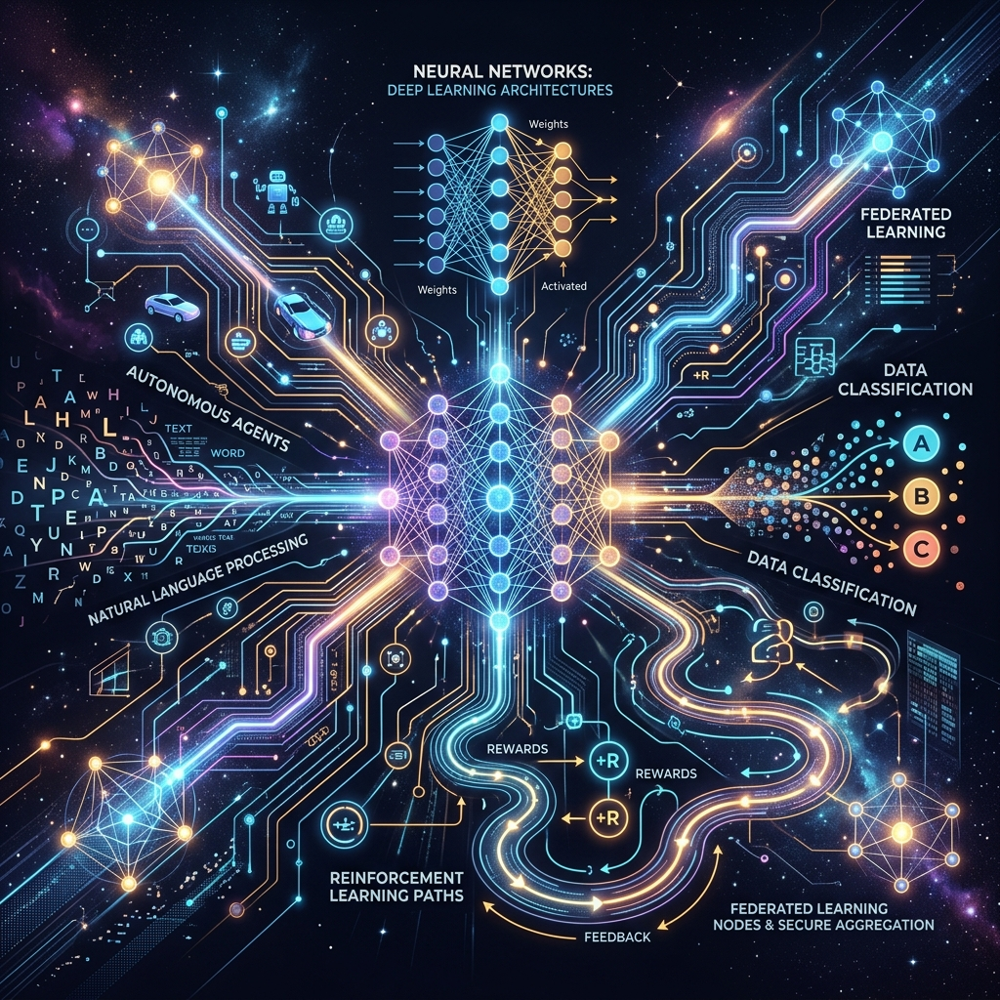

<div align="center">
  
</div>

# 🤖 AI & Machine Learning — From Fundamentals to Multi-Agent Systems

A **hands-on, beginner-friendly** curriculum that takes you from the core principles of Deep Learning all the way to autonomous Multi-Agent Systems. Every chapter is self-contained and includes clear explanations, reflection questions with answers, and a **fully Dockerized exercise** you can run immediately — no local setup required beyond Docker.

---

## 📚 Course Overview

This course is organized into **27 chapters**, each covering a major pillar of modern AI and Machine Learning. The material is synthesized from over 50 academic textbooks and distilled into language that anyone can understand.

| # | Chapter | Topic | Exercise |
|---|---------|-------|----------|
| 1 | [Deep Learning Fundamentals](chapter_01_deep_learning_fundamentals/) | Neural networks, activation functions, backpropagation | XOR gate solver with pure NumPy |
| 2 | [Federated Learning Basics](chapter_02_federated_learning/) | Privacy-preserving distributed training, FedAvg | 3-client federated averaging simulation |
| 3 | [Reinforcement Learning & Agents](chapter_03_reinforcement_learning/) | Q-Learning, exploration vs. exploitation, reward design | Visual Q-Learning maze agent |
| 4 | [Conversational AI & NLP](chapter_04_conversational_ai_nlp/) | Tokenization, sentiment analysis, dialogue systems | Sentiment analysis bot with TextBlob |
| 5 | [Advanced Algorithms & SVM](chapter_05_advanced_algorithms_svm/) | Hyperplanes, support vectors, the kernel trick | SVM classifier with scikit-learn |
| 6 | [Multi-Agent Systems & Swarm AI](chapter_06_multi_agent_systems/) | Emergent behavior, competitive vs. collaborative agents | Dual trading bot market simulation |
| 7 | [Computer Vision & Object Recognition](chapter_07_computer_vision/) | CNNs, convolution, pooling, image classification | CIFAR-10 CNN classifier with PyTorch |
| 8 | [Transfer Learning](chapter_08_transfer_learning/) | Pre-trained models, fine-tuning, feature extraction | ResNet-18 fine-tuning demo |
| 9 | [Semi-Supervised Learning](chapter_09_semi_supervised_learning/) | Label propagation, unlabeled data, cluster assumptions | Label Propagation on synthetic data |
| 10 | [Autonomous Vehicles & Robotics](chapter_10_autonomous_vehicles/) | Sensor fusion, LiDAR, perception, path planning | Obstacle avoidance simulation |
| 11 | [ML for Algorithmic Trading](chapter_11_algorithmic_trading/) | Moving averages, backtesting, trading signals | Moving average crossover backtest |
| 12 | [Graph Neural Networks](chapter_12_graph_neural_networks/) | Message passing, node embeddings, graph structure | GNN message passing from scratch |
| 13 | [Deep Learning for Games](chapter_13_deep_learning_games/) | DQN, experience replay, epsilon-greedy | Coin collector grid world agent |
| 14 | [Active Learning](chapter_14_active_learning/) | Uncertainty sampling, query strategies, smart labeling | Active vs random sampling comparison |
| 15 | [Adversarial Machine Learning](chapter_15_adversarial_ml/) | FGSM attacks, robustness, adversarial defenses | Gradient-based attack simulation |
| 16 | [Fake News Detection](chapter_16_fake_news_detection/) | TF-IDF, linguistic features, credibility scoring | TF-IDF fake news classifier |
| 17 | [AI for the Internet of Things](chapter_17_ai_for_iot/) | Edge AI, anomaly detection, sensor fusion | IoT sensor anomaly detector |
| 18 | [Lifelong Machine Learning](chapter_18_lifelong_learning/) | Catastrophic forgetting, replay buffers, continual learning | Forgetting vs replay comparison |
| 19 | [Metric Learning](chapter_19_metric_learning/) | Triplet loss, embeddings, similarity search | Triplet loss embedding trainer |
| 20 | [Data Management for ML](chapter_20_data_management_ml/) | Data versioning, pipelines, quality monitoring | Full data pipeline simulation |
| 21 | [Game Theory for AI](chapter_21_game_theory_ai/) | Nash equilibrium, Prisoner's Dilemma, Tit-for-Tat | Iterated game tournament |
| 22 | [Bayesian Learning](chapter_22_bayesian_learning/) | Bayes' theorem, priors & posteriors, MAP vs MLE | Bayesian coin inference |
| 23 | [Ensemble Methods](chapter_23_ensemble_methods/) | Boosting, bagging, AdaBoost, Random Forests | AdaBoost from scratch |
| 24 | [Dimensionality Reduction](chapter_24_dimensionality_reduction/) | PCA, eigenvalues, variance preservation | PCA from scratch |
| 25 | [Statistical Learning Theory](chapter_25_statistical_learning_theory/) | Bias-variance tradeoff, Ridge & Lasso regularization | Bias-variance & regularization explorer |
| 26 | [Kernel Methods](chapter_26_kernel_methods/) | Kernel trick, RBF kernels, Mercer's theorem | Kernel classifier from scratch |
| 27 | [Time Series Forecasting](chapter_27_time_series_forecasting/) | Autoregression, ARIMA, stationarity, sliding windows | AR forecasting from scratch |

---

## 🚀 Getting Started

### Prerequisites

- [Docker](https://docs.docker.com/get-docker/) installed on your machine.
- That's it! Every exercise runs inside a container — no Python, pip, or library installation needed.

### Running an Exercise

Each chapter contains an `exercise/` folder with a `Dockerfile` and a Python script. To run any exercise:

```bash
# Navigate to a chapter's exercise folder
cd chapter_01_deep_learning_fundamentals/exercise

# Build the Docker image
docker build -t ch1-deep-learning .

# Run it
docker run --rm ch1-deep-learning
```

---

## 🎯 What You Will Learn

By the end of this course you will be able to:

- **Build** a neural network from scratch using only NumPy and understand forward/backpropagation.
- **Explain** how Federated Learning enables privacy-preserving AI training across decentralized devices.
- **Implement** a Q-Learning agent that teaches itself to navigate an environment through trial and error.
- **Analyze** text using tokenization and sentiment analysis, the building blocks of modern Conversational AI.
- **Classify** data using Support Vector Machines and understand the mathematical elegance of hyperplanes.
- **Simulate** multi-agent environments where autonomous agents compete or collaborate in real time.
- **Recognize** objects in images using Convolutional Neural Networks and understand convolution mechanics.
- **Transfer** knowledge from pre-trained models to solve new tasks with minimal data.
- **Leverage** unlabeled data using Semi-Supervised Learning when labels are scarce and expensive.
- **Navigate** autonomous vehicles using sensor fusion and rule-based obstacle avoidance.
- **Backtest** algorithmic trading strategies using moving average crossover signals.
- **Propagate** messages through graph networks to learn from relational data structures.
- **Train** game-playing AI agents using Deep Q-Networks and experience replay.
- **Optimize** labeling budgets using Active Learning's uncertainty-based query strategies.
- **Defend** AI models against adversarial attacks that exploit gradient information.
- **Detect** fake news using NLP feature extraction and text classification.
- **Deploy** lightweight AI models on IoT edge devices for real-time anomaly detection.
- **Prevent** catastrophic forgetting in models that must learn new tasks continuously.
- **Measure** similarity between data points using learned metric embeddings and triplet loss.
- **Engineer** production-quality ML data pipelines with versioning and quality monitoring.
- **Analyze** strategic interactions between AI agents using game-theoretic frameworks.
- **Update** beliefs using Bayesian inference and understand the difference between MAP and MLE estimation.
- **Combine** weak learners into powerful ensembles using Boosting, Bagging, and AdaBoost.
- **Compress** high-dimensional data using PCA while preserving the most important variance structure.
- **Balance** bias and variance through regularization techniques like Ridge and Lasso regression.
- **Transform** non-linear data into linearly separable spaces using kernel methods and the RBF kernel.
- **Forecast** future values from sequential data using autoregressive models and sliding windows.

---

## 📖 How Each Chapter Is Structured

Every chapter follows a consistent, learner-friendly format:

1. **🖼️ Cover Image** — A visual representation of the chapter's core topic.
2. **🎯 The Big Goal** — A one-sentence summary of what you will achieve.
3. **Core Concepts** — Plain-language explanations of the theory, accessible to anyone.
4. **🤔 Reflection Questions** — Test your understanding with expandable answers.
5. **🐳 Hands-On Exercise** — A fully Dockerized, runnable code exercise with step-by-step instructions and inline source code you can copy and paste.

---

## 📘 Source Material

This curriculum synthesizes knowledge from over **50 academic textbooks** spanning deep learning, federated learning, reinforcement learning, NLP, sentiment analysis, support vector machines, graph-based learning, multi-agent systems, autonomous vehicles, trading agents, computer vision, transfer learning, semi-supervised learning, game AI, active learning, adversarial ML, IoT, lifelong learning, metric learning, data management, game theory, Bayesian inference, ensemble methods, dimensionality reduction, statistical learning theory, kernel methods, and time series forecasting.

---

## 📄 License

This project is licensed under the terms of the [Apache License 2.0](LICENSE).
