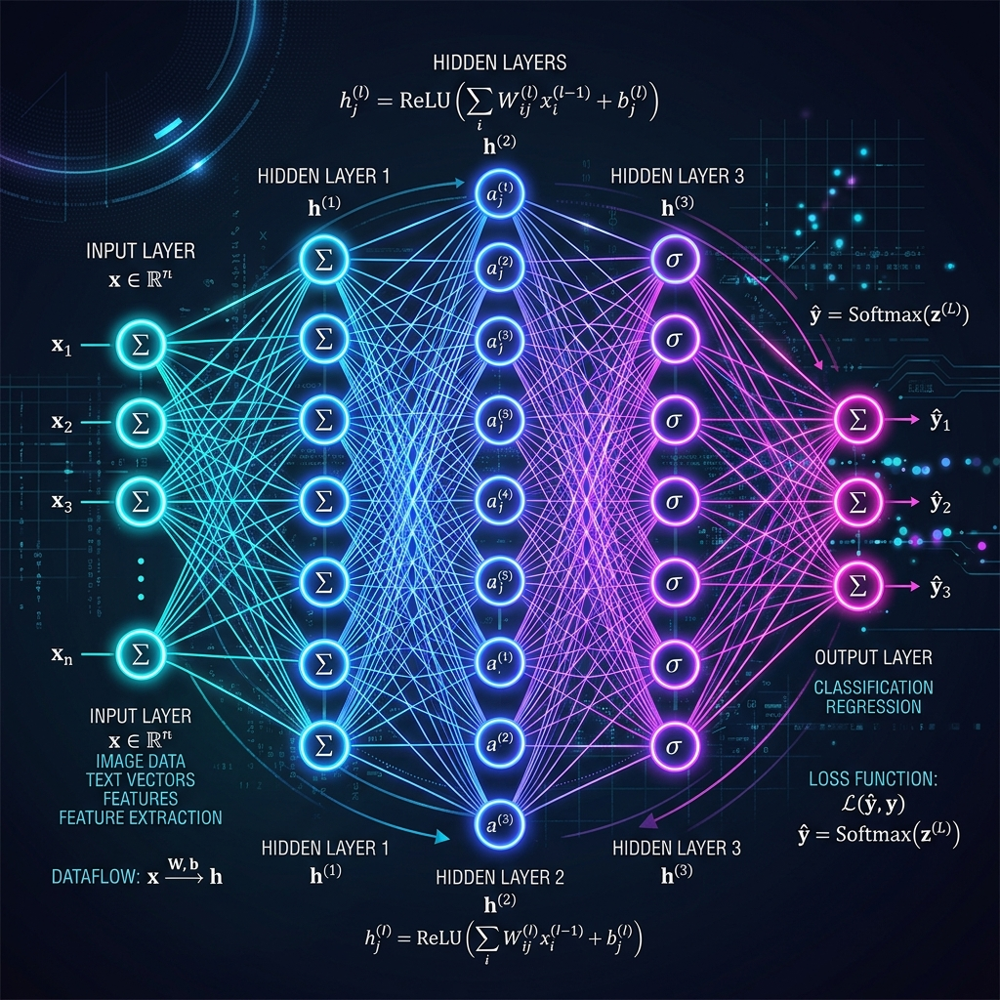

<div align="center">
  
</div>

# Chapter 1: Deep Learning Fundamentals

**🎯 The Big Goal:** Understand the basic architecture of a Feedforward Neural Network and how data transforms through it, and ultimately build your own from scratch using pure Python.

## Core Concepts

Deep Learning is a subset of Machine Learning that uses multi-layered artificial neural networks to deliver state-of-the-art accuracy in tasks such as object detection, speech recognition, and language translation.

### What is a Neural Network?
Think of a neural network as a mathematical machine inspired by the human brain. It consists of layers of "neurons":
1. **Input Layer**: Receives the raw data (like an image's pixels).
2. **Hidden Layers**: The core processors. Each layer applies weights (importance) and biases (adjustments) to the data, then passes the result through an *Activation Function* (a mathematical rule to determine if a neuron should "fire").
3. **Output Layer**: Gives the final prediction (like "This is a picture of a cat" or "This is a picture of a dog").

### Forward Propagation
The process of pushing data from the input layer to the output layer is called *forward propagation*. 
At the simplest, it involves:
`Output = Activation(Weight * Input + Bias)`

---

## 🤔 Reflection Questions

<details>
<summary>💡 View Answer: What is the purpose of an Activation Function?</summary>

An activation function introduces **non-linearity** to the network. Without it, no matter how many layers a network has, it would behave just like a simple linear regression model. By adding non-linearity, the network can learn complex, curved boundaries in the data.
</details>

<details>
<summary>💡 View Answer: Why do we have "Hidden" layers?</summary>

Hidden layers act as intermediate feature extractors. Earlier hidden layers might detect simple patterns (like edges in an image), while deeper hidden layers combine those simple patterns into complex object representations (like a face or a car's wheel). They are "hidden" because they aren't directly exposed to the Input or Output data.
</details>

---

## Hands-On Exercise: Your First Neural Network

In this exercise, you will run a simple Feedforward Neural Network written in pure Python/NumPy. It’s designed to learn the logical "XOR" gate—a classic problem that cannot be solved without a hidden layer.

### Step 1: Build the Docker Environment
Navigate to the `exercise` folder and run:
```bash
cd exercise
docker build -t ch1-deep-learning .
```

### Step 2: Run the Neural Network
```bash
docker run --rm ch1-deep-learning
```

Watch the terminal output as the loss drops! The network will initialize random weights, test its initial predictions, and then correct itself (backpropagation) over 10,000 iterations to predict the correct logical outputs.


### Source Code

```python
import numpy as np

# Non-linear activation function and its derivative
def sigmoid(x):
    return 1 / (1 + np.exp(-x))

def sigmoid_derivative(x):
    return x * (1 - x)

# Input datasets (XOR problem)
inputs = np.array([[0,0],[0,1],[1,0],[1,1]])
# Expected output
expected_output = np.array([[0],[1],[1],[0]])

# Initialize random weights and biases
np.random.seed(42)
inputLayerNeurons, hiddenLayerNeurons, outputLayerNeurons = 2, 2, 1

hidden_weights = np.random.uniform(size=(inputLayerNeurons, hiddenLayerNeurons))
hidden_bias = np.random.uniform(size=(1, hiddenLayerNeurons))
output_weights = np.random.uniform(size=(hiddenLayerNeurons, outputLayerNeurons))
output_bias = np.random.uniform(size=(1, outputLayerNeurons))

print("Initial Hidden Weights:\n", hidden_weights)
print("Initial Output Weights:\n", output_weights)
print("-" * 30)

epochs = 10000
lr = 0.5 # learning rate

for _ in range(epochs):
    # Forward Propagation
    hidden_layer_activation = np.dot(inputs, hidden_weights)
    hidden_layer_activation += hidden_bias
    hidden_layer_output = sigmoid(hidden_layer_activation)

    output_layer_activation = np.dot(hidden_layer_output, output_weights)
    output_layer_activation += output_bias
    predicted_output = sigmoid(output_layer_activation)

    # Backpropagation
    error = expected_output - predicted_output
    d_predicted_output = error * sigmoid_derivative(predicted_output)
    
    error_hidden_layer = d_predicted_output.dot(output_weights.T)
    d_hidden_layer = error_hidden_layer * sigmoid_derivative(hidden_layer_output)

    # Updating Weights and Biases
    output_weights += hidden_layer_output.T.dot(d_predicted_output) * lr
    output_bias += np.sum(d_predicted_output, axis=0, keepdims=True) * lr
    hidden_weights += inputs.T.dot(d_hidden_layer) * lr
    hidden_bias += np.sum(d_hidden_layer, axis=0, keepdims=True) * lr

print("Final Predictions after 10000 Epochs:")
for i in range(len(inputs)):
    print(f"Input: {inputs[i]} -> Prediction: {predicted_output[i][0]:.4f} (Expected: {expected_output[i][0]})")
```
