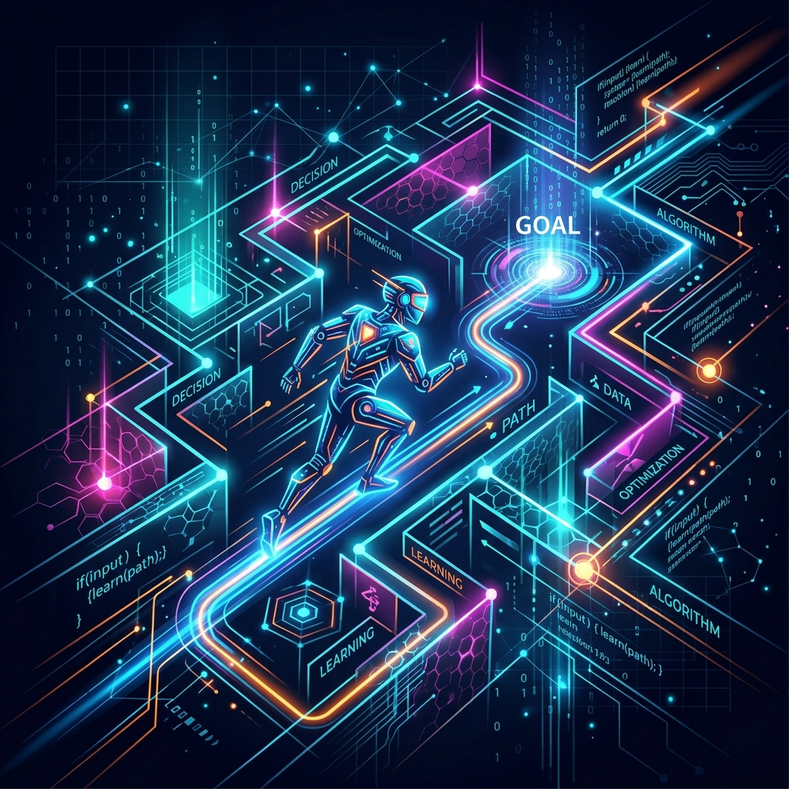

<div align="center">
  
</div>

# Chapter 3: Reinforcement Learning & Agents

**🎯 The Big Goal:** Comprehend how an Agent learns to make decisions in an Environment by taking actions to maximize cumulative rewards.

## Core Concepts

In Reinforcement Learning (RL), the system is learning by trial-and-error. Rather than being told what the right answers are (as in supervised learning), an **Agent** must figure it out by exploring its world.

### The RL Loop
- **Environment**: The world the agent interacts with.
- **State ($S$)**: The current situation the agent is in.
- **Action ($A$)**: A move the agent makes in the environment.
- **Reward ($R$)**: The feedback from the environment based on the action taken. Can be positive (a treat) or negative (a penalty).

### Q-Learning
One of the most foundational algorithms is **Q-Learning**. The agent maintains a table (the "Q-Table") that maps a State-Action pair to a specific expected future reward. Over time, as the agent explores and accidentally finds the goal, it propagates this knowledge back into the Q-Table so it remembers the correct path in the future!

---

## 🤔 Reflection Questions

<details>
<summary>💡 View Answer: Describe the Exploration vs. Exploitation tradeoff.</summary>

**Exploration**: Trying wild, random actions to discover new areas that might yield huge rewards.
**Exploitation**: Using the knowledge that the agent already possesses to secure a known reward.
A good RL agent must balance both! If it only exploits, it might get stuck taking a sub-optimal path forever.
</details>

<details>
<summary>💡 View Answer: What happens if you define a reward function poorly? (Also known as "Reward Hacking")</summary>

The agent will learn to exploit the reward function in unintended ways. For example, if a robotic vacuum cleaner is rewarded for throwing away dust, it might learn to dump its own dustbin back onto the floor just to pick it up again and get infinite points!
</details>

---

## Hands-On Exercise: Autonomous Maze Agent using Q-Learning

In this module, you will train a Q-learning agent to navigate a 1-dimensional "Cliff" or "Grid" environment in your terminal. You'll literally see the AI taking random steps until it learns to dash straight to the reward!

### Step 1: Build the Docker Environment
Navigate to the `exercise` folder and run:
```bash
cd exercise
docker build -t ch3-reinforcement-learning .
```

### Step 2: Run the Simulation
```bash
docker run --rm ch3-reinforcement-learning
```

The script will begin visually outputting the agent navigating its small grid world. The goal 'G' is to the far right. 'A' represents the agent. You'll see the agent being clumsy during Episode 1, and sprinting straight to the goal flawlessly by Episode 20!


### Source Code

```python
import numpy as np
import time

# Environment: A 1D track of length 6. 
# State 0 is the start, State 5 is the Goal. '---G'
N_STATES = 6
ACTIONS = ['left', 'right']

# Q-Table initialized to 0
# 6 rows for states, 2 columns for actions
q_table = np.zeros((N_STATES, len(ACTIONS)))

# Hyperparameters
EPSILON = 0.9      # 90% chance to exploit, 10% to explore
ALPHA = 0.1        # Learning rate
GAMMA = 0.9        # Discount factor for future rewards
MAX_EPISODES = 20

def choose_action(state):
    # Epsilon-greedy
    if np.random.uniform() < EPSILON:
        # Exploit (choose action with max Q-value)
        action_idx = np.argmax(q_table[state, :])
    else:
        # Explore (choose random action)
        action_idx = np.random.choice([0, 1])
    return ACTIONS[action_idx]

def get_env_feedback(state, action):
    # Move left
    if action == 'left':
        next_state = max(0, state - 1)
        reward = 0
    # Move right
    else:
        next_state = min(N_STATES - 1, state + 1)
        if next_state == N_STATES - 1:
            reward = 1  # Reached the goal!
        else:
            reward = 0
    return next_state, reward

def update_env(state, episode, step):
    env_list = ['-'] * (N_STATES - 1) + ['G']
    if state == N_STATES - 1:
        print(f"\rEpisode {episode}: Reached Goal in {step} steps!" + " " * 10)
    else:
        env_list[state] = 'A'
        print(f"\rEpisode {episode}: {''.join(env_list)}", end='')
        time.sleep(0.05) 

print("Training our Q-Learning Agent. Watch it improve!\n")
time.sleep(2)

for episode in range(1, MAX_EPISODES + 1):
    step = 0
    state = 0 # Start at the beginning
    is_terminated = False
    
    update_env(state, episode, step)
    
    while not is_terminated:
        # 1. Choose Action
        action = choose_action(state)
        action_idx = ACTIONS.index(action)
        
        # 2. Take Action, get reward and see next state
        next_state, reward = get_env_feedback(state, action)
        
        # 3. Update Q-Table
        q_predict = q_table[state, action_idx]
        if next_state != N_STATES - 1:
            q_target = reward + GAMMA * np.max(q_table[next_state, :])
        else:
            q_target = reward # Terminal state
            is_terminated = True
            
        q_table[state, action_idx] += ALPHA * (q_target - q_predict)
        
        state = next_state
        step += 1
        
        # Visuals
        update_env(state, episode, step)
        
print("\nFinal Q-Table:\n", q_table)
print("Notice how the values increase as you get closer to State 5 (Goal), naturally leading the agent there!")
```
