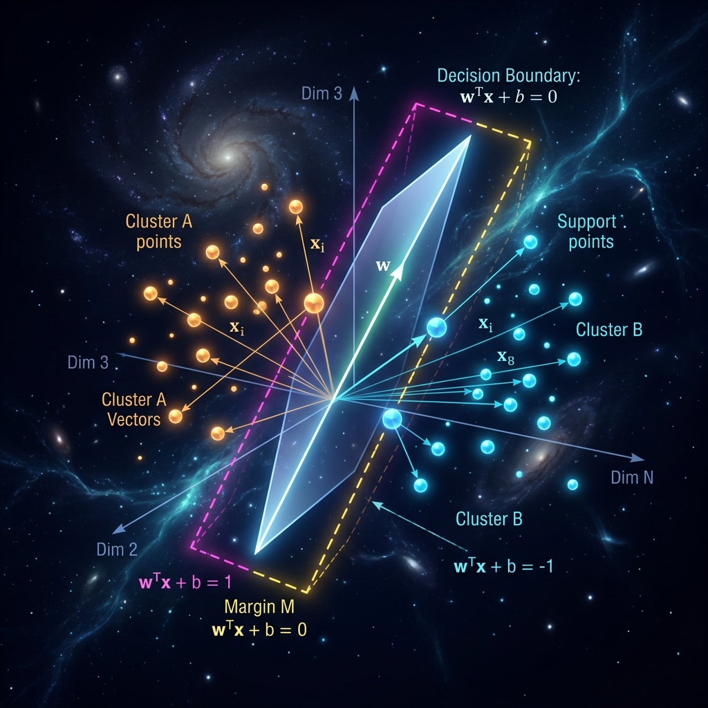

<div align="center">
  
</div>

# Chapter 5: Advanced Algorithms & Support Vector Machines

**🎯 The Big Goal:** Comprehend how algorithms elegantly classify complex datasets by creating optimal mathematical boundaries called "Hyperplanes."

## Core Concepts

In Machine Learning classification, we want to split data into different categories (e.g., spam vs. non-spam). While neural networks do this through layered learning, statistical algorithms like the **Support Vector Machine (SVM)** approach this purely mathematically.

### Hyperplanes & Margins
Imagine drawing a line on a piece of paper to separate blue dots from red dots. 
An SVM doesn't just draw any line; it draws the **optimal line**.
1. **Hyperplane**: In a 2D space, this is a line. In a 3D space, it becomes a flat plane. In N-dimensional data space, it's called a Hyperplane.
2. **Support Vectors**: These are the specific data points that lie closest to the boundary. They "support" the construction of the margin. If you move these points, the boundary changes!
3. **The Margin**: The SVM tries to make the gap (margin) between the blue line and red line as wide as possible. A wider margin means the model is universally more confident in its classifications!

### Non-Linearity via the "Kernel Trick"
What if the blue and red dots are arranged in a circle, and a straight line simply cannot separate them? SVMs use the **Kernel Trick** to project the data into a higher dimension (like popping the dots off the paper into the air) where a flat plane *can* slice between them effortlessly.

---

## 🤔 Reflection Questions

<details>
<summary>💡 View Answer: If you add one million new data points to your dataset far away from the boundary, will the SVM's hyperplane shift?</summary>

No! The beauty of an SVM is that it only cares about the **Support Vectors** (the points closest to the boundary). As long as the newly added points do not encroach on the margin gaps, the mathematical hyperplane remains completely identical!
</details>

<details>
<summary>💡 View Answer: What is "Overfitting" in the context of advanced algorithms?</summary>

Overfitting occurs when your algorithm learns the "noise" or random fluctuations in the training data rather than the underlying pattern. If your SVM boundary loops around every single solitary dot perfectly, it will likely fail miserably when presented with new, unseen data.
</details>

---

## Hands-On Exercise: SVM Hyperplane Classification

In this exercise, we will unleash `scikit-learn`'s Support Vector Classifier inside Python. We'll generate a random set of two-class data and the script will automatically calculate the accuracy logic!

### Step 1: Build the Docker Environment
Navigate to the `exercise` folder and run:
```bash
cd exercise
docker build -t ch5-svm-algorithm .
```

### Step 2: Run the Classifier
```bash
docker run --rm ch5-svm-algorithm
```

The script trains highly optimized classification parameters and outputs the accuracy and number of crucial Support Vectors it leveraged to draw the margin!


### Source Code

```python
import numpy as np
from sklearn import svm
from sklearn.model_selection import train_test_split
from sklearn.metrics import accuracy_score

# 1. Generate Synthetic Data
# We are creating two "blobs" of data to classify
np.random.seed(42)
X_cluster_1 = np.random.randn(50, 2) + np.array([2, 2])
X_cluster_2 = np.random.randn(50, 2) + np.array([-2, -2])

X = np.vstack((X_cluster_1, X_cluster_2))
Y = np.array([0] * 50 + [1] * 50)

# Split into 80% Training Data and 20% Test Data
X_train, X_test, Y_train, Y_test = train_test_split(X, Y, test_size=0.2, random_state=42)

print("--- SVM Classification Initialized ---\n")
print(f"Total Data Points: {len(X)}")
print(f"Training on: {len(X_train)} points")
print(f"Testing on: {len(X_test)} points\n")

# 2. Initialize the Support Vector Classifier
# We'll use a 'linear' kernel to find a straight hyperplane boundary
clf = svm.SVC(kernel='linear')

# 3. Train the Model
print("Training model to find the optimal hyperplane...")
clf.fit(X_train, Y_train)

# 4. Analyze Internal State
support_vectors = clf.support_vectors_
print(f"\nModel mathematically stabilized!")
print(f"Total Support Vectors utilized to hold the margin: {len(support_vectors)}")

# 5. Predict on Unseen Test Data
predictions = clf.predict(X_test)
accuracy = accuracy_score(Y_test, predictions)

print(f"\nModel Accuracy against Unseen Data: {accuracy * 100:.2f}%")

if accuracy == 1.0:
    print("Perfect classification! The SVM margin successfully isolated the clusters.")
```
