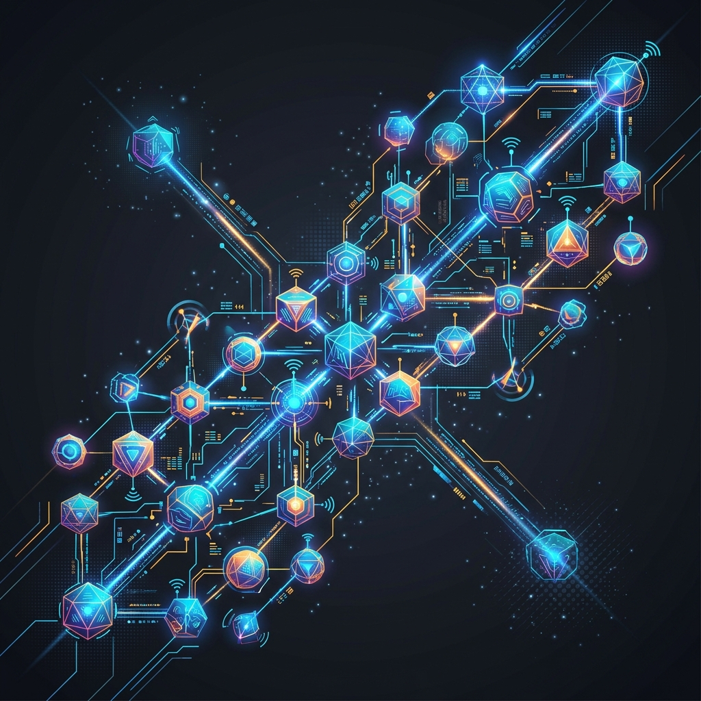

<div align="center">
  
</div>

# Chapter 6: Multi-Agent Systems & Swarm AI

**🎯 The Big Goal:** Understand how complex, intelligent behavior can emerge from multiple independent AI agents interacting with each other rather than relying on a single mega-brain.

## Core Concepts

A **Multi-Agent System (MAS)** consists of multiple interacting, intelligent agents within an environment. These agents can be software programs, robots, or autonomous vehicles. 

### Why Multiple Agents?
1. **Decentralization**: If one agent fails, the system survives. This is critical for drone swarms or autonomous grid management.
2. **Specialization**: Instead of building one massively heavy neural network to do everything, you build specialized agents (e.g., an Explorer agent, a Builder agent, a Defender agent) that collaborate to solve complex goals.
3. **Emergent Behavior**: Sometimes, giving very simple rules to multiple agents results in incredibly complex, "swarm-like" intelligent behavior (mimicking ants or bees!).

### Competitive vs. Collaborative
Agents aren't always friends!
- **Collaborative**: Autonomous delivery drones avoiding crashing into each other to safely carry a large payload.
- **Competitive**: High-frequency algorithmic trading bots battling in the stock market to secure the best margins.

---

## 🤔 Reflection Questions

<details>
<summary>💡 View Answer: Describe a real-world scenario where a Multi-Agent System is highly favorable over a Single-Agent System.</summary>

**Traffic Light Optimization**. A single massive AI trying to control every traffic light in a city would suffer from terrible latency and calculation bottlenecks. A MAS where *each intersection* is an independent agent that only talks to its four closest neighbor intersections can optimize city traffic instantly in real-time!
</details>

<details>
<summary>💡 View Answer: What is a "Nash Equilibrium" in competitive Multi-Agent environments?</summary>

Borrowed from Game Theory, a Nash Equilibrium is a state where no agent can gain any advantage by changing their strategy as long as all other agents keep their strategies unchanged. It's the moment of mathematical "stalemate" or perfect balance in a competitive ecosystem.
</details>

---

## Hands-On Exercise: Dual Trading Bots

In this exercise, we will simulate two independent trading agents interacting within a simplified "Market." Agent A uses an aggressive strategy, while Agent B uses a conservative, slow-growth strategy. 

### Step 1: Build the Docker Environment
Navigate to the `exercise` folder and run:
```bash
cd exercise
docker build -t ch6-multi-agent .
```

### Step 2: Run the Simulation
```bash
docker run --rm ch6-multi-agent
```

Watch how their differing programmatic behaviors lead to emergent profit scenarios over a simulated 10-day market run!


### Source Code

```python
import random
import time

class TradingAgent:
    def __init__(self, name, strategy, starting_balance):
        self.name = name
        self.strategy = strategy
        self.balance = starting_balance
        self.inventory = 0

    def evaluate_market(self, market_price):
        if self.strategy == 'aggressive':
            # Aggressive agent buys often, sells only when profit is very high
            if self.balance > market_price and random.random() > 0.3:
                return 'buy'
            elif self.inventory > 0 and random.random() > 0.8:
                return 'sell'
                
        elif self.strategy == 'conservative':
            # Conservative agent buys only sparingly, sells instantly on minor profit
            if self.balance > market_price and random.random() > 0.7:
                return 'buy'
            elif self.inventory > 0 and random.random() > 0.4:
                return 'sell'
                
        return 'hold'

class MarketEnvironment:
    def __init__(self):
        self.price = 100
        
    def next_day(self):
        # The market fluctuates randomly each day between -15 and +15
        fluctuation = random.randint(-15, 15)
        self.price = max(10, self.price + fluctuation)
        return self.price

# Initialize Environment and Agents
market = MarketEnvironment()
agent_a = TradingAgent("Agent Alpha", "aggressive", 500)
agent_b = TradingAgent("Agent Beta", "conservative", 500)

agents = [agent_a, agent_b]

print("--- Multi-Agent Market Simulation Initiated ---")
print(f"Starting Balances -> Alpha (Aggressive): ${agent_a.balance} | Beta (Conservative): ${agent_b.balance}\n")

for day in range(1, 11):
    current_price = market.next_day()
    print(f"[Day {day}] Market Price: ${current_price}")
    
    for agent in agents:
        action = agent.evaluate_market(current_price)
        
        if action == 'buy' and agent.balance >= current_price:
            agent.balance -= current_price
            agent.inventory += 1
            print(f"  > {agent.name} decided to BUY. (Remaining Balance: ${agent.balance})")
        elif action == 'sell' and agent.inventory > 0:
            agent.balance += current_price
            agent.inventory -= 1
            print(f"  > {agent.name} decided to SELL. (New Balance: ${agent.balance})")
        else:
            print(f"  > {agent.name} is HOLDING.")
            
    print("-" * 30)
    time.sleep(0.5)

# Calculate final liquid value (Balance + Value of inventory at final price)
print("\n--- Final Results ---")
for a in agents:
    total_worth = a.balance + (a.inventory * market.price)
    profit = total_worth - 500
    print(f"{a.name} Total Worth: ${total_worth} -> Net Profit: ${profit}")
```
