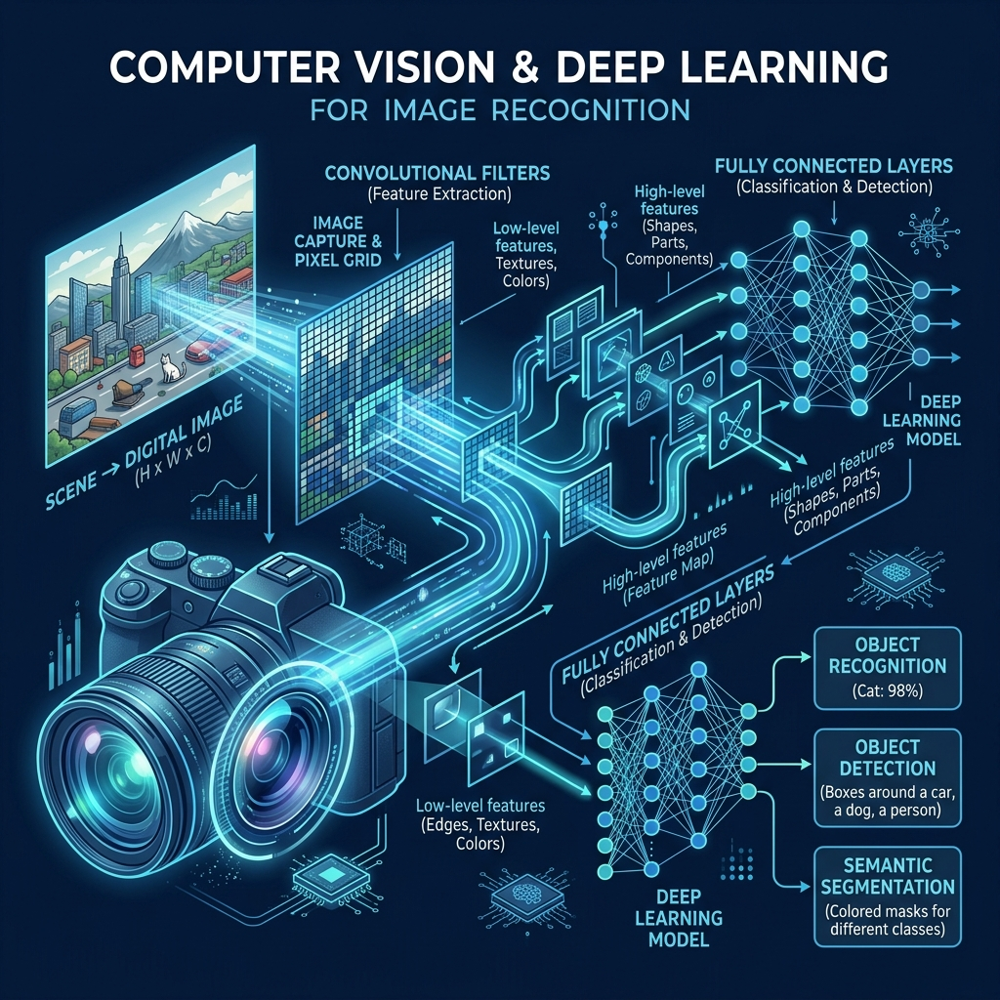

<div align="center">
  
</div>

# Chapter 7: Computer Vision & Object Recognition

**🎯 The Big Goal:** Understand how Convolutional Neural Networks (CNNs) enable machines to "see" by automatically learning to detect edges, textures, shapes, and objects from raw pixel data — and build a working image classifier.

## Core Concepts

Computer Vision is the field of AI that teaches machines to interpret visual information from the world — images and video. At its heart lies the **Convolutional Neural Network (CNN)**, an architecture specifically designed to process grid-like data such as images.

### How Does a CNN Work?

Unlike a regular neural network that treats an image as a flat list of numbers, a CNN preserves the spatial structure of the image. It works in three stages:

1. **Convolutional Layers:** Small filters (e.g., 3×3 grids of numbers) slide across the entire image. Each filter learns to detect a specific pattern — early filters detect simple edges (horizontal, vertical, diagonal), while deeper filters detect complex features (eyes, wheels, text).

2. **Pooling Layers:** After convolution, pooling shrinks the feature maps by keeping only the strongest signals (e.g., Max Pooling takes the highest value in each small region). This makes the model faster and reduces overfitting.

3. **Fully Connected Layers:** After several rounds of convolution and pooling, the extracted features are flattened into a 1D vector and fed into a traditional neural network that outputs the final class prediction (e.g., "cat", "dog", "car").

### Why Convolution Instead of Flat Networks?

A tiny 64×64 color image has 64 × 64 × 3 = 12,288 pixels. A flat network connecting every pixel to every neuron in the first hidden layer creates millions of parameters — wasteful and prone to overfitting. Convolution uses **weight sharing** (the same small filter everywhere) and **local connectivity** (each neuron only sees a small patch), making it vastly more efficient.

---

## 🤔 Reflection Questions

<details>
<summary>💡 View Answer: What is the "kernel" or "filter" in a CNN?</summary>

A kernel (or filter) is a small matrix of learnable weights (e.g., 3×3 or 5×5). During convolution, this filter slides across the input image, computing the dot product at each position to produce a **feature map**. The network learns the optimal values for these filters during training — early layers might learn edge detectors while deeper layers learn to recognize entire objects.
</details>

<details>
<summary>💡 View Answer: What is the difference between object classification and object detection?</summary>

**Classification** answers "What is in this image?" and outputs a single label (e.g., "cat"). **Detection** answers "Where are the objects?" and outputs multiple bounding boxes with labels (e.g., "cat at [x=50, y=30, w=100, h=120]" and "dog at [x=200, y=50, w=80, h=100]"). Detection is harder because the network must both classify and localize.
</details>

---

## 🐳 Hands-On Exercise: CIFAR-10 Image Classifier

In this exercise, you will build and train a CNN that classifies tiny images into 10 categories (airplane, car, bird, cat, deer, dog, frog, horse, ship, truck) using PyTorch.

### Step 1: Build the Docker Environment
```bash
cd exercise
docker build -t ch7-computer-vision .
```

### Step 2: Run the Classifier
```bash
docker run --rm ch7-computer-vision
```

### Source Code

```python
import torch
import torch.nn as nn
import torch.optim as optim
import torchvision
import torchvision.transforms as transforms

# 1. Prepare & load CIFAR-10 dataset
transform = transforms.Compose([
    transforms.ToTensor(),
    transforms.Normalize((0.5, 0.5, 0.5), (0.5, 0.5, 0.5))
])

print("Downloading CIFAR-10 dataset...")
trainset = torchvision.datasets.CIFAR10(root='./data', train=True, download=True, transform=transform)
trainloader = torch.utils.data.DataLoader(trainset, batch_size=64, shuffle=True)
testset = torchvision.datasets.CIFAR10(root='./data', train=False, download=True, transform=transform)
testloader = torch.utils.data.DataLoader(testset, batch_size=64, shuffle=False)

classes = ('airplane', 'car', 'bird', 'cat', 'deer', 'dog', 'frog', 'horse', 'ship', 'truck')

# 2. Define CNN Architecture
class SimpleCNN(nn.Module):
    def __init__(self):
        super(SimpleCNN, self).__init__()
        self.conv1 = nn.Conv2d(3, 16, 3, padding=1)
        self.conv2 = nn.Conv2d(16, 32, 3, padding=1)
        self.pool = nn.MaxPool2d(2, 2)
        self.fc1 = nn.Linear(32 * 8 * 8, 128)
        self.fc2 = nn.Linear(128, 10)
        self.relu = nn.ReLU()

    def forward(self, x):
        x = self.pool(self.relu(self.conv1(x)))
        x = self.pool(self.relu(self.conv2(x)))
        x = x.view(-1, 32 * 8 * 8)
        x = self.relu(self.fc1(x))
        x = self.fc2(x)
        return x

model = SimpleCNN()
criterion = nn.CrossEntropyLoss()
optimizer = optim.Adam(model.parameters(), lr=0.001)

# 3. Train
print("Training CNN for 5 epochs...")
for epoch in range(5):
    running_loss = 0.0
    for i, (inputs, labels) in enumerate(trainloader):
        optimizer.zero_grad()
        outputs = model(inputs)
        loss = criterion(outputs, labels)
        loss.backward()
        optimizer.step()
        running_loss += loss.item()
    print(f"Epoch {epoch+1}/5 — Loss: {running_loss/len(trainloader):.4f}")

# 4. Evaluate
correct, total = 0, 0
with torch.no_grad():
    for inputs, labels in testloader:
        outputs = model(inputs)
        _, predicted = torch.max(outputs, 1)
        total += labels.size(0)
        correct += (predicted == labels).sum().item()

print(f"\nTest Accuracy: {100 * correct / total:.2f}%")
```

### Dockerfile

```dockerfile
FROM python:3.9-slim
WORKDIR /app
RUN pip install torch torchvision
COPY cv_classifier.py /app/
CMD ["python", "cv_classifier.py"]
```
