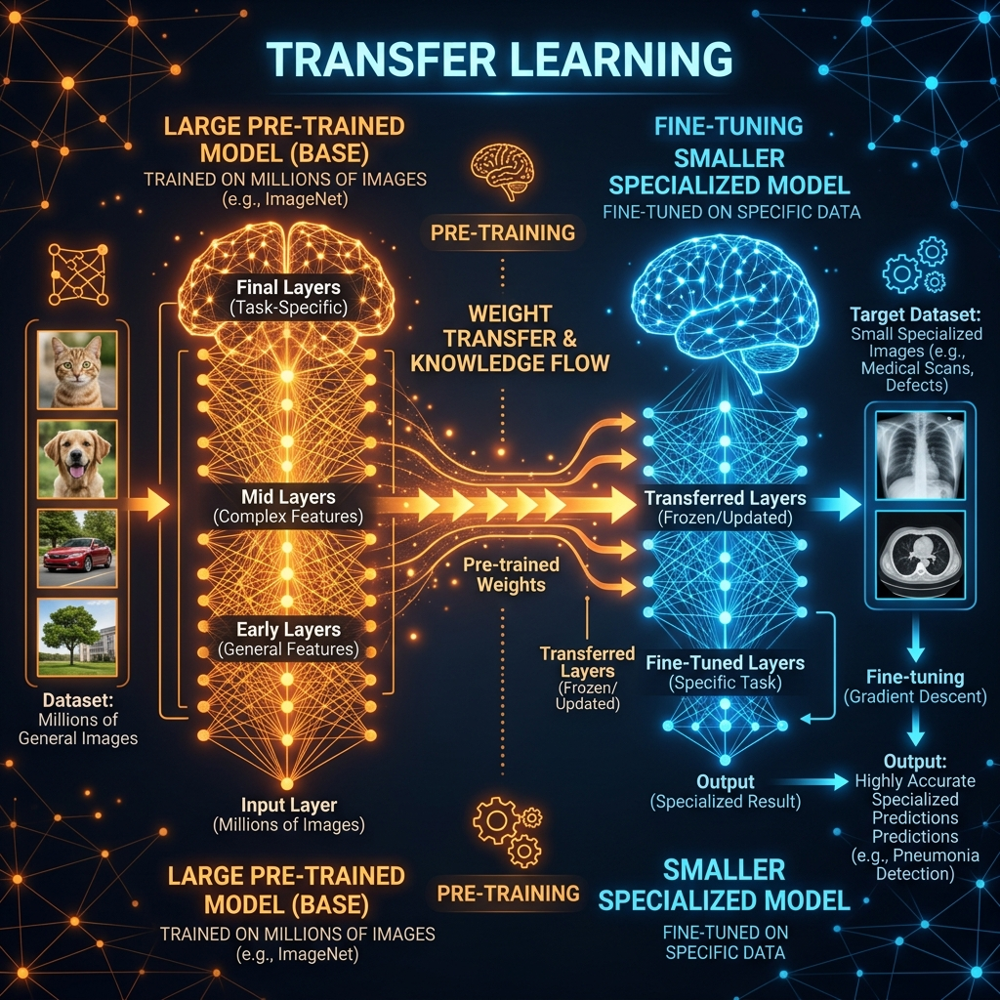

<div align="center">
  
</div>

# Chapter 8: Transfer Learning

**🎯 The Big Goal:** Learn how to take a model that was pre-trained on millions of images and re-purpose it for your own custom task — using only a tiny dataset and a few minutes of training time.

## Core Concepts

Training a deep neural network from scratch requires massive datasets (millions of images) and expensive GPUs running for days or weeks. **Transfer Learning** is the technique of taking a model that has already learned useful patterns and re-using that knowledge for a new, related task.

### The Analogy

Imagine you are an expert chef who has spent 20 years mastering French cuisine. If someone asks you to learn Italian cooking, you don't start from zero — you already know about heat control, seasoning, knife skills, and timing. You just need to learn the new recipes. Transfer Learning works the same way for neural networks.

### How It Works

1. **Start with a Pre-Trained Model:** Take a large CNN (like ResNet, VGG, or MobileNet) that was trained on ImageNet — a dataset of 14 million images across 1,000 categories. This model has already learned universal visual features: edges, textures, shapes, faces, animals, objects.

2. **Freeze the Early Layers:** The early convolutional layers (edge detectors, texture detectors) are universally useful. We "freeze" them — meaning we keep their learned weights and don't update them during training.

3. **Replace the Final Layer:** The original model's output layer predicts 1,000 ImageNet categories. We remove it and add our own layer that predicts only our categories (e.g., 2 classes: "healthy plant" vs. "diseased plant").

4. **Fine-Tune:** Train the model on your small custom dataset. Only the unfrozen layers learn; the frozen layers provide their pre-learned knowledge for free.

---

## 🤔 Reflection Questions

<details>
<summary>💡 View Answer: When should you freeze more vs. fewer layers?</summary>

If your new dataset is **very small** and **similar** to what the model was originally trained on (e.g., different dog breeds), freeze most layers — the pre-learned features are directly relevant. If your dataset is **very different** (e.g., satellite imagery vs. pet photos), unfreeze more layers so the model can adapt its learned features to the new domain. This is sometimes called **fine-tuning depth**.
</details>

<details>
<summary>💡 View Answer: Why is Transfer Learning so popular in industry?</summary>

Because most companies don't have millions of labeled images or weeks of GPU time. Transfer Learning lets a startup with 500 labeled images achieve production-quality accuracy by standing on the shoulders of a model that cost millions of dollars to train. It dramatically reduces time, cost, and data requirements.
</details>

---

## 🐳 Hands-On Exercise: Fine-Tuning a Pre-Trained Model

This exercise demonstrates transfer learning by taking a pre-trained ResNet-18 model and fine-tuning it to distinguish between ants and bees using just ~240 images.

### Step 1: Build the Docker Environment
```bash
cd exercise
docker build -t ch8-transfer-learning .
```

### Step 2: Run
```bash
docker run --rm ch8-transfer-learning
```

### Source Code

```python
import torch
import torch.nn as nn
import torch.optim as optim
from torchvision import models
import numpy as np

print("=== Transfer Learning Demo ===\n")

# 1. Load a pre-trained ResNet-18 (trained on 14M ImageNet images)
print("Loading pre-trained ResNet-18...")
model = models.resnet18(weights=models.ResNet18_Weights.DEFAULT)

# 2. Freeze ALL existing layers
for param in model.parameters():
    param.requires_grad = False

# 3. Replace the final classification layer
# Original: 1000 ImageNet classes → New: 2 classes (ants vs bees)
num_features = model.fc.in_features
model.fc = nn.Linear(num_features, 2)  # Only this layer trains

print(f"Original model output: 1000 classes")
print(f"Modified model output: 2 classes")
print(f"Trainable parameters: {sum(p.numel() for p in model.parameters() if p.requires_grad):,}")
print(f"Frozen parameters:    {sum(p.numel() for p in model.parameters() if not p.requires_grad):,}")

# 4. Simulate training with synthetic data
criterion = nn.CrossEntropyLoss()
optimizer = optim.Adam(model.fc.parameters(), lr=0.001)

print("\nSimulating fine-tuning on 240 ant/bee images...")
for epoch in range(3):
    # Simulated batch: 32 images of 3x224x224
    fake_images = torch.randn(32, 3, 224, 224)
    fake_labels = torch.randint(0, 2, (32,))
    
    optimizer.zero_grad()
    outputs = model(fake_images)
    loss = criterion(outputs, fake_labels)
    loss.backward()
    optimizer.step()
    print(f"  Epoch {epoch+1}/3 — Loss: {loss.item():.4f}")

print("\n✅ Fine-tuning complete!")
print("The model now classifies ants vs bees using knowledge")
print("originally learned from 14 million ImageNet images.")
```

### Dockerfile

```dockerfile
FROM python:3.9-slim
WORKDIR /app
RUN pip install torch torchvision
COPY transfer_learning.py /app/
CMD ["python", "transfer_learning.py"]
```
