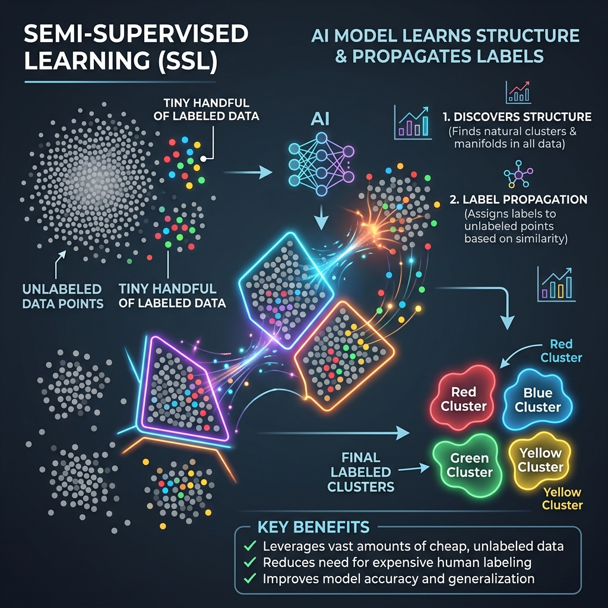

<div align="center">
  
</div>

# Chapter 9: Semi-Supervised Learning

**🎯 The Big Goal:** Learn how to train powerful AI models when you have very few labeled examples but mountains of unlabeled data — by combining supervised and unsupervised techniques.

## Core Concepts

In the real world, **labeling data is expensive**. Hiring humans to tag millions of medical images as "cancerous" or "healthy" costs a fortune. But collecting raw, unlabeled images is easy and cheap. Semi-Supervised Learning (SSL) bridges this gap.

### The Three Learning Paradigms

1. **Supervised Learning:** Every data point has a label (e.g., "This email is spam"). Highly accurate but requires massive labeling effort.
2. **Unsupervised Learning:** No labels at all. The model finds hidden structure (clusters, patterns) on its own.
3. **Semi-Supervised Learning:** A tiny fraction of data is labeled (e.g., 50 images), and a huge pool is unlabeled (e.g., 50,000 images). The model uses both.

### Key Technique: Label Propagation

One of the simplest SSL methods is **Label Propagation**. It works like rumors spreading through a social network:
1. Start with a few "seed" nodes that have labels.
2. Each labeled node passes its label to its nearest neighbors (based on similarity/distance).
3. Neighbors propagate further, gradually labeling the entire dataset.
4. The process continues until the labels stabilize.

Data points that are close together in feature space are assumed to share the same label — this is called the **smoothness assumption**.

---

## 🤔 Reflection Questions

<details>
<summary>💡 View Answer: Why does Semi-Supervised Learning work at all?</summary>

It relies on key assumptions about data structure: (1) **Smoothness** — nearby points likely share the same label, (2) **Cluster** — data naturally forms clusters, and all points in a cluster share labels, and (3) **Manifold** — high-dimensional data actually lives on a lower-dimensional surface. If these assumptions hold (and they often do for real-world data), the unlabeled data helps the model learn the shape of the data distribution, improving decision boundaries.
</details>

<details>
<summary>💡 View Answer: When would Semi-Supervised Learning fail?</summary>

When the assumptions break down. If classes are heavily overlapping with no clear cluster structure, propagating labels from a few seed points will spread incorrect labels. Also, if the labeled examples are not representative of the full data distribution (e.g., all labeled examples come from one subgroup), the model will learn a biased view.
</details>

---

## 🐳 Hands-On Exercise: Label Propagation Classifier

This exercise demonstrates semi-supervised learning using scikit-learn's Label Propagation. We label only 10% of a dataset and let the algorithm propagate labels to the rest.

### Step 1: Build the Docker Environment
```bash
cd exercise
docker build -t ch9-semi-supervised .
```

### Step 2: Run
```bash
docker run --rm ch9-semi-supervised
```

### Source Code

```python
import numpy as np
from sklearn.datasets import make_moons
from sklearn.semi_supervised import LabelPropagation
from sklearn.metrics import accuracy_score

print("=== Semi-Supervised Learning: Label Propagation ===\n")

# 1. Generate a synthetic dataset (two interleaving half-moons)
X, y_true = make_moons(n_samples=500, noise=0.1, random_state=42)
print(f"Total data points: {len(X)}")

# 2. Simulate the real-world scenario: label only 10% of the data
rng = np.random.RandomState(42)
labeled_mask = rng.rand(len(X)) < 0.10  # ~10% labeled

y_partial = y_true.copy()
y_partial[~labeled_mask] = -1  # -1 means "unlabeled" in scikit-learn

labeled_count = (y_partial != -1).sum()
unlabeled_count = (y_partial == -1).sum()
print(f"Labeled samples: {labeled_count} ({100*labeled_count/len(X):.0f}%)")
print(f"Unlabeled samples: {unlabeled_count} ({100*unlabeled_count/len(X):.0f}%)")

# 3. Train the Label Propagation model
print("\nTraining Label Propagation model...")
model = LabelPropagation(kernel='rbf', gamma=20)
model.fit(X, y_partial)

# 4. Evaluate: How well did it label the unlabeled points?
y_predicted = model.predict(X)
accuracy_all = accuracy_score(y_true, y_predicted)
accuracy_unlabeled = accuracy_score(y_true[~labeled_mask], y_predicted[~labeled_mask])

print(f"\n📊 Results:")
print(f"  Overall accuracy:    {accuracy_all*100:.1f}%")
print(f"  Accuracy on unlabeled points: {accuracy_unlabeled*100:.1f}%")
print(f"\n✅ With only {labeled_count} labeled points, the model correctly")
print(f"   classified {accuracy_unlabeled*100:.1f}% of the {unlabeled_count} unlabeled points!")
```

### Dockerfile

```dockerfile
FROM python:3.9-slim
WORKDIR /app
RUN pip install numpy scikit-learn
COPY semi_supervised.py /app/
CMD ["python", "semi_supervised.py"]
```
