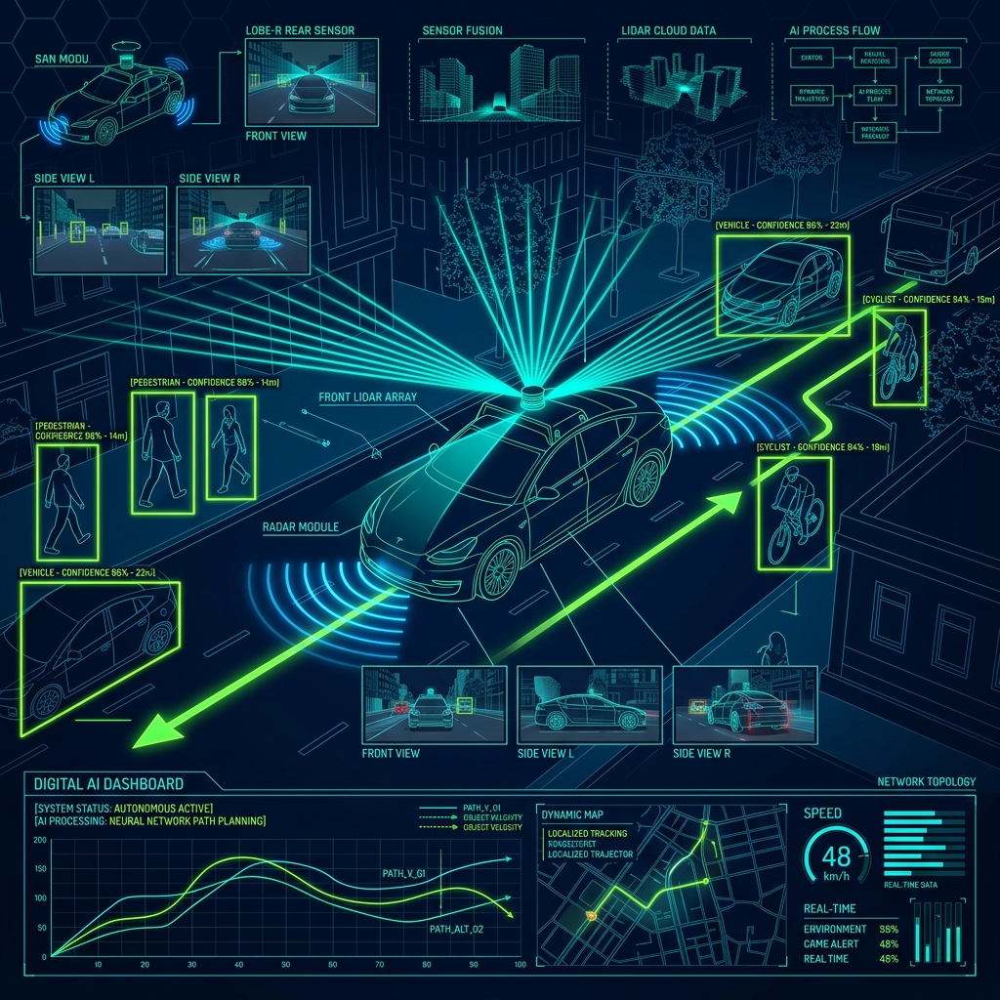

<div align="center">
  
</div>

# Chapter 10: Autonomous Vehicles & Robotics

**🎯 The Big Goal:** Understand how self-driving cars perceive the world by fusing data from cameras, LiDAR, and radar — and build a simple obstacle avoidance system that makes decisions based on sensor readings.

## Core Concepts

An autonomous vehicle (AV) must continuously answer three questions: **Where am I?** (Localization), **What is around me?** (Perception), and **What should I do next?** (Planning & Control). This chapter focuses on Perception — the AI's ability to understand its surroundings.

### The Sensor Suite

No single sensor is perfect. AVs combine multiple sensors to compensate for each other's weaknesses:

| Sensor | Strengths | Weaknesses |
|--------|-----------|------------|
| **Camera** | Color, texture, reads signs & lights | No depth, fails in rain/glare |
| **LiDAR** | Precise 3D depth map (point cloud) | Colorblind, expensive, struggles in fog |
| **Radar** | Works in all weather, detects speed | Low resolution, can't distinguish shapes |

### Sensor Fusion

The AI combines all sensor streams into a single unified understanding of the world. This is called **Sensor Fusion**. The most critical step is temporal synchronization — aligning data from sensors that operate at different frequencies (camera at 60 Hz, LiDAR at 10 Hz, radar at 20 Hz) so the AI analyzes the exact same moment in time.

### The Decision Pipeline

1. **Detect** objects (pedestrians, cars, signs) using CNNs on camera images.
2. **Localize** objects in 3D space using LiDAR point clouds.
3. **Track** objects across frames to predict their trajectories.
4. **Plan** a safe path that avoids all obstacles.
5. **Control** the steering, throttle, and brakes to follow the plan.

---

## 🤔 Reflection Questions

<details>
<summary>💡 View Answer: Why can't a self-driving car rely on cameras alone?</summary>

Cameras provide rich visual information but lack native depth perception — a flat photograph of a car and an actual approaching car look identical. Cameras also fail in adverse conditions: direct sunlight causes glare, rain distorts the image, and nighttime dramatically reduces visibility. LiDAR and radar provide depth and all-weather capability that cameras cannot.
</details>

<details>
<summary>💡 View Answer: What is a "point cloud" and why is it useful?</summary>

A point cloud is a set of thousands or millions of 3D coordinates (x, y, z) generated by LiDAR. Each point represents where a laser beam bounced off a surface. Together, they form a 3D "skeleton" of the environment. Unlike a 2D image, a point cloud gives precise distances to every object, making it ideal for collision avoidance and path planning.
</details>

---

## 🐳 Hands-On Exercise: Simple Obstacle Avoidance

This exercise simulates a basic autonomous navigation system. A virtual robot receives sensor readings (distances to obstacles) and uses a rule-based controller to navigate safely.

### Step 1: Build the Docker Environment
```bash
cd exercise
docker build -t ch10-autonomous-vehicle .
```

### Step 2: Run
```bash
docker run --rm ch10-autonomous-vehicle
```

### Source Code

```python
import random
import time

class AutonomousVehicle:
    def __init__(self):
        self.x, self.y = 0, 0
        self.heading = "NORTH"
        self.speed = 0
        self.steps = 0
    
    def read_sensors(self):
        """Simulate LiDAR/Radar readings: distance to nearest obstacle in each direction"""
        return {
            "front": random.uniform(0.5, 20.0),
            "left":  random.uniform(0.5, 20.0),
            "right": random.uniform(0.5, 20.0),
            "rear":  random.uniform(2.0, 20.0),
        }
    
    def decide_action(self, sensors):
        """Rule-based obstacle avoidance (like a simple planning module)"""
        DANGER_ZONE = 3.0  # meters

        if sensors["front"] > DANGER_ZONE:
            return "ACCELERATE", "Path clear ahead"
        elif sensors["left"] > sensors["right"] and sensors["left"] > DANGER_ZONE:
            return "TURN_LEFT", "Obstacle ahead, left is clear"
        elif sensors["right"] > DANGER_ZONE:
            return "TURN_RIGHT", "Obstacle ahead, right is clear"
        else:
            return "BRAKE", "Obstacles on all sides — emergency stop!"
    
    def execute(self, action):
        directions = ["NORTH", "EAST", "SOUTH", "WEST"]
        idx = directions.index(self.heading)
        
        if action == "ACCELERATE":
            self.speed = min(self.speed + 10, 60)
        elif action == "TURN_LEFT":
            self.heading = directions[(idx - 1) % 4]
            self.speed = max(self.speed - 5, 10)
        elif action == "TURN_RIGHT":
            self.heading = directions[(idx + 1) % 4]
            self.speed = max(self.speed - 5, 10)
        elif action == "BRAKE":
            self.speed = 0
        
        self.steps += 1

# Run simulation
av = AutonomousVehicle()
print("=== Autonomous Vehicle Simulation ===\n")

for step in range(10):
    sensors = av.read_sensors()
    action, reason = av.decide_action(sensors)
    av.execute(action)
    
    print(f"Step {step+1:2d} | Sensors: F={sensors['front']:5.1f}m L={sensors['left']:5.1f}m R={sensors['right']:5.1f}m")
    print(f"         Action: {action:12s} | Reason: {reason}")
    print(f"         Speed: {av.speed} km/h | Heading: {av.heading}\n")

print(f"✅ Vehicle navigated {av.steps} steps safely!")
```

### Dockerfile

```dockerfile
FROM python:3.9-alpine
WORKDIR /app
COPY av_simulation.py /app/
CMD ["python", "av_simulation.py"]
```
