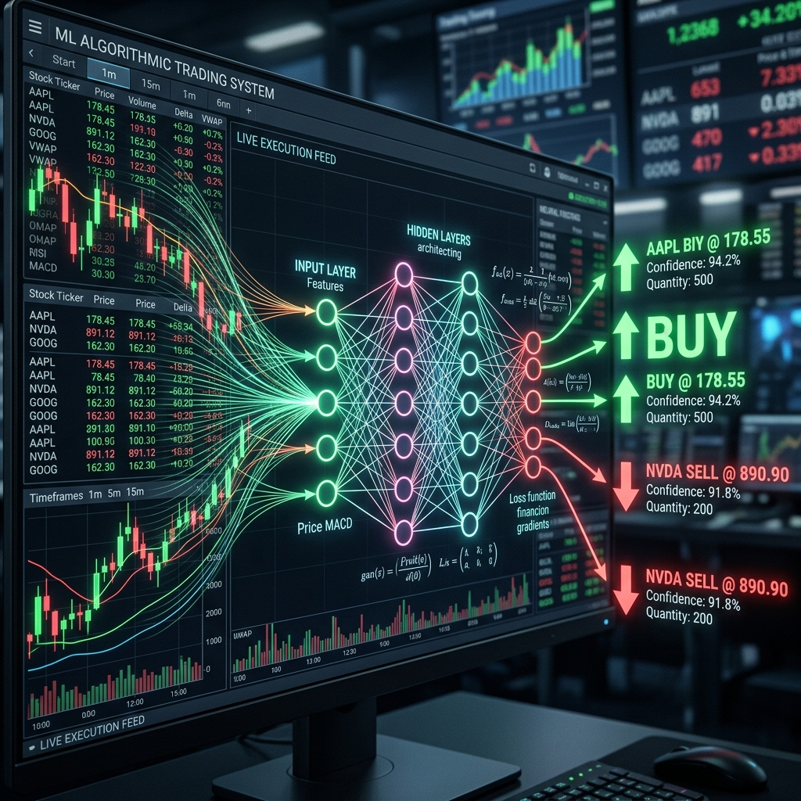

<div align="center">
  
</div>

# Chapter 11: Machine Learning for Algorithmic Trading

**🎯 The Big Goal:** Understand how machine learning models can analyze historical market data to generate trading signals — and build a simple moving-average crossover strategy that backtests itself on simulated stock prices.

## Core Concepts

Algorithmic trading uses computer programs to execute trades at speeds and frequencies impossible for a human. When you add Machine Learning, the system can learn patterns from historical data and adapt its strategy — moving beyond hard-coded rules.

### The Trading Pipeline

1. **Data Collection:** Gather historical price data — open, high, low, close prices (OHLC), volume, and timestamps for every trading day.
2. **Feature Engineering:** Transform raw prices into meaningful signals the model can learn from — examples include Moving Averages, RSI (Relative Strength Index), MACD, and Bollinger Bands.
3. **Model Training:** Train a classifier or regressor to predict whether the price will go **up** or **down** tomorrow based on today's features.
4. **Backtesting:** Simulate your strategy on historical data to measure profit/loss without risking real money.
5. **Execution:** If the backtest is profitable, deploy the model to trade with real capital (with strict risk management).

### Moving Average Crossover Strategy

One of the simplest and most classic strategies:
- Calculate a **short-term moving average** (e.g., 10-day SMA) and a **long-term moving average** (e.g., 50-day SMA).
- **BUY signal:** When the short MA crosses above the long MA (momentum is building).
- **SELL signal:** When the short MA crosses below the long MA (momentum is fading).

---

## 🤔 Reflection Questions

<details>
<summary>💡 View Answer: Why is backtesting not a guarantee of future performance?</summary>

Historical data only represents one version of the past. Markets are non-stationary — the statistical patterns that existed in 2020 may not exist in 2025. **Overfitting** to historical data is the biggest danger: a model might "memorize" past patterns that were just noise, not real signals. Additionally, backtesting doesn't account for slippage, transaction costs, or market impact of large orders.
</details>

<details>
<summary>💡 View Answer: What is the difference between fundamental and technical analysis?</summary>

**Fundamental analysis** values a company based on its financial health — revenue, profit, debt, growth potential. **Technical analysis** ignores the company entirely and studies only the price chart — patterns, trends, volume, and momentum indicators. Machine Learning for trading typically uses technical analysis features because they are numerical and easy to compute, but some advanced models incorporate fundamental data as well.
</details>

---

## 🐳 Hands-On Exercise: Moving Average Crossover Backtest

This exercise generates simulated stock prices, applies the Moving Average Crossover strategy, and reports the profit or loss.

### Step 1: Build the Docker Environment
```bash
cd exercise
docker build -t ch11-algo-trading .
```

### Step 2: Run
```bash
docker run --rm ch11-algo-trading
```

### Source Code

```python
import numpy as np

print("=== Algorithmic Trading: Moving Average Crossover ===\n")

# 1. Generate simulated stock prices (random walk with drift)
np.random.seed(42)
days = 252  # One trading year
returns = np.random.normal(loc=0.0005, scale=0.02, size=days)
prices = 100 * np.cumprod(1 + returns)

print(f"Simulated {days} trading days")
print(f"Starting price: ${prices[0]:.2f}")
print(f"Ending price:   ${prices[-1]:.2f}")

# 2. Calculate Moving Averages
short_window = 10
long_window = 50

short_ma = np.convolve(prices, np.ones(short_window)/short_window, mode='valid')
long_ma = np.convolve(prices, np.ones(long_window)/long_window, mode='valid')

# Align arrays (trim to same length)
min_len = min(len(short_ma), len(long_ma))
short_ma = short_ma[-min_len:]
long_ma = long_ma[-min_len:]
aligned_prices = prices[-min_len:]

# 3. Generate signals
signals = np.where(short_ma > long_ma, 1, -1)  # 1 = long, -1 = short

# 4. Backtest
daily_returns = np.diff(aligned_prices) / aligned_prices[:-1]
strategy_returns = signals[:-1] * daily_returns

cumulative_market = np.cumprod(1 + daily_returns) - 1
cumulative_strategy = np.cumprod(1 + strategy_returns) - 1

buy_signals = np.sum(np.diff(signals) > 0)
sell_signals = np.sum(np.diff(signals) < 0)

print(f"\n📊 Backtest Results:")
print(f"  Buy signals generated:  {buy_signals}")
print(f"  Sell signals generated: {sell_signals}")
print(f"  Market return (buy & hold): {cumulative_market[-1]*100:+.2f}%")
print(f"  Strategy return:            {cumulative_strategy[-1]*100:+.2f}%")

if cumulative_strategy[-1] > cumulative_market[-1]:
    print("\n✅ Strategy BEAT the market!")
else:
    print("\n📉 Strategy underperformed the market this time.")
    print("   (This is expected — no strategy wins every time!)")
```

### Dockerfile

```dockerfile
FROM python:3.9-alpine
WORKDIR /app
RUN pip install numpy
COPY algo_trading.py /app/
CMD ["python", "algo_trading.py"]
```
