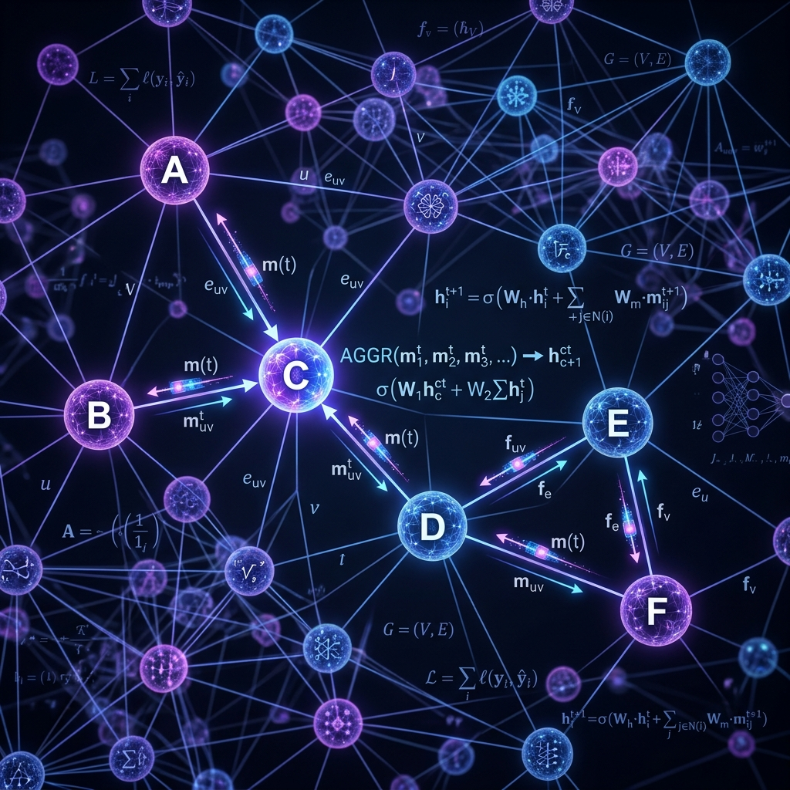

<div align="center">
  
</div>

# Chapter 12: Graph Neural Networks

**🎯 The Big Goal:** Understand how neural networks can learn from graph-structured data (social networks, molecules, knowledge bases) where relationships between entities matter as much as the entities themselves.

## Core Concepts

Traditional neural networks work on grids (images) or sequences (text). But what about data that is naturally a **graph** — a collection of nodes connected by edges? Social networks (users connected by friendships), molecules (atoms connected by bonds), and the internet (pages connected by hyperlinks) are all graphs.

### What Makes Graphs Special?

Unlike images (which have a fixed grid structure) or sentences (which have a linear order), graphs have:
- **No fixed size:** A graph can have 5 nodes or 5 million.
- **No fixed order:** There's no "first" node — you can start anywhere.
- **Variable connectivity:** One node might have 2 neighbors, another might have 2,000.

This means we can't just flatten a graph into a vector and feed it to a regular neural network. We need a new architecture.

### Message Passing

The key idea behind Graph Neural Networks (GNNs) is **message passing**:

1. Each node starts with its own feature vector (e.g., a user's age, location, interests).
2. In each round, every node **collects messages** from its neighbors (their feature vectors).
3. Each node **aggregates** these messages (e.g., by averaging or summing them).
4. Each node **updates** its own feature vector using its current state plus the aggregated neighbor information.
5. After several rounds, each node's feature vector encodes information about its entire local neighborhood.

This is like asking everyone at a party to tell you about themselves, then using that information to understand the social dynamics of the group.

---

## 🤔 Reflection Questions

<details>
<summary>💡 View Answer: What is the difference between node classification and graph classification?</summary>

**Node classification** predicts a label for each individual node (e.g., "Is this social media account a bot or a real person?"). **Graph classification** predicts a label for the entire graph (e.g., "Is this molecule toxic or safe?"). Node classification uses the learned node embeddings directly; graph classification aggregates all node embeddings into a single graph-level vector (via pooling) before making a prediction.
</details>

<details>
<summary>💡 View Answer: How many rounds of message passing are typical?</summary>

Usually 2–5 rounds (layers). Each round expands how far each node can "see" into the graph. With 1 round, a node knows about its direct neighbors. With 2 rounds, it knows about neighbors-of-neighbors. Too many rounds can cause **over-smoothing** — every node ends up with nearly identical representations because information has spread everywhere, washing out local distinctiveness.
</details>

---

## 🐳 Hands-On Exercise: Message Passing from Scratch

This exercise implements the core message passing algorithm on a small social network graph using pure Python/NumPy — no external graph libraries needed.

### Step 1: Build the Docker Environment
```bash
cd exercise
docker build -t ch12-gnn .
```

### Step 2: Run
```bash
docker run --rm ch12-gnn
```

### Source Code

```python
import numpy as np

print("=== Graph Neural Networks: Message Passing ===\n")

# 1. Define a small social network graph
#    Nodes: 0=Alice, 1=Bob, 2=Carol, 3=Dave, 4=Eve
node_names = ["Alice", "Bob", "Carol", "Dave", "Eve"]

# Adjacency matrix (1 = connected, 0 = not connected)
A = np.array([
    [0, 1, 1, 0, 0],  # Alice → Bob, Carol
    [1, 0, 1, 1, 0],  # Bob → Alice, Carol, Dave
    [1, 1, 0, 0, 1],  # Carol → Alice, Bob, Eve
    [0, 1, 0, 0, 1],  # Dave → Bob, Eve
    [0, 0, 1, 1, 0],  # Eve → Carol, Dave
])

# 2. Initial node features (e.g., [age_normalized, activity_score])
H = np.array([
    [0.2, 0.9],  # Alice: young, very active
    [0.5, 0.3],  # Bob: middle, low active
    [0.8, 0.7],  # Carol: older, active
    [0.3, 0.1],  # Dave: young, inactive
    [0.6, 0.5],  # Eve: middle, moderate
])

print("Initial Node Features:")
for i, name in enumerate(node_names):
    print(f"  {name}: {H[i]}")

# 3. Simple Message Passing (2 rounds)
W = np.random.RandomState(42).randn(2, 2) * 0.5  # Learnable weight matrix

for round_num in range(2):
    # Add self-loops (each node also sends a message to itself)
    A_hat = A + np.eye(len(A))
    
    # Normalize by degree (so high-degree nodes don't dominate)
    D = np.diag(1.0 / A_hat.sum(axis=1))
    
    # Message passing: aggregate neighbor features, transform, activate
    H = np.tanh(D @ A_hat @ H @ W)
    
    print(f"\nAfter Round {round_num + 1}:")
    for i, name in enumerate(node_names):
        print(f"  {name}: [{H[i][0]:+.4f}, {H[i][1]:+.4f}]")

# 4. Show which nodes are most similar after message passing
print("\n📊 Node Similarity (cosine) after message passing:")
for i in range(len(node_names)):
    for j in range(i+1, len(node_names)):
        cos_sim = np.dot(H[i], H[j]) / (np.linalg.norm(H[i]) * np.linalg.norm(H[j]))
        marker = "🔗" if A[i][j] == 1 else "  "
        print(f"  {marker} {node_names[i]:6s} ↔ {node_names[j]:6s}: {cos_sim:.4f}")

print("\n✅ Connected nodes (🔗) should have higher similarity!")
```

### Dockerfile

```dockerfile
FROM python:3.9-alpine
WORKDIR /app
RUN pip install numpy
COPY gnn_message_passing.py /app/
CMD ["python", "gnn_message_passing.py"]
```
