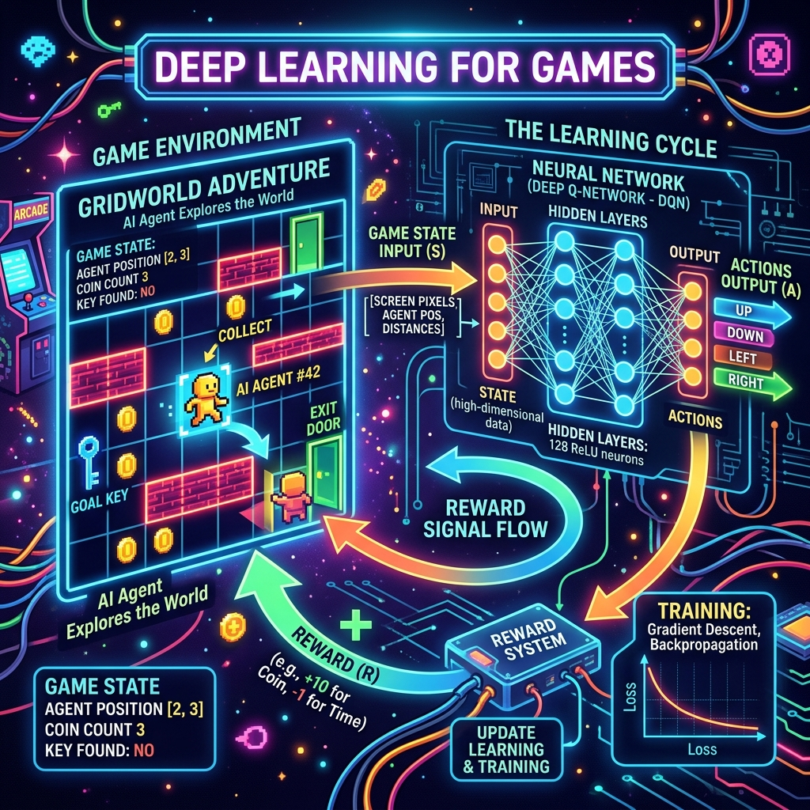

<div align="center">
  
</div>

# Chapter 13: Deep Learning for Games

**🎯 The Big Goal:** Understand how Deep Q-Networks (DQN) combine deep learning with reinforcement learning to teach AI agents to play games — and build an agent that learns to collect coins in a grid world entirely through trial and error.

## Core Concepts

In Chapter 3, we learned basic Q-Learning using a Q-table. But Q-tables don't scale — a game with a 100×100 grid has 10,000 possible states, and with multiple objects, the state space explodes into millions. **Deep Q-Networks (DQN)** solve this by replacing the Q-table with a neural network that approximates Q-values.

### From Q-Table to Q-Network

| Q-Table | Deep Q-Network |
|---------|----------------|
| A lookup table with one row per state | A neural network that takes any state as input |
| Fails when states are numerous | Generalizes to unseen states |
| Works for tiny environments | Works for complex games (Atari, Chess) |

### How DQN Works

1. **State Input:** The game state (e.g., player position, coin positions) is fed into a neural network.
2. **Q-Value Output:** The network outputs one Q-value per possible action (up, down, left, right). Each Q-value estimates the total future reward for taking that action.
3. **Action Selection:** The agent usually picks the action with the highest Q-value (**exploitation**), but sometimes picks randomly (**exploration**) to discover new strategies.
4. **Learning:** After taking an action and receiving a reward, the agent stores the experience in a **replay buffer**. During training, it samples random batches from this buffer to update the neural network — this is called **Experience Replay**.

### Why Experience Replay?

Without it, the network would train on highly correlated sequential data (step 1, step 2, step 3...), which causes unstable learning. By sampling random past experiences, we break the correlation and train more stably — similar to shuffling training data in supervised learning.

---

## 🤔 Reflection Questions

<details>
<summary>💡 View Answer: What is the exploration-exploitation dilemma in game AI?</summary>

**Exploitation** means doing what the agent already thinks is best (highest Q-value). **Exploration** means trying random actions to discover potentially better strategies. Too much exploitation → the agent gets stuck in a suboptimal strategy. Too much exploration → the agent never masters any strategy. The standard solution is **epsilon-greedy**: start with high exploration (ε = 1.0), then gradually reduce it (ε → 0.01) so the agent explores early and exploits later.
</details>

<details>
<summary>💡 View Answer: How did DeepMind's DQN beat Atari games?</summary>

DeepMind's 2015 DQN took raw pixel screenshots of Atari games as input (no hand-engineered features), fed them through a CNN to extract visual features, and output Q-values for each joystick action. The key innovations were: (1) **Experience Replay** for stable training, (2) a **Target Network** (a frozen copy of the Q-network updated periodically) to prevent feedback loops, and (3) training on 50 million frames per game. It achieved superhuman performance on 29 of 49 Atari games.
</details>

---

## 🐳 Hands-On Exercise: Coin Collector Grid World

This exercise builds a DQN agent that learns to navigate a 5×5 grid and collect a coin. The agent receives +10 reward for collecting the coin and -1 for each step (to encourage efficiency).

### Step 1: Build the Docker Environment
```bash
cd exercise
docker build -t ch13-game-ai .
```

### Step 2: Run
```bash
docker run --rm ch13-game-ai
```

### Source Code

```python
import numpy as np
import random
from collections import deque

print("=== Deep Learning for Games: Coin Collector DQN ===\n")

# 1. Simple Grid World Environment
class CoinGrid:
    def __init__(self, size=5):
        self.size = size
        self.reset()
    
    def reset(self):
        self.agent = [0, 0]
        self.coin = [self.size-1, self.size-1]
        return self._get_state()
    
    def _get_state(self):
        return tuple(self.agent + self.coin)
    
    def step(self, action):
        # Actions: 0=up, 1=down, 2=left, 3=right
        moves = [(-1,0), (1,0), (0,-1), (0,1)]
        dr, dc = moves[action]
        self.agent[0] = max(0, min(self.size-1, self.agent[0] + dr))
        self.agent[1] = max(0, min(self.size-1, self.agent[1] + dc))
        
        if self.agent == self.coin:
            return self._get_state(), 10.0, True
        return self._get_state(), -1.0, False

# 2. Simple Q-Network (using NumPy — no PyTorch needed!)
class SimpleQNet:
    def __init__(self, state_size, action_size, hidden=32):
        self.W1 = np.random.randn(state_size, hidden) * 0.1
        self.b1 = np.zeros(hidden)
        self.W2 = np.random.randn(hidden, action_size) * 0.1
        self.b2 = np.zeros(action_size)
        self.lr = 0.01
    
    def predict(self, state):
        state = np.array(state, dtype=float)
        self.h = np.maximum(0, state @ self.W1 + self.b1)  # ReLU
        return self.h @ self.W2 + self.b2
    
    def train(self, state, target_q):
        pred_q = self.predict(state)
        error = pred_q - target_q
        # Backprop through output layer
        dW2 = np.outer(self.h, error)
        db2 = error
        # Backprop through hidden layer
        dh = error @ self.W2.T * (self.h > 0)
        state = np.array(state, dtype=float)
        dW1 = np.outer(state, dh)
        db1 = dh
        # Update weights
        self.W2 -= self.lr * dW2
        self.b2 -= self.lr * db2
        self.W1 -= self.lr * dW1
        self.b1 -= self.lr * db1

# 3. Training Loop
env = CoinGrid(size=5)
qnet = SimpleQNet(state_size=4, action_size=4)
replay_buffer = deque(maxlen=5000)

epsilon = 1.0
gamma = 0.95
episodes = 500

wins = 0
recent_rewards = deque(maxlen=50)

for ep in range(episodes):
    state = env.reset()
    total_reward = 0
    
    for step in range(50):  # Max 50 steps per episode
        # Epsilon-greedy action selection
        if random.random() < epsilon:
            action = random.randint(0, 3)
        else:
            q_vals = qnet.predict(state)
            action = np.argmax(q_vals)
        
        next_state, reward, done = env.step(action)
        replay_buffer.append((state, action, reward, next_state, done))
        total_reward += reward
        state = next_state
        
        # Train on a random experience
        if len(replay_buffer) > 32:
            s, a, r, ns, d = random.choice(replay_buffer)
            target = qnet.predict(s).copy()
            if d:
                target[a] = r
            else:
                target[a] = r + gamma * np.max(qnet.predict(ns))
            qnet.train(s, target)
        
        if done:
            wins += 1
            break
    
    recent_rewards.append(total_reward)
    epsilon = max(0.01, epsilon * 0.995)
    
    if (ep + 1) % 100 == 0:
        avg_reward = np.mean(recent_rewards)
        print(f"Episode {ep+1:4d} | Avg Reward: {avg_reward:6.1f} | Epsilon: {epsilon:.3f} | Wins: {wins}")

print(f"\n✅ Agent won {wins}/{episodes} episodes!")
print(f"   Final average reward: {np.mean(recent_rewards):.1f}")
```

### Dockerfile

```dockerfile
FROM python:3.9-alpine
WORKDIR /app
RUN pip install numpy
COPY game_dqn.py /app/
CMD ["python", "game_dqn.py"]
```
