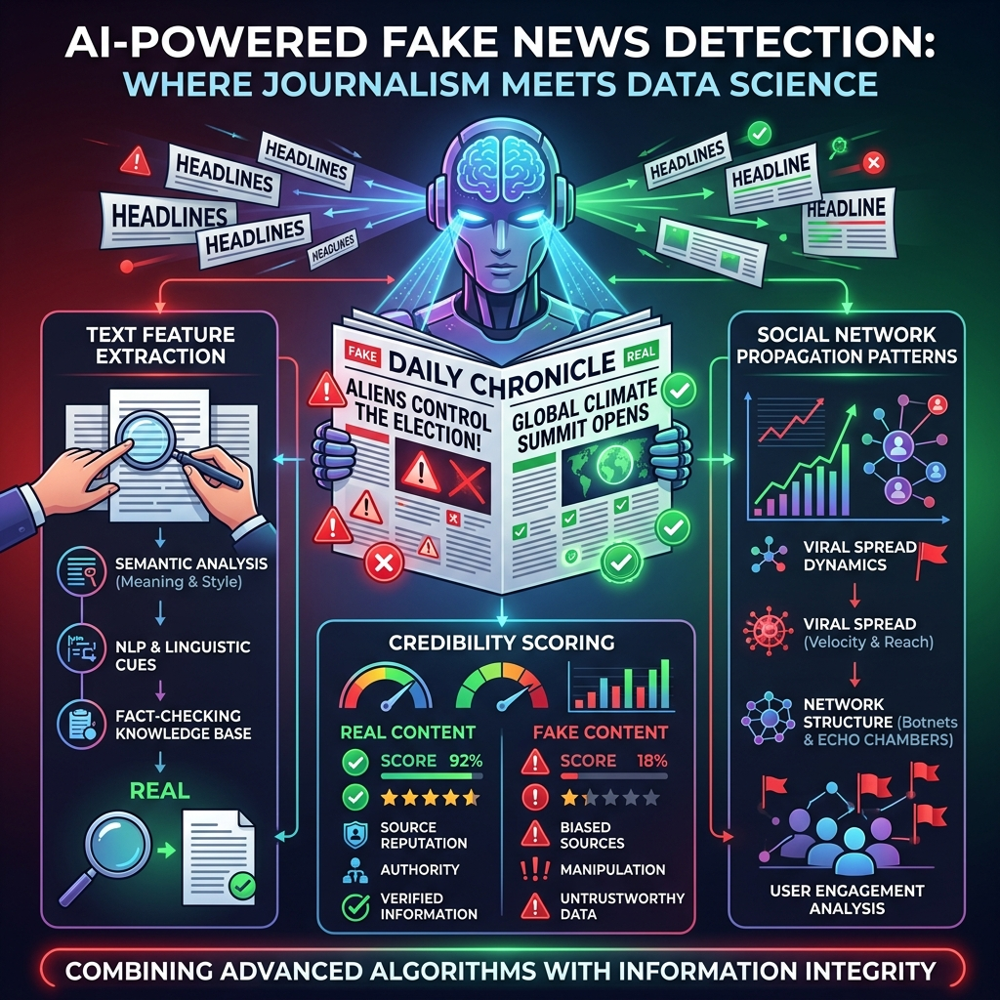

<div align="center">
  
</div>

# Chapter 16: Fake News Detection

**🎯 The Big Goal:** Learn how NLP and machine learning can automatically distinguish real news from fake news by analyzing linguistic patterns, writing style, and source credibility signals.

## Core Concepts

Misinformation spreads 6x faster than real news on social media. **Fake News Detection** uses AI to automatically flag unreliable content before it goes viral.

### How AI Detects Fake News

1. **Linguistic Features:** Fake news uses more sensational language ("SHOCKING!", "You won't BELIEVE"), more capital letters, more exclamation marks, and more emotional words.
2. **Source Analysis:** Real news comes from established outlets with editorial standards. AI can learn source reputation patterns.
3. **Propagation Patterns:** Fake news spreads differently — it often originates from bot networks and spreads through echo chambers.
4. **Fact Verification:** Advanced systems cross-reference claims against knowledge bases.

### TF-IDF: The Workhorse of Text Classification

**Term Frequency-Inverse Document Frequency** converts text into numbers:
- **TF:** How often a word appears in one document.
- **IDF:** How rare a word is across all documents.
- Words that are frequent in one document but rare overall get high TF-IDF scores — they're distinctive.

---

## 🤔 Reflection Questions

<details>
<summary>💡 View Answer: Can AI completely solve the fake news problem?</summary>

No. AI can flag likely fake content, but the problem is fundamentally social, not technical. Sophisticated disinformation blends true and false information, uses real sources selectively, and exploits cognitive biases. Satire and opinion pieces add ambiguity. AI is a tool in the fight against misinformation, but media literacy, editorial standards, and platform policies are equally important.
</details>

<details>
<summary>💡 View Answer: What is the danger of false positives in fake news detection?</summary>

Incorrectly flagging real news as fake is dangerous — it can silence legitimate journalism, reinforce censorship, and erode trust in media. This is why real-world systems use confidence thresholds and human review rather than fully automated removal.
</details>

---

## 🐳 Hands-On Exercise: TF-IDF Fake News Classifier

### Step 1: Build
```bash
cd exercise
docker build -t ch16-fake-news .
```

### Step 2: Run
```bash
docker run --rm ch16-fake-news
```

### Dockerfile
```dockerfile
FROM python:3.9-slim
WORKDIR /app
RUN pip install numpy scikit-learn
COPY fake_news.py /app/
CMD ["python", "fake_news.py"]
```

### Source Code

```python
import numpy as np
from sklearn.feature_extraction.text import TfidfVectorizer
from sklearn.linear_model import LogisticRegression
from sklearn.metrics import accuracy_score, classification_report

print("=== Fake News Detection: TF-IDF + Classifier ===\n")

# Simulated news dataset
real_news = [
    "Scientists discover new treatment for heart disease in clinical trial",
    "Stock market rises 2% following positive economic data report",
    "New renewable energy plant opens providing power to 50000 homes",
    "Research shows regular exercise reduces risk of chronic disease",
    "International summit addresses climate change with new agreements",
    "University study finds link between sleep quality and productivity",
    "City council approves budget for new public transportation system",
    "Medical journal publishes peer reviewed study on vaccine efficacy",
    "Technology company reports quarterly earnings beating expectations",
    "Archaeological team discovers ancient artifacts dating back 3000 years",
]

fake_news = [
    "SHOCKING aliens secretly control world governments revealed insider",
    "This ONE weird trick will make you a millionaire overnight guaranteed",
    "BREAKING celebrity secretly a lizard person sources confirm",
    "Doctors HATE this miracle cure big pharma doesnt want you to know",
    "URGENT share before deleted government hiding truth from citizens",
    "You wont BELIEVE what scientists found will blow your mind",
    "SECRET footage proves moon landing was filmed in Hollywood studio",
    "AMAZING new pill lets you eat anything and lose 50 pounds instantly",
    "EXPOSED the real reason they dont want you to know the truth",
    "TERRIFYING discovery proves everything you know is a lie wake up",
]

texts = real_news + fake_news
labels = [0]*len(real_news) + [1]*len(fake_news)  # 0=real, 1=fake

vectorizer = TfidfVectorizer(max_features=100, stop_words='english')
X = vectorizer.fit_transform(texts)

model = LogisticRegression(max_iter=200)
model.fit(X, labels)

print("📊 Training Results:")
predictions = model.predict(X)
print(f"   Accuracy: {accuracy_score(labels, predictions)*100:.0f}%\n")

# Show most indicative words
feature_names = vectorizer.get_feature_names_out()
coef = model.coef_[0]
fake_words = sorted(zip(coef, feature_names), reverse=True)[:5]
real_words = sorted(zip(coef, feature_names))[:5]

print("🔴 Top words indicating FAKE news:")
for score, word in fake_words:
    print(f"   {word:20s} (score: {score:+.3f})")

print("\n🟢 Top words indicating REAL news:")
for score, word in real_words:
    print(f"   {word:20s} (score: {score:+.3f})")

# Test on new headlines
test_articles = [
    "New study published in Nature reveals promising cancer treatment results",
    "SHOCKING you wont believe this secret cure doctors are hiding from you",
]
print("\n📰 Testing on new articles:")
for article in test_articles:
    X_new = vectorizer.transform([article])
    pred = model.predict(X_new)[0]
    prob = model.predict_proba(X_new)[0]
    label = "🔴 FAKE" if pred == 1 else "🟢 REAL"
    print(f"   {label} ({max(prob)*100:.0f}% confidence): {article[:60]}...")

print("\n✅ The classifier learns linguistic patterns that distinguish fake from real news!")
```
