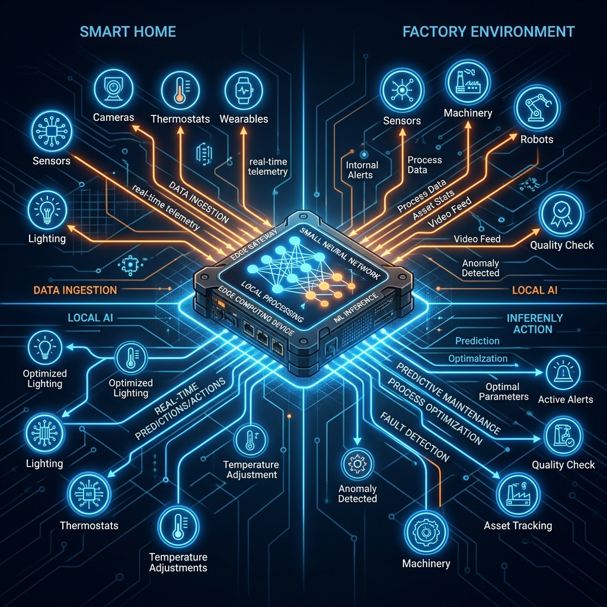

<div align="center">
  
</div>

# Chapter 17: AI for the Internet of Things

**🎯 The Big Goal:** Understand how to deploy lightweight AI models on edge devices to process sensor data in real-time — enabling smart homes, factories, and wearables to make instant decisions without cloud connectivity.

## Core Concepts

The Internet of Things (IoT) connects billions of devices — thermostats, cameras, industrial sensors, wearables — to the internet. Adding AI to these devices enables them to make intelligent decisions locally.

### Edge AI vs. Cloud AI

| | Cloud AI | Edge AI |
|---|---------|---------|
| **Latency** | 100–500ms (network round-trip) | 1–10ms (local processing) |
| **Privacy** | Data leaves the device | Data stays on-device |
| **Bandwidth** | Requires constant internet | Works offline |
| **Power** | Unlimited compute | Battery-constrained |

### Anomaly Detection

The most common AI task for IoT is **anomaly detection**: continuously monitoring sensor readings and flagging unusual patterns. A factory temperature sensor normally reads 20–24°C. If it suddenly reads 35°C, that's an anomaly that could indicate equipment failure.

The simplest approach uses **statistical methods**: compute a rolling mean and standard deviation, then flag any reading that deviates more than N standard deviations from the mean (z-score method).

---

## 🤔 Reflection Questions

<details>
<summary>💡 View Answer: Why can't we just send all IoT data to the cloud for processing?</summary>

Three reasons: (1) **Latency** — a self-driving car cannot wait 500ms for a cloud response when it needs to brake immediately. (2) **Bandwidth** — a factory with 10,000 sensors each producing 100 readings/second generates 1 million data points per second — too much for most internet connections. (3) **Privacy** — health wearables and home cameras contain sensitive data that users may not want leaving their devices.
</details>

<details>
<summary>💡 View Answer: What is model compression and why does it matter for IoT?</summary>

IoT devices have limited memory (often kilobytes, not gigabytes). Model compression techniques — quantization (reducing weight precision from 32-bit to 8-bit), pruning (removing unnecessary connections), and knowledge distillation (training a tiny student model to mimic a large teacher) — shrink models to fit on microcontrollers while preserving most of the accuracy.
</details>

---

## 🐳 Hands-On Exercise: IoT Sensor Anomaly Detection

### Step 1: Build
```bash
cd exercise
docker build -t ch17-iot .
```

### Step 2: Run
```bash
docker run --rm ch17-iot
```

### Dockerfile
```dockerfile
FROM python:3.9-alpine
WORKDIR /app
RUN pip install numpy
COPY iot_anomaly.py /app/
CMD ["python", "iot_anomaly.py"]
```
