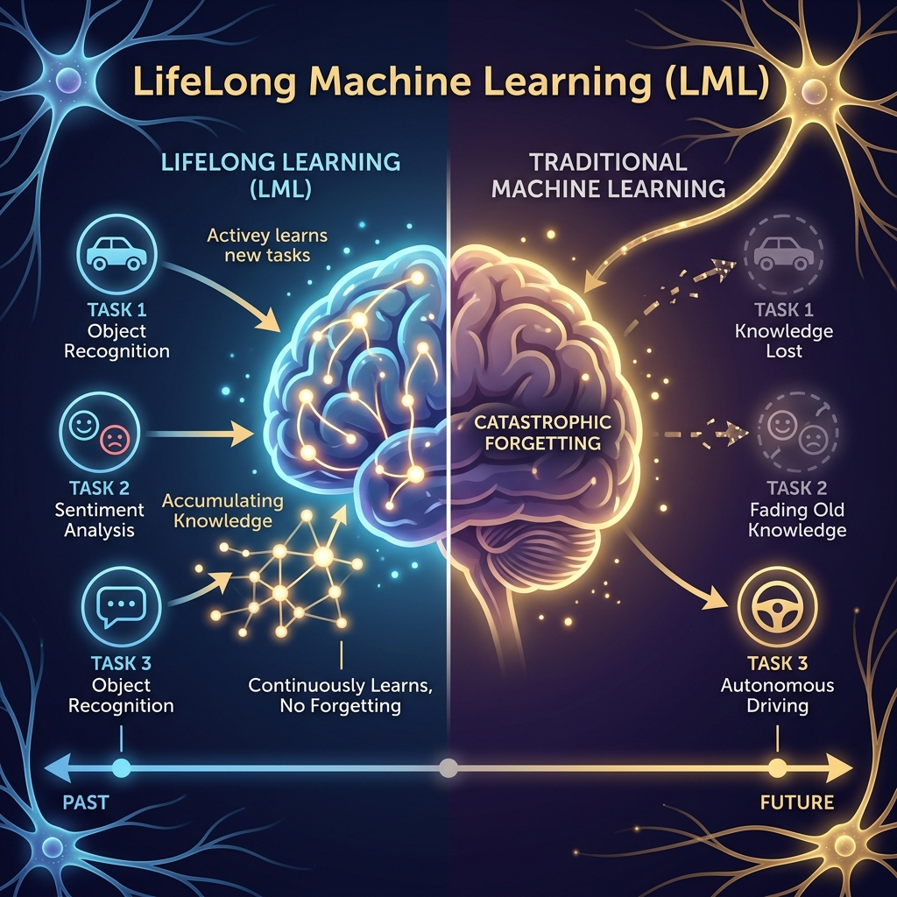

<div align="center">
  
</div>

# Chapter 18: Lifelong Machine Learning

**🎯 The Big Goal:** Understand why neural networks catastrophically forget old knowledge when trained on new tasks — and learn the replay-based strategy that enables continuous, lifelong learning.

## Core Concepts

Traditional ML assumes a fixed dataset. Train once, deploy forever. But real-world AI needs to learn continuously — a spam filter must adapt to new spam patterns without forgetting how to detect old ones.

### The Catastrophic Forgetting Problem

When you train a neural network on Task A, then train it on Task B, the weights optimized for B **overwrite** the weights that were optimized for A. The model becomes good at B but forgets A entirely. This is called **catastrophic forgetting**.

### Strategies to Prevent Forgetting

1. **Replay/Rehearsal:** Keep a small buffer of examples from previous tasks. When learning a new task, mix in old examples.
2. **Elastic Weight Consolidation (EWC):** Identify which weights are most important for previous tasks and penalize changes to those weights.
3. **Progressive Networks:** Add new neural network columns for each task while keeping old columns frozen.
4. **Knowledge Distillation:** Use the old model as a "teacher" to guide the new model, preserving old knowledge.

---

## 🤔 Reflection Questions

<details>
<summary>💡 View Answer: How is lifelong learning different from transfer learning?</summary>

**Transfer learning** moves knowledge from one task to another (one-directional, one-time). **Lifelong learning** continuously accumulates knowledge across a sequence of tasks (multi-directional, ongoing). In lifelong learning, knowledge from Task 3 might actually improve performance on Task 1 through shared representations — this is called **backward transfer**.
</details>

<details>
<summary>💡 View Answer: Why is replay the most practical defense against forgetting?</summary>

Replay is simple to implement, works with any model architecture, and directly addresses the problem by ensuring old data remains in the training process. The main challenge is choosing which examples to store in the limited buffer — random selection works surprisingly well, but more sophisticated methods select examples near decision boundaries for maximum impact.
</details>

---

## 🐳 Hands-On Exercise: Catastrophic Forgetting vs Replay

### Step 1: Build
```bash
cd exercise
docker build -t ch18-lifelong .
```

### Step 2: Run
```bash
docker run --rm ch18-lifelong
```

### Dockerfile
```dockerfile
FROM python:3.9-slim
WORKDIR /app
RUN pip install numpy scikit-learn
COPY lifelong_learning.py /app/
CMD ["python", "lifelong_learning.py"]
```
