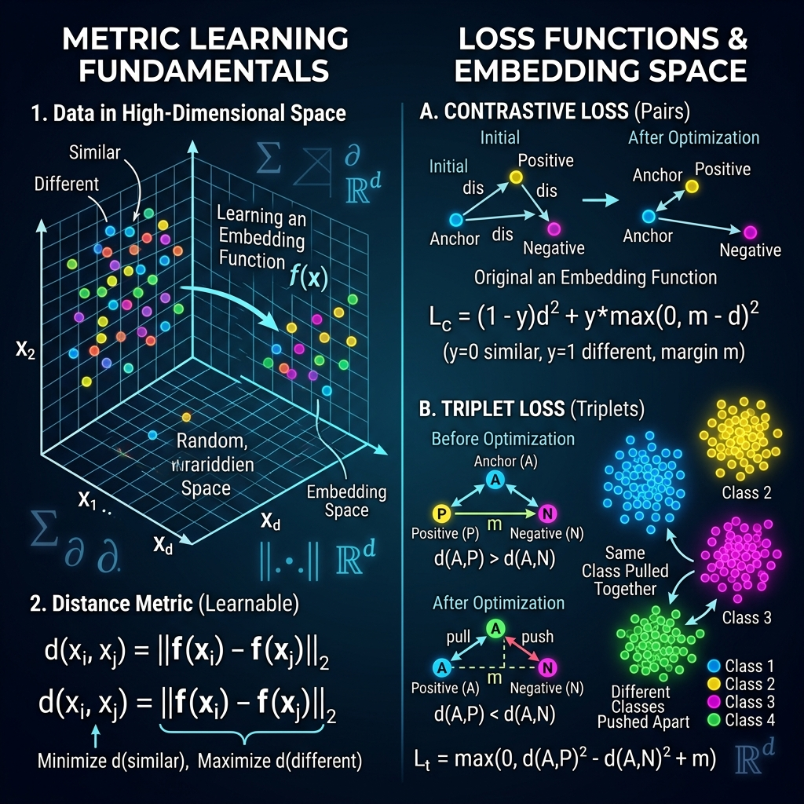

<div align="center">
  
</div>

# Chapter 19: Metric Learning

**🎯 The Big Goal:** Learn how to train neural networks to measure similarity — producing embeddings where similar items are close together and different items are far apart, enabling face recognition, recommendation systems, and few-shot learning.

## Core Concepts

Traditional classification assigns each input to one of N fixed classes. But what if you need to recognize a new person's face without retraining the model? Or find products similar to one a customer liked? **Metric Learning** solves this by learning a distance function.

### The Embedding Space

Instead of outputting class labels, a metric learning model outputs a vector (embedding) that captures the "essence" of the input. In this learned space:
- Two photos of the same person → embeddings close together
- Photos of different people → embeddings far apart

### Triplet Loss

The most popular training strategy uses "triplets" of examples:
- **Anchor (A):** A reference example (e.g., photo of Alice)
- **Positive (P):** Another example of the same class (another photo of Alice)
- **Negative (N):** An example of a different class (photo of Bob)

The loss function: `L = max(0, d(A,P) - d(A,N) + margin)`

This pushes the model to make d(A,P) small (same person = close) and d(A,N) large (different person = far), with a safety margin.

---

## 🤔 Reflection Questions

<details>
<summary>💡 View Answer: How does face recognition work using metric learning?</summary>

During enrollment, the system takes a few photos of each person and stores their embeddings. During recognition, it computes the embedding of the new face and finds the nearest stored embedding using cosine similarity or Euclidean distance. If the distance is below a threshold, the face is identified. This approach scales to millions of identities without retraining — you just add new embeddings to the database.
</details>

<details>
<summary>💡 View Answer: What is the difference between contrastive loss and triplet loss?</summary>

**Contrastive loss** works with pairs: pull similar pairs together, push dissimilar pairs apart. **Triplet loss** works with triplets (anchor, positive, negative) and directly enforces that the positive is closer than the negative. Triplet loss is generally more effective because it considers relative distances rather than absolute distances, but it requires careful "hard negative mining" — finding the most challenging negative examples for effective training.
</details>

---

## 🐳 Hands-On Exercise: Triplet Loss Embedding

### Step 1: Build
```bash
cd exercise
docker build -t ch19-metric .
```

### Step 2: Run
```bash
docker run --rm ch19-metric
```

### Dockerfile
```dockerfile
FROM python:3.9-alpine
WORKDIR /app
RUN pip install numpy
COPY metric_learning.py /app/
CMD ["python", "metric_learning.py"]
```
