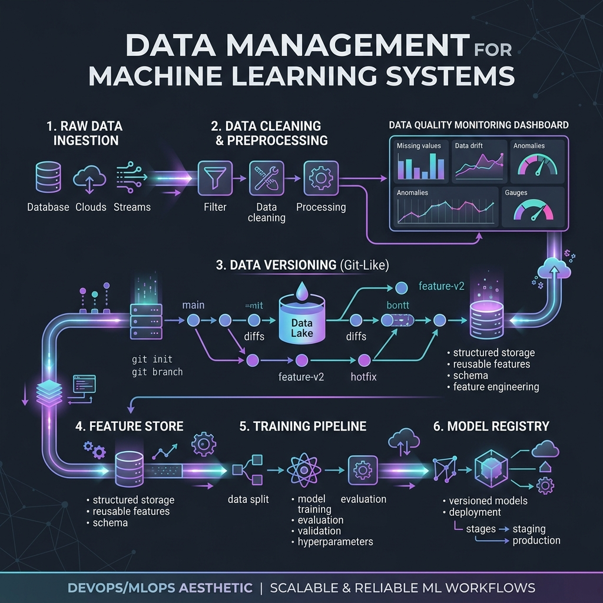

<div align="center">
  
</div>

# Chapter 20: Data Management for ML Systems

**🎯 The Big Goal:** Learn the engineering practices behind production ML data pipelines — data versioning, quality monitoring, feature stores, and reproducible preprocessing — the invisible infrastructure that makes or breaks real AI systems.

## Core Concepts

In production ML, 80% of the work is data engineering. A model is only as good as its data. **Data Management for ML** covers the tools and practices that ensure your data is clean, versioned, and reproducible.

### The ML Data Pipeline

1. **Ingestion:** Collect raw data from databases, APIs, streams.
2. **Cleaning:** Handle missing values, remove duplicates, fix encoding errors.
3. **Validation:** Detect data drift (distribution changes), schema violations, outliers.
4. **Feature Engineering:** Transform raw data into model-ready features.
5. **Versioning:** Track which data was used to train which model.
6. **Splitting:** Create reproducible train/validation/test splits.

### Why Data Versioning Matters

Imagine your model works great in January but fails in February. Was it a code change or a data change? Without data versioning, you can't tell. Tools like DVC (Data Version Control) add git-like version tracking to datasets, so you can always reproduce any past training run.

### Data Drift

The world changes. Customer preferences shift, new products launch, pandemics happen. When the real-world data distribution diverges from training data, model accuracy silently degrades — this is **data drift**, ML's silent killer.

---

## 🤔 Reflection Questions

<details>
<summary>💡 View Answer: What is the difference between data drift and concept drift?</summary>

**Data drift** (covariate shift) is when the input distribution changes — e.g., your model trained on English text now receives Spanish text. **Concept drift** is when the relationship between input and output changes — e.g., what counts as "spam" evolves over time even though emails look similar. Both degrade model performance, but concept drift is harder to detect because the inputs may look normal.
</details>

<details>
<summary>💡 View Answer: Why is reproducibility critical in ML?</summary>

If you can't reproduce a training run, you can't debug failures, prove compliance with regulations, or compare experiments fairly. Reproducibility requires versioning code, data, model weights, hyperparameters, and the random seed. In regulated industries (healthcare, finance), non-reproducible models are often illegal to deploy.
</details>

---

## 🐳 Hands-On Exercise: ML Data Pipeline Simulation

### Step 1: Build
```bash
cd exercise
docker build -t ch20-data-mgmt .
```

### Step 2: Run
```bash
docker run --rm ch20-data-mgmt
```

### Dockerfile
```dockerfile
FROM python:3.9-alpine
WORKDIR /app
RUN pip install numpy
COPY data_pipeline.py /app/
CMD ["python", "data_pipeline.py"]
```
