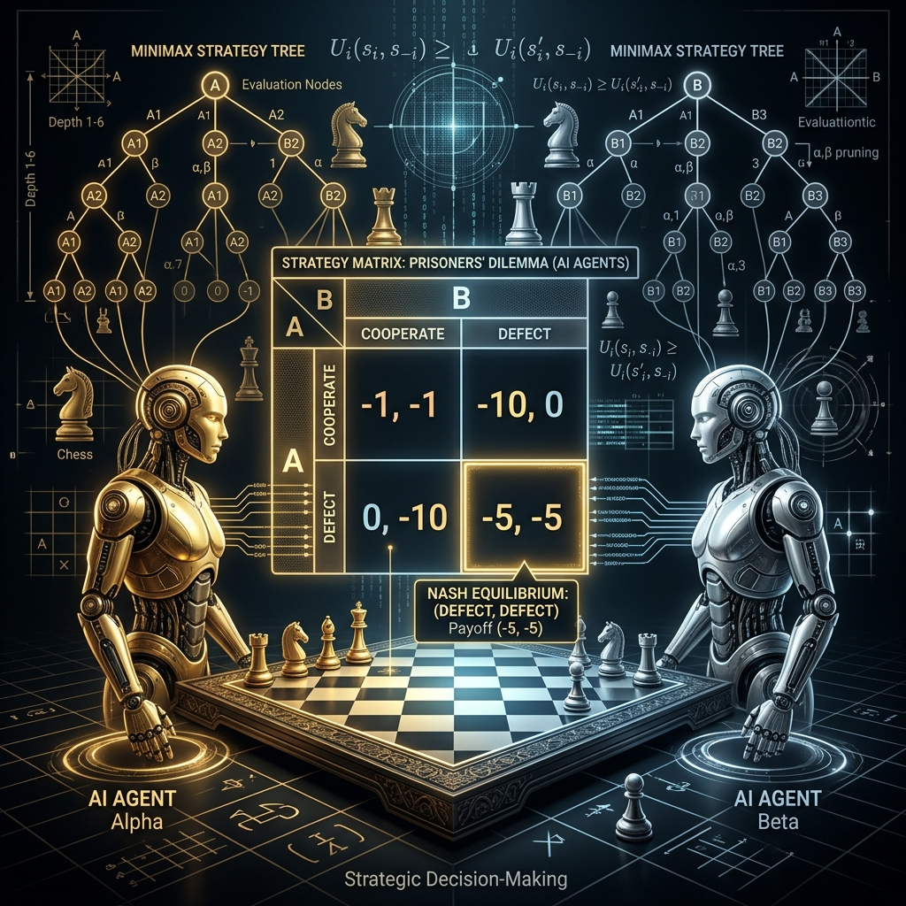

<div align="center">
  
</div>

# Chapter 21: Game Theory for AI

**🎯 The Big Goal:** Understand the mathematical foundations of strategic decision-making — Nash Equilibrium, the Prisoner's Dilemma, and minimax strategies — and see how these concepts underpin multi-agent AI systems.

## Core Concepts

**Game Theory** studies how rational agents make decisions when their outcomes depend on each other's actions. It's the mathematical backbone of competitive AI, mechanism design, and adversarial reasoning.

### Key Concepts

- **Players:** The decision-making agents.
- **Strategies:** The set of actions each player can take.
- **Payoff Matrix:** The reward each player receives for each combination of strategies.
- **Nash Equilibrium:** A state where no player can improve their payoff by changing their strategy alone — everyone is playing their best response to everyone else.

### The Prisoner's Dilemma

Two suspects are arrested. Each can Cooperate (stay silent) or Defect (betray the other):
- Both cooperate → mild punishment (-1, -1)
- Both defect → moderate punishment (-5, -5)
- One defects, one cooperates → defector goes free (0), cooperator gets max (-10)

The **Nash Equilibrium** is (Defect, Defect) even though (Cooperate, Cooperate) gives a better joint outcome. This is the tragedy — rational individual behavior leads to collectively worse results.

### Tit-for-Tat Strategy

In repeated games, **Tit-for-Tat** is famously effective: cooperate first, then mirror the opponent's last move. It's simple, forgiving, and retaliatory — all desirable properties for robust long-term strategy.

---

## 🤔 Reflection Questions

<details>
<summary>💡 View Answer: How does game theory connect to multi-agent reinforcement learning?</summary>

In multi-agent RL, each agent's environment includes other learning agents, making the "environment" non-stationary. Game theory provides the mathematical framework for analyzing these interactions — Nash Equilibria define stable outcomes, and solution concepts like correlated equilibrium and stackelberg games guide the design of learning algorithms that converge to desirable outcomes.
</details>

<details>
<summary>💡 View Answer: What is the difference between zero-sum and non-zero-sum games?</summary>

In **zero-sum** games (chess, Go), one player's gain is exactly the other's loss — the payoffs sum to zero. In **non-zero-sum** games (business negotiations, climate agreements), it's possible for all players to gain or all to lose. Most real-world interactions are non-zero-sum, which is why cooperation strategies like Tit-for-Tat can outperform pure defection.
</details>

---

## 🐳 Hands-On Exercise: Nash Equilibrium & Iterated Prisoner's Dilemma

### Step 1: Build
```bash
cd exercise
docker build -t ch21-game-theory .
```

### Step 2: Run
```bash
docker run --rm ch21-game-theory
```

### Dockerfile
```dockerfile
FROM python:3.9-alpine
WORKDIR /app
RUN pip install numpy
COPY game_theory.py /app/
CMD ["python", "game_theory.py"]
```

### Source Code

```python
import numpy as np
print("=== Game Theory for AI: Nash Equilibrium Finder ===\n")
print("--- Prisoner's Dilemma ---")
payoff_A = np.array([[-1, -10], [0, -5]])
payoff_B = np.array([[-1, 0], [-10, -5]])
strategies = ["Cooperate", "Defect"]
print("\nPayoff Matrix (A's payoff, B's payoff):")
print(f"{'':15s} B:Cooperate  B:Defect")
for i in range(2):
    print(f"A:{strategies[i]:10s}  ({payoff_A[i,0]:3d},{payoff_B[i,0]:3d})    ({payoff_A[i,1]:3d},{payoff_B[i,1]:3d})")
print("\nFinding Nash Equilibria (pure strategy)...")
nash = []
for i in range(2):
    for j in range(2):
        a_best = payoff_A[i, j] >= max(payoff_A[:, j])
        b_best = payoff_B[i, j] >= max(payoff_B[i, :])
        if a_best and b_best:
            nash.append((i, j))
            print(f"  ✅ Nash Equilibrium: A={strategies[i]}, B={strategies[j]} → Payoff ({payoff_A[i,j]},{payoff_B[i,j]})")
print("\n--- Iterated Prisoner's Dilemma (100 rounds) ---\n")
class TitForTat:
    def __init__(self): self.name = "Tit-for-Tat"
    def act(self, history): return 0 if not history else history[-1]
class AlwaysDefect:
    def __init__(self): self.name = "Always Defect"
    def act(self, history): return 1
class Random:
    def __init__(self): self.name = "Random"
    def act(self, history): return np.random.randint(2)
agents = [TitForTat(), AlwaysDefect(), Random()]
results = {}
for a1 in agents:
    for a2 in agents:
        if a1.name >= a2.name: continue
        score1, score2 = 0, 0
        h1, h2 = [], []
        for _ in range(100):
            m1, m2 = a1.act(h2), a2.act(h1)
            score1 += payoff_A[m1, m2]
            score2 += payoff_B[m1, m2]
            h1.append(m1); h2.append(m2)
        results[(a1.name, a2.name)] = (score1, score2)
        print(f"  {a1.name:15s} vs {a2.name:15s}: {score1:4d} vs {score2:4d}")
print("\n✅ Tit-for-Tat is the strongest long-term strategy!")
print("   It cooperates first, then mirrors the opponent's last move.")
```
