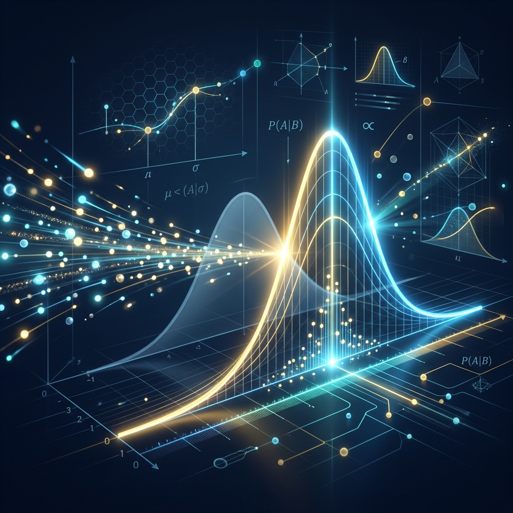
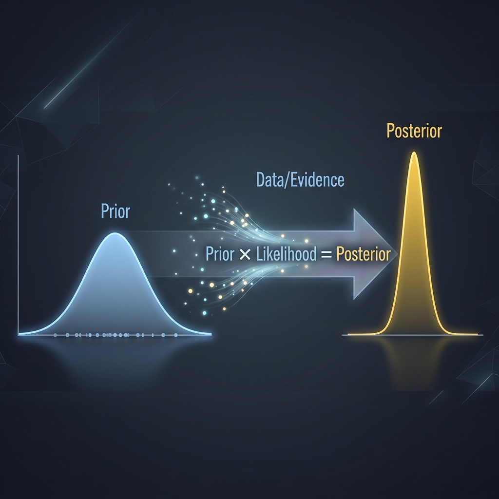
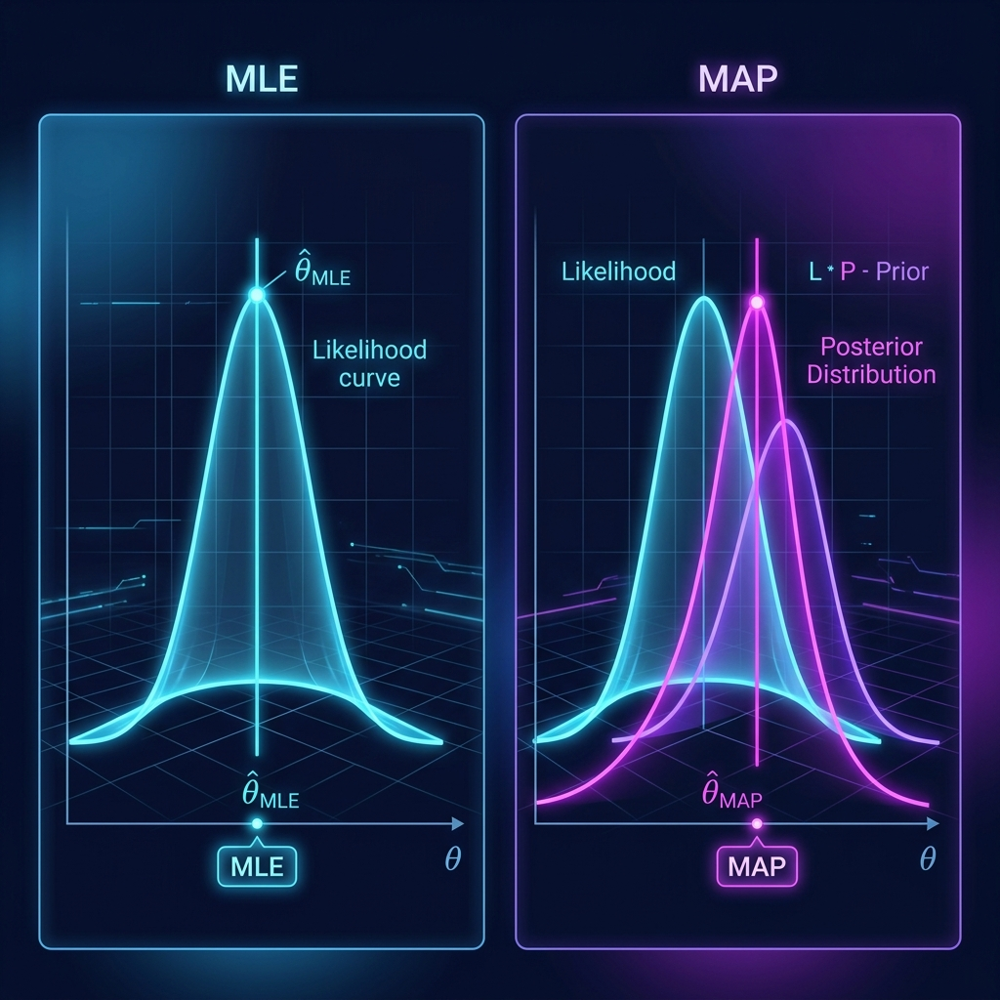

<div align="center">
  
</div>

# Chapter 22: Bayesian Learning

**🎯 The Big Goal:** Understand how to reason about uncertainty using probability — learn how Bayes' Theorem lets us update our beliefs as new evidence arrives, and see the critical difference between MLE and MAP estimation.

## Core Concepts

### What Is Bayesian Learning?

Imagine you're a doctor. A patient walks in coughing. Before any tests, you already have a rough idea of what might be wrong — maybe it's a cold (common) or pneumonia (rare). That initial guess is your **prior belief**. Now the lab results come back: the patient has a high white blood cell count. This is new **evidence**. You combine your prior belief with this evidence to form an **updated belief** — your **posterior**. That's Bayesian learning in a nutshell.

In mathematical terms, **Bayes' Theorem** tells us:

```
P(hypothesis | data) = P(data | hypothesis) × P(hypothesis) / P(data)
```

Or more intuitively: **Posterior ∝ Likelihood × Prior**

<div align="center">
  
</div>

### The Three Players

1. **Prior — P(θ):** What you believed *before* seeing any data. Think of it as your starting assumption. A flat prior says "I have no idea"; a peaked prior says "I'm fairly confident the answer is near this value."

2. **Likelihood — P(data | θ):** How well the data fits a particular hypothesis. If θ says "the coin is fair" but you flipped 10 heads in a row, the likelihood of that hypothesis is very low.

3. **Posterior — P(θ | data):** Your updated belief *after* incorporating the data. It's always a compromise between the prior and the likelihood — pulled toward whichever one carries more information.

### The Coin Flip Analogy

Suppose someone hands you a coin. You assume it's fair (prior: 50/50). You flip it 10 times and get 8 heads. A **frequentist** would say "the probability of heads is 8/10 = 0.8." A **Bayesian** would say "well, my prior was 0.5, and the data suggests 0.8, so my updated belief is somewhere in between — maybe 0.65." The Bayesian approach is more cautious because it doesn't throw away what you already knew.

### MLE vs MAP: Two Ways to Pick the Best Parameters

<div align="center">
  
</div>

- **Maximum Likelihood Estimation (MLE):** Find the parameter θ that makes the observed data most probable. MLE asks: *"What value of θ maximizes P(data | θ)?"* It completely ignores any prior knowledge — it trusts only the data. With enough data, MLE is excellent. With little data, it can overfit wildly.

- **Maximum A Posteriori (MAP):** Find the parameter θ that maximizes the posterior P(θ | data). MAP asks: *"What value of θ maximizes P(data | θ) × P(θ)?"* It's like MLE with a safety net — the prior acts as a regularizer that prevents extreme estimates when data is scarce.

**The punchline:** MAP reduces to MLE when the prior is uniform (flat). The prior is the only difference between them.

### Why Bayesian Thinking Matters in ML

- **Small datasets:** When you have limited training data, priors prevent overfitting by encoding domain knowledge.
- **Uncertainty quantification:** Unlike point estimates, Bayesian methods give you a full distribution over predictions — you know *how confident* the model is.
- **Online learning:** Bayesian updating is naturally sequential — today's posterior becomes tomorrow's prior as new data streams in.

---

## 🤔 Reflection Questions

<details>
<summary>💡 View Answer: Why is the prior controversial in Bayesian learning?</summary>

The prior is controversial because it introduces **subjectivity** into the analysis. Two analysts with different priors will reach different posteriors from the same data. Critics argue this makes Bayesian methods arbitrary. Defenders counter that (1) with enough data, the prior's influence washes out — the posterior converges regardless of the prior, and (2) all models encode assumptions; at least Bayesian methods make those assumptions *explicit* via the prior. As Bishop (2006) notes, "the prior allows us to incorporate additional information beyond the training data," which is a feature, not a bug.
</details>

<details>
<summary>💡 View Answer: When does MAP give the same result as MLE?</summary>

MAP and MLE give identical results when the prior distribution is **uniform** (flat) — that is, when P(θ) is the same for all values of θ. In that case, maximizing P(data | θ) × P(θ) is the same as maximizing P(data | θ) alone, because the prior is just a constant multiplier. This shows that MLE is actually a special case of MAP with a "know-nothing" prior. As Murphy (2012) explains, "MLE can be viewed as MAP estimation with a uniform prior."
</details>

<details>
<summary>💡 View Answer: How does Bayesian learning connect to regularization in neural networks?</summary>

Weight decay (L2 regularization) in neural networks is mathematically equivalent to MAP estimation with a **Gaussian prior** on the weights. The regularization term λ||w||² corresponds to assuming the weights are drawn from a zero-mean Gaussian distribution — meaning we believe *a priori* that weights should be small. Larger λ means a tighter prior (stronger belief that weights are small), which prevents overfitting. L1 regularization (Lasso) corresponds to a **Laplace prior**, which encourages sparsity. This deep connection between regularization and Bayesian priors was first highlighted by Bishop in *Pattern Recognition and Machine Learning* (2006, Chapter 3).
</details>

---

## 🐳 Hands-On Exercise: Bayesian Coin Inference

In this exercise, you'll implement Bayesian updating from scratch. Starting with a uniform prior over the bias of a coin, you'll observe flips one at a time and watch the posterior sharpen around the true bias.

### Step 1: Build
```bash
cd exercise
docker build -t ch22-bayesian .
```

### Step 2: Run
```bash
docker run --rm ch22-bayesian
```

### Dockerfile
```dockerfile
FROM python:3.9-alpine
WORKDIR /app
RUN pip install numpy
COPY bayesian_learning.py /app/
CMD ["python", "bayesian_learning.py"]
```

### Source Code

```python
import numpy as np

def bayesian_coin_inference():
    """
    Bayesian inference for a biased coin.
    We discretize the bias parameter theta into a grid and update
    the posterior after each observed flip.
    """
    # Discretize theta (coin bias) into 100 values from 0 to 1
    theta_grid = np.linspace(0, 1, 100)

    # Start with a uniform prior: "I have no idea what the bias is"
    prior = np.ones_like(theta_grid) / len(theta_grid)

    # True coin bias (unknown to the learner)
    true_bias = 0.7
    np.random.seed(42)

    # Simulate 50 coin flips
    flips = np.random.binomial(1, true_bias, size=50)

    print("=" * 60)
    print("BAYESIAN COIN INFERENCE")
    print("=" * 60)
    print(f"True coin bias: {true_bias}")
    print(f"Prior: Uniform (no initial assumption)")
    print("-" * 60)

    posterior = prior.copy()

    milestones = [1, 5, 10, 20, 50]
    heads_count = 0

    for i, flip in enumerate(flips, 1):
        heads_count += flip

        # Likelihood: P(flip | theta)
        if flip == 1:  # heads
            likelihood = theta_grid
        else:  # tails
            likelihood = 1 - theta_grid

        # Bayesian update: posterior ∝ likelihood × prior
        posterior = likelihood * posterior
        posterior = posterior / posterior.sum()  # normalize

        if i in milestones:
            map_estimate = theta_grid[np.argmax(posterior)]
            mle_estimate = heads_count / i if i > 0 else 0.5
            confidence = posterior.max()

            print(f"\nAfter {i:2d} flips ({heads_count}H, {i - heads_count}T):")
            print(f"  MLE estimate:  {mle_estimate:.4f}")
            print(f"  MAP estimate:  {map_estimate:.4f}")
            print(f"  Peak confidence: {confidence:.4f}")

            # Show posterior distribution as ASCII bar chart
            # Downsample to 20 bins for display
            bins = 20
            bin_size = len(theta_grid) // bins
            print(f"  Posterior distribution:")
            for b in range(bins):
                start = b * bin_size
                end = start + bin_size
                bar_val = posterior[start:end].sum()
                bar = "█" * int(bar_val * 200)
                label = f"  θ={theta_grid[start]:.2f}-{theta_grid[end-1]:.2f}"
                if bar:
                    print(f"    {label} |{bar}")

    print("\n" + "=" * 60)
    print("KEY INSIGHT:")
    print("With few flips, the prior matters a lot (MAP ≠ MLE).")
    print("With many flips, data dominates and MAP ≈ MLE.")
    print("Both converge toward the true bias as data increases.")
    print("=" * 60)

if __name__ == "__main__":
    bayesian_coin_inference()
```

---

## 📚 References

- Bishop, C. M. (2006). *Pattern Recognition and Machine Learning*. Springer. — Chapters 1–3 on Bayesian inference, prior/posterior distributions, and the relationship between regularization and Bayesian priors.
- Murphy, K. P. (2012). *Machine Learning: A Probabilistic Perspective*. MIT Press. — Chapters 3 and 5 on generative models, MAP vs MLE, and Bayesian decision theory.
- Alpaydin, E. (2010). *Introduction to Machine Learning*. MIT Press (Cambridge). — Chapter 4 on Bayesian estimation and parametric methods.
- Kriesel, D. (2005). *A Brief Introduction to Neural Networks*. — Supplementary material on probabilistic interpretations of neural network training.
