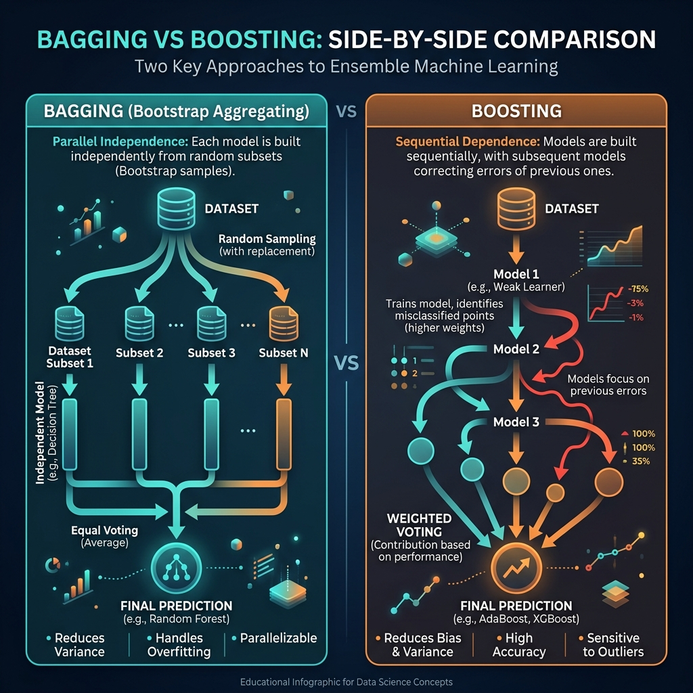
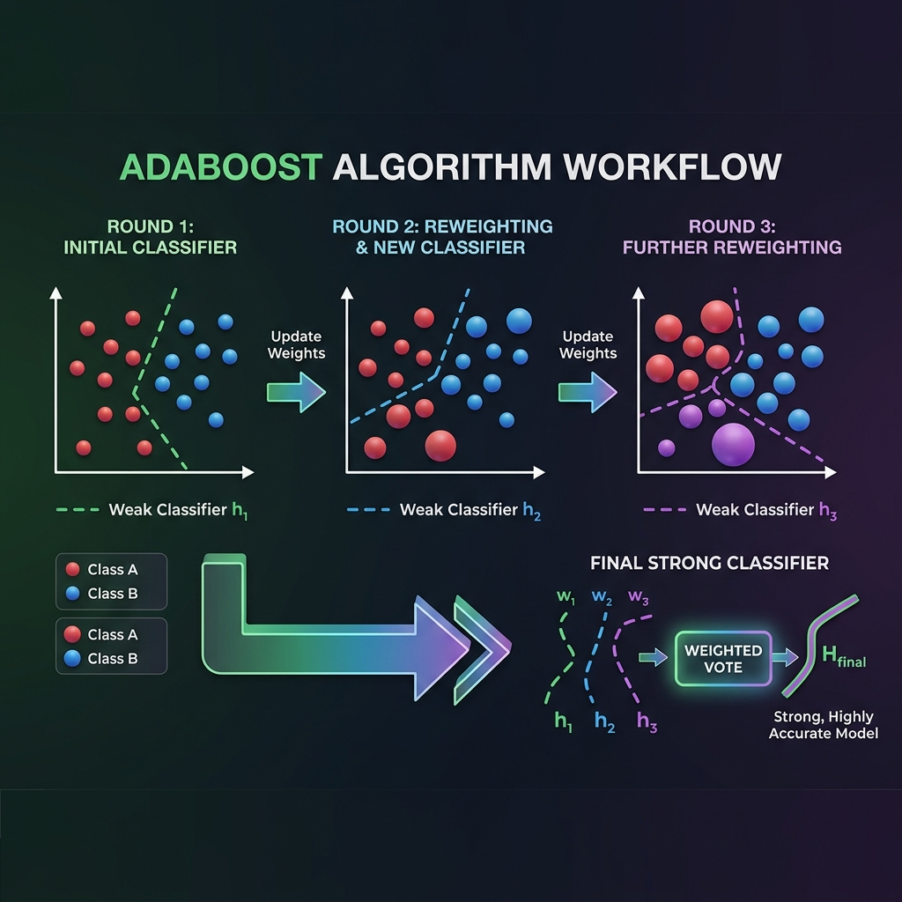

<div align="center">
  
</div>

# Chapter 23: Ensemble Methods — Boosting, Bagging & Random Forests

**🎯 The Big Goal:** Understand how combining many weak learners into a single strong learner dramatically improves prediction accuracy — and master the two fundamental strategies: Bagging (parallel) and Boosting (sequential).

## Core Concepts

### The Wisdom of Crowds

Imagine you're at a county fair, and there's a contest to guess the weight of an ox. Individually, most guesses are wildly off. But if you **average all the guesses**, the result is shockingly close to the true weight. This is the essence of ensemble methods: many imperfect models, combined intelligently, outperform any single sophisticated model.

In machine learning, a **weak learner** is a model that's only slightly better than random guessing — like a decision tree with just one split (a "decision stump"). Ensemble methods take dozens or hundreds of these weak learners and combine them into a powerful predictor.

### Bagging vs Boosting

<div align="center">
  
</div>

#### Bagging (Bootstrap Aggregating)

Think of bagging like asking 100 different doctors to independently diagnose a patient, then taking a majority vote.

1. **Create diversity:** Draw many random subsets of the training data (with replacement — this is called "bootstrapping").
2. **Train independently:** Train one model on each subset — in parallel, no communication between models.
3. **Combine by voting:** For classification, take a majority vote. For regression, take the average.

**Why it works:** Each model sees a slightly different view of the data, so they make different mistakes. When you average their predictions, the individual errors cancel out — reducing **variance** without increasing bias.

**Random Forests** are the most famous bagging method: they bag decision trees, with the additional twist that each tree only considers a random subset of features at each split. This extra randomness decorrelates the trees even further.

#### Boosting

Think of boosting like a student preparing for an exam by focusing specifically on the questions they got wrong in practice tests.

1. **Start simple:** Train one weak learner on the full dataset.
2. **Find mistakes:** Identify which data points it misclassified.
3. **Focus on errors:** Increase the weight of misclassified points, so the next learner pays more attention to them.
4. **Repeat and combine:** Each new learner corrects the mistakes of all previous learners. The final prediction is a weighted vote where better learners get louder voices.

**Why it works:** Boosting systematically reduces **bias** by forcing each new model to focus on the hardest examples.

### AdaBoost: The Algorithm That Changed Everything

<div align="center">
  
</div>

**AdaBoost** (Adaptive Boosting) was the first practical boosting algorithm. Here's the intuition:

1. Give every training example equal weight.
2. Train a weak classifier (e.g., a decision stump).
3. Compute its error rate on the weighted examples.
4. Calculate the classifier's "say" (α) — classifiers with lower error get a louder vote: `α = 0.5 × ln((1 - error) / error)`.
5. Increase the weights of misclassified examples; decrease the weights of correctly classified ones.
6. Repeat for T rounds. The final classifier is: `H(x) = sign(Σ αₜ × hₜ(x))`.

The beauty of AdaBoost is that it provably reduces the training error exponentially fast — as shown by Freund and Schapire in their foundational 1997 paper.

### Bagging Reduces Variance, Boosting Reduces Bias

This is the most important distinction:

- **Bagging:** Your individual models are complex (high variance, low bias). Averaging them out smooths the variance → more stable predictions.
- **Boosting:** Your individual models are simple (low variance, high bias). Each one chips away at the bias → more accurate predictions.

---

## 🤔 Reflection Questions

<details>
<summary>💡 View Answer: Why does Random Forest add feature randomness on top of bagging?</summary>

Standard bagging with decision trees still produces correlated trees — if one feature is very strong, every tree will split on it first, making the trees similar. Random Forest addresses this by randomly restricting each split to consider only a subset of features (typically √p for classification, p/3 for regression). This forces trees to explore different splitting paths, **decorrelating** them. As Hastie et al. (2009) explain in *Elements of Statistical Learning*: "The correlation between trees in an ordinary bootstrap sample decreases by reducing the number of candidate variables," which directly improves the variance reduction from averaging.
</details>

<details>
<summary>💡 View Answer: Can boosting overfit?</summary>

Yes, but it's surprisingly resistant to overfitting. AdaBoost in particular can run for many rounds and often continues to improve test accuracy even after achieving zero training error — a phenomenon that puzzled researchers for years. The explanation, as described by Schapire et al. in *A Statistical View of Boosting* (1998), is that boosting continues to increase the **margin** (the confidence of predictions) even after training error reaches zero, which improves generalization. However, with noisy data, boosting *can* eventually overfit because it aggressively up-weights mislabeled examples, treating noise as signal.
</details>

<details>
<summary>💡 View Answer: When should you use bagging vs boosting?</summary>

Use **bagging** (Random Forest) when your base learner tends to overfit — i.e., it has high variance. This is common with deep decision trees. Use **boosting** (AdaBoost, Gradient Boosting) when your base learner is too simple — i.e., it has high bias. Decision stumps are the classic choice. In practice, gradient boosting (XGBoost, LightGBM) tends to achieve the highest accuracy on tabular data, while Random Forests are more robust to hyperparameter choices and easier to use out of the box.
</details>

---

## 🐳 Hands-On Exercise: AdaBoost from Scratch

In this exercise, you'll implement AdaBoost with decision stumps from scratch and compare it against a single decision stump on a synthetic dataset.

### Step 1: Build
```bash
cd exercise
docker build -t ch23-ensemble .
```

### Step 2: Run
```bash
docker run --rm ch23-ensemble
```

### Dockerfile
```dockerfile
FROM python:3.9-alpine
WORKDIR /app
RUN pip install numpy
COPY ensemble_methods.py /app/
CMD ["python", "ensemble_methods.py"]
```

### Source Code

```python
import numpy as np

def generate_data(n=200, seed=42):
    """Generate a non-linearly separable 2D dataset."""
    np.random.seed(seed)
    X = np.random.randn(n, 2)
    # Circle boundary: points inside radius 1 are class +1
    y = np.where(X[:, 0]**2 + X[:, 1]**2 < 1.2, 1, -1)
    # Add noise by flipping 5% of labels
    flip = np.random.choice(n, size=n // 20, replace=False)
    y[flip] *= -1
    return X, y

class DecisionStump:
    """A weak classifier: single threshold on one feature."""
    def __init__(self):
        self.feature = 0
        self.threshold = 0
        self.polarity = 1

    def fit(self, X, y, weights):
        n_samples, n_features = X.shape
        best_error = float('inf')

        for feature in range(n_features):
            thresholds = np.unique(X[:, feature])
            for threshold in thresholds:
                for polarity in [1, -1]:
                    predictions = np.ones(n_samples)
                    predictions[polarity * X[:, feature] < polarity * threshold] = -1
                    error = np.sum(weights[predictions != y])
                    if error < best_error:
                        best_error = error
                        self.feature = feature
                        self.threshold = threshold
                        self.polarity = polarity
        return best_error

    def predict(self, X):
        n_samples = X.shape[0]
        predictions = np.ones(n_samples)
        predictions[self.polarity * X[:, self.feature] < self.polarity * self.threshold] = -1
        return predictions

def adaboost(X, y, T=10):
    """AdaBoost with decision stumps."""
    n_samples = X.shape[0]
    weights = np.ones(n_samples) / n_samples
    stumps = []
    alphas = []

    for t in range(T):
        stump = DecisionStump()
        error = stump.fit(X, y, weights)
        error = max(error, 1e-10)  # prevent division by zero

        # Classifier weight: better stumps get higher alpha
        alpha = 0.5 * np.log((1 - error) / error)

        predictions = stump.predict(X)

        # Update weights: increase weight of misclassified samples
        weights *= np.exp(-alpha * y * predictions)
        weights /= weights.sum()

        stumps.append(stump)
        alphas.append(alpha)

    return stumps, alphas

def predict_adaboost(X, stumps, alphas):
    """Combined prediction from all stumps."""
    n_samples = X.shape[0]
    final_pred = np.zeros(n_samples)
    for stump, alpha in zip(stumps, alphas):
        final_pred += alpha * stump.predict(X)
    return np.sign(final_pred)

def main():
    X, y = generate_data()
    split = 150
    X_train, y_train = X[:split], y[:split]
    X_test, y_test = X[split:], y[split:]

    print("=" * 60)
    print("ADABOOST FROM SCRATCH")
    print("=" * 60)

    # Single stump baseline
    stump = DecisionStump()
    weights = np.ones(len(y_train)) / len(y_train)
    stump.fit(X_train, y_train, weights)
    single_acc = np.mean(stump.predict(X_test) == y_test)
    print(f"\nSingle Decision Stump Accuracy: {single_acc:.2%}")

    # AdaBoost with increasing rounds
    for T in [1, 5, 10, 25, 50]:
        stumps, alphas = adaboost(X_train, y_train, T=T)
        train_pred = predict_adaboost(X_train, stumps, alphas)
        test_pred = predict_adaboost(X_test, stumps, alphas)

        train_acc = np.mean(train_pred == y_train)
        test_acc = np.mean(test_pred == y_test)

        bar = "█" * int(test_acc * 40)
        print(f"  T={T:3d} stumps → Train: {train_acc:.2%}  Test: {test_acc:.2%}  {bar}")

    print("\n" + "=" * 60)
    print("KEY INSIGHT:")
    print("A single stump barely beats random guessing.")
    print("AdaBoost combines many stumps into a strong classifier.")
    print("Each new stump focuses on what previous ones got wrong.")
    print("=" * 60)

if __name__ == "__main__":
    main()
```

---

## 📚 References

- Freund, Y. & Schapire, R. E. (1997). A Decision-Theoretic Generalization of On-Line Learning and an Application to Boosting. *Journal of Computer and System Sciences*, 55(1). — The foundational AdaBoost paper.
- Schapire, R. E. (1999). A Brief Introduction to Boosting. *IJCAI Tutorial*. — Accessible overview of boosting theory and practice.
- Friedman, J., Hastie, T. & Tibshirani, R. (2000). Additive Logistic Regression: A Statistical View of Boosting. *Annals of Statistics*. — Statistical framework for understanding boosting as forward stagewise additive modeling.
- Hastie, T., Tibshirani, R. & Friedman, J. (2009). *The Elements of Statistical Learning* (2nd ed.). Springer. — Chapters 8, 10, and 15 on bagging, boosting, and random forests.
- Breiman, L. (2001). Random Forests. *Machine Learning*, 45(1). — Referenced in Hastie et al. for the decorrelation argument.
