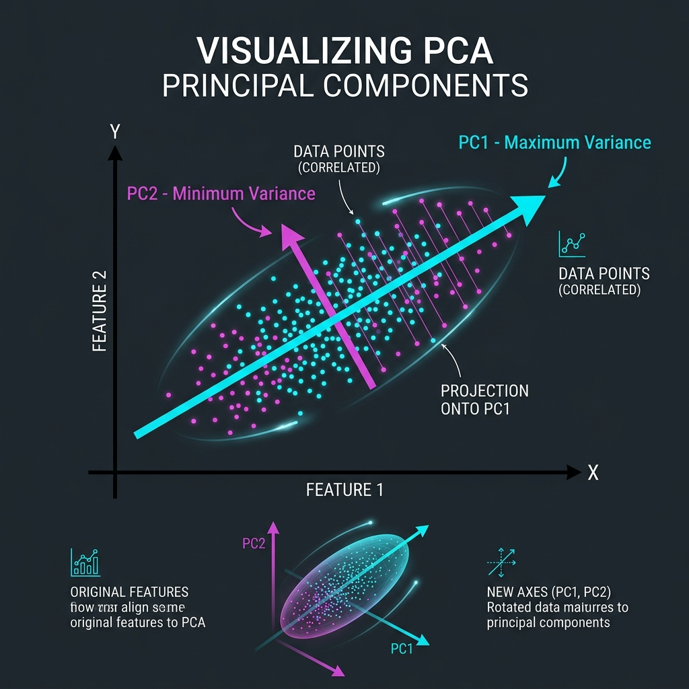
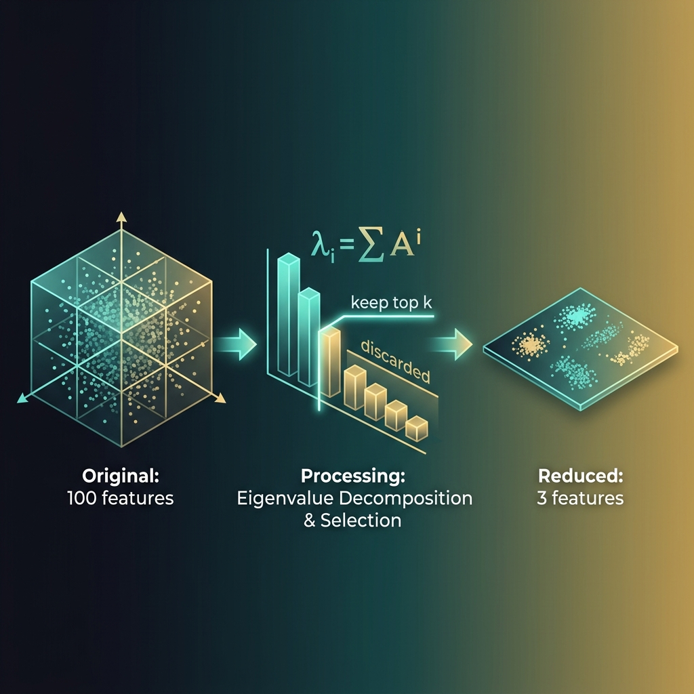

<div align="center">
  
</div>

# Chapter 24: Dimensionality Reduction & PCA

**🎯 The Big Goal:** Understand how to compress high-dimensional data into fewer dimensions while preserving the most important structure — and master PCA, the most fundamental technique in the field.

## Core Concepts

### The Curse of Dimensionality

Imagine you're searching for your friend in a room. Easy — it's 3D. Now imagine searching for them in a 100-dimensional room. The volume of that space is so astronomically vast that even a billion data points would be sprinkled like a few grains of sand in the Sahara. This is the **curse of dimensionality**: as dimensions increase, data becomes increasingly sparse, distances lose meaning, and models need exponentially more data to learn anything useful.

**Dimensionality reduction** fights this curse by finding a lower-dimensional representation of the data that preserves its essential structure.

### PCA: Finding the Best Camera Angle

<div align="center">
  
</div>

Think of PCA like photographing a 3D sculpture. If you photograph it from the worst angle, it looks like a flat blob — you've lost all the interesting shape information. But if you find the *best* angle — the one that captures the most variation in shape — your 2D photo preserves the sculpture's essential form.

**Principal Component Analysis (PCA)** does exactly this:

1. **Center the data:** Subtract the mean so the data cloud is centered at the origin.
2. **Find the covariance matrix:** This captures how features vary together. If height and weight are correlated, the covariance matrix encodes that relationship.
3. **Compute eigenvectors and eigenvalues:** The eigenvectors point in the directions of maximum variance. The eigenvalues tell you *how much* variance each direction captures.
4. **Sort and select:** Rank the eigenvectors by their eigenvalues. The top-k eigenvectors become your new axes — your "principal components."
5. **Project:** Transform the data onto these new axes, discarding the low-variance directions.

### The Eigenvalue Drop-Off

<div align="center">
  
</div>

The magic of PCA is that real-world data is often **intrinsically low-dimensional**. A dataset with 100 features might have 95% of its variance captured by just 5 principal components. The eigenvalue spectrum tells you this story: a steep drop-off means aggressive compression is safe; a flat spectrum means every dimension matters.

The rule of thumb: keep enough components to capture **90–95% of total variance**:

```
Explained variance ratio = eigenvalue_k / sum(all eigenvalues)
```

### PCA vs Feature Selection

They're both methods to reduce dimensions, but they work differently:

- **Feature selection** picks a subset of the original features (e.g., "keep only age and income, drop the rest"). Simple, interpretable, but you might lose information.
- **PCA** creates *new* features that are combinations of the originals (e.g., "PC1 = 0.7 × age + 0.3 × income + ..."). Mathematically optimal for preserving variance, but the new features are harder to interpret.

---

## 🤔 Reflection Questions

<details>
<summary>💡 View Answer: Why must we center (subtract the mean) before PCA?</summary>

PCA finds directions of maximum **variance**, not maximum magnitude. If the data isn't centered, the first principal component would simply point toward the data's center of mass — capturing the mean, not the spread. By centering first, we ensure PCA focuses purely on the variance structure. As the FORTH-ICS PCA tutorial explains, "centering ensures that the first principal component describes the direction of maximum variance" rather than being dominated by the data's offset from the origin.
</details>

<details>
<summary>💡 View Answer: When does PCA fail?</summary>

PCA assumes that the directions of maximum **linear** variance are the most informative. This fails when: (1) The important structure is **non-linear** — for example, data arranged on a Swiss roll in 3D. PCA would flatten it rather than unroll it. Kernel PCA or t-SNE handles this better. (2) The features have **different scales** — a feature measured in millions will dominate one measured in decimals. Always standardize first. (3) The variance structure is **isotropic** (equal in all directions) — PCA can't find meaningful axes if all eigenvalues are similar.
</details>

<details>
<summary>💡 View Answer: What is the relationship between PCA and SVD?</summary>

PCA is intimately connected to Singular Value Decomposition (SVD). If X is the centered data matrix, then X = UΣVᵀ. The columns of V are the principal component directions (eigenvectors of XᵀX), and the singular values (diagonal of Σ) are the square roots of the eigenvalues. In practice, PCA is almost always computed via SVD rather than explicit eigendecomposition, because SVD is more numerically stable. As Bishop (2006) notes in *Pattern Recognition and Machine Learning*, "the SVD provides a numerically stable and computationally efficient approach to PCA."
</details>

---

## 🐳 Hands-On Exercise: PCA from Scratch

In this exercise, you'll implement PCA using only NumPy — computing the covariance matrix, eigendecomposition, and projection manually — then visualize how much variance each component captures.

### Step 1: Build
```bash
cd exercise
docker build -t ch24-pca .
```

### Step 2: Run
```bash
docker run --rm ch24-pca
```

### Dockerfile
```dockerfile
FROM python:3.9-alpine
WORKDIR /app
RUN pip install numpy
COPY dimensionality_reduction.py /app/
CMD ["python", "dimensionality_reduction.py"]
```

### Source Code

```python
import numpy as np

def pca_from_scratch(X, n_components):
    """Perform PCA using eigendecomposition of the covariance matrix."""
    # Step 1: Center the data
    mean = X.mean(axis=0)
    X_centered = X - mean

    # Step 2: Compute covariance matrix
    cov_matrix = np.cov(X_centered, rowvar=False)

    # Step 3: Eigendecomposition
    eigenvalues, eigenvectors = np.linalg.eigh(cov_matrix)

    # Step 4: Sort by eigenvalue (descending)
    sorted_idx = np.argsort(eigenvalues)[::-1]
    eigenvalues = eigenvalues[sorted_idx]
    eigenvectors = eigenvectors[:, sorted_idx]

    # Step 5: Select top-k components
    components = eigenvectors[:, :n_components]

    # Step 6: Project data onto new axes
    X_projected = X_centered @ components

    return X_projected, eigenvalues, components

def main():
    np.random.seed(42)

    # Generate synthetic 10D data with only 3 real dimensions of variation
    n_samples = 200
    n_features = 10
    n_informative = 3

    # Create 3 informative features
    Z = np.random.randn(n_samples, n_informative) * [5, 3, 1]

    # Embed into 10D via a random linear transformation
    W = np.random.randn(n_informative, n_features)
    X = Z @ W + np.random.randn(n_samples, n_features) * 0.5  # small noise

    print("=" * 60)
    print("PCA FROM SCRATCH")
    print("=" * 60)
    print(f"Original data: {n_samples} samples × {n_features} features")
    print(f"True informative dimensions: {n_informative}")
    print("-" * 60)

    # Run PCA
    X_reduced, eigenvalues, components = pca_from_scratch(X, n_components=n_features)

    # Explained variance ratios
    total_var = eigenvalues.sum()
    explained_ratios = eigenvalues / total_var
    cumulative = np.cumsum(explained_ratios)

    print("\nEigenvalue Spectrum (Scree Plot):")
    print("-" * 45)
    for i, (ev, ratio, cum) in enumerate(zip(eigenvalues, explained_ratios, cumulative)):
        bar = "█" * int(ratio * 80)
        marker = " ← 95% threshold" if i > 0 and cumulative[i-1] < 0.95 <= cum else ""
        print(f"  PC{i+1:2d}: {ratio:6.1%} (cumulative: {cum:6.1%}) {bar}{marker}")

    # Determine optimal components for 95% variance
    n_optimal = np.argmax(cumulative >= 0.95) + 1
    print(f"\nOptimal components for 95% variance: {n_optimal}")
    print(f"Compression ratio: {n_features}D → {n_optimal}D ({(1 - n_optimal/n_features):.0%} reduction)")

    # Show reconstruction error
    for k in [1, 2, 3, 5, n_features]:
        X_proj, _, comps = pca_from_scratch(X, n_components=k)
        X_reconstructed = X_proj @ comps.T + X.mean(axis=0)
        error = np.mean((X - X_reconstructed) ** 2)
        print(f"  k={k:2d} components → MSE: {error:.4f}")

    print("\n" + "=" * 60)
    print("KEY INSIGHT:")
    print(f"10 features, but {n_optimal} principal components capture 95%+ variance.")
    print("PCA reveals the true dimensionality hidden in the data.")
    print("=" * 60)

if __name__ == "__main__":
    main()
```

---

## 📚 References

- Shlens, J. (2014). *A Tutorial on Principal Component Analysis*. — Referenced in PCA (FORTH-ICS) tutorial materials for geometric intuition.
- Bishop, C. M. (2006). *Pattern Recognition and Machine Learning*. Springer. — Chapter 12 on continuous latent variables and PCA.
- Hastie, T., Tibshirani, R. & Friedman, J. (2009). *The Elements of Statistical Learning* (2nd ed.). Springer. — Section 14.5 on Principal Components, Curves, and Surfaces.
- James, G., Witten, D., Hastie, T. & Tibshirani, R. (2013). *An Introduction to Statistical Learning*. Springer. — Chapter 10 on unsupervised learning and PCA.
- FORTH-ICS. *Principal Component Analysis Tutorial*. — Practical step-by-step derivation of PCA from the covariance matrix.
