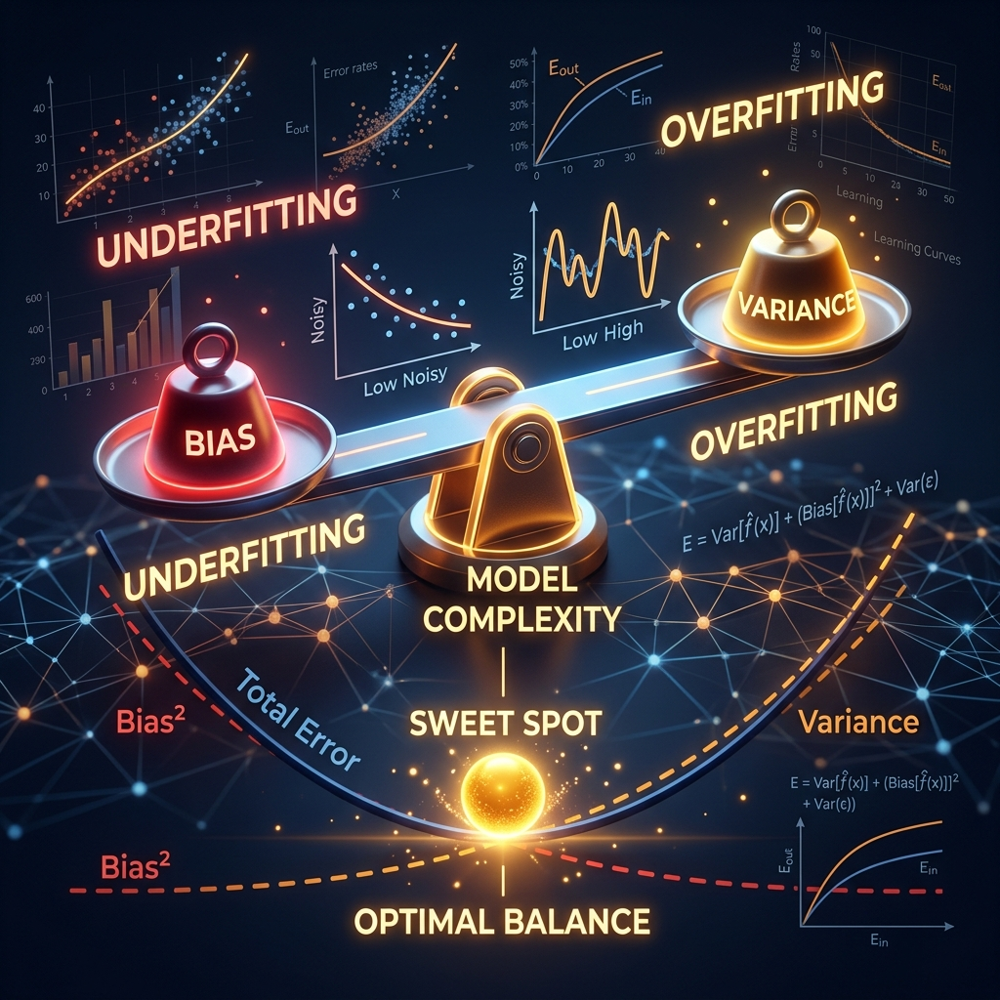
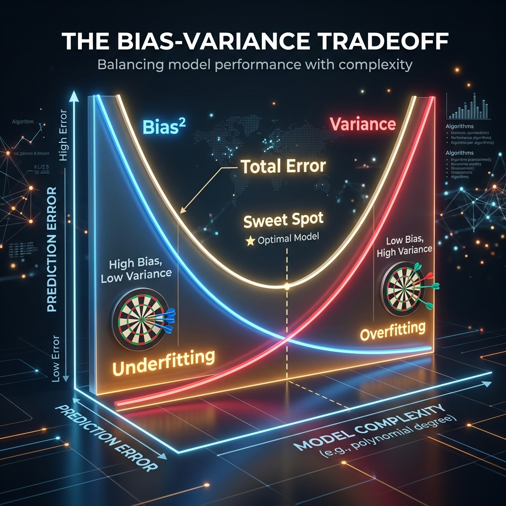
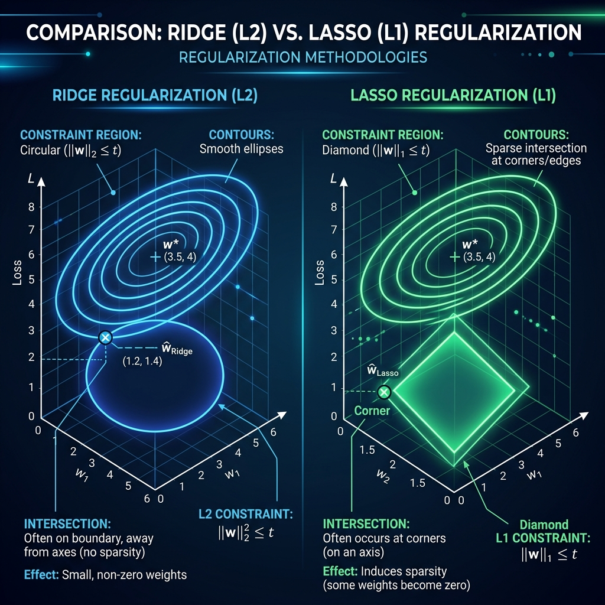

<div align="center">
  
</div>

# Chapter 25: Statistical Learning Theory — Bias, Variance & Regularization

**🎯 The Big Goal:** Understand the fundamental tradeoff at the heart of all machine learning — bias vs variance — and learn how regularization techniques (Ridge, Lasso) control model complexity to find the sweet spot.

## Core Concepts

### The Dartboard Analogy

Imagine throwing darts at a target:

- **High bias, low variance:** Your darts consistently land in the same spot, but that spot is far from the bullseye. You're *consistently wrong* — this is **underfitting**.
- **Low bias, high variance:** Your darts are centered on the bullseye on average, but they're scattered everywhere. Any single throw could land anywhere — this is **overfitting**.
- **The sweet spot:** Your darts are both centered on the bullseye *and* tightly clustered. This is what we want.

### The Bias-Variance Decomposition

<div align="center">
  
</div>

For any model, the expected prediction error can be decomposed into three parts:

```
Expected Error = Bias² + Variance + Irreducible Noise
```

- **Bias:** Error from overly simple assumptions. A linear model fitting curvy data has high bias — it *systematically* misses the pattern.
- **Variance:** Error from sensitivity to training data fluctuations. A degree-20 polynomial perfectly fits the training data but gives wildly different predictions on new data.
- **Irreducible noise:** Randomness inherent in the data. No model can fix this.

As model complexity increases: bias decreases (the model can fit more patterns) but variance increases (the model starts memorizing noise). The total error forms a U-shape, and the bottom of that U is where we want to be.

### Cross-Validation: The Honest Test

How do you find the sweet spot without peeking at the test data? **K-fold cross-validation:**

1. Split the data into K equal folds.
2. For each fold: train on the other K-1 folds, test on the held-out fold.
3. Average the K test errors.

This gives you an unbiased estimate of how well your model generalizes — without wasting data on a single train/test split.

### Regularization: Adding a Penalty for Complexity

<div align="center">
  
</div>

Regularization explicitly adds a penalty term to the loss function that punishes model complexity:

```
Regularized Loss = Data Loss + λ × Complexity Penalty
```

#### Ridge Regression (L2)

Adds the sum of **squared** weights: `λ × Σ wᵢ²`

- Shrinks all weights toward zero, but never exactly to zero.
- Think of it as a gentle nudge: "keep your weights small."
- Geometrically, the constraint region is a **circle** — smooth, no corners.

#### Lasso Regression (L1)

Adds the sum of **absolute** weights: `λ × Σ |wᵢ|`

- Can shrink weights all the way to exactly zero — performing **feature selection**.
- Think of it as a sharp knife: "some features must go."
- Geometrically, the constraint region is a **diamond** — the corners sit on the axes, which is why solutions tend to land on an axis (= some weight is zero).

#### The λ Knob

- **λ = 0:** No regularization → pure data fitting → risk of overfitting.
- **λ → ∞:** Maximum regularization → all weights shrink to zero → underfitting.
- **Optimal λ:** Found via cross-validation.

---

## 🤔 Reflection Questions

<details>
<summary>💡 View Answer: Why does Lasso produce sparse solutions but Ridge does not?</summary>

The geometric explanation is elegant: Lasso's constraint region is a diamond whose corners lie on the coordinate axes. The loss function contours (ellipses) are most likely to first touch the diamond at a **corner**, where one or more coordinates are exactly zero. Ridge's constraint region is a smooth circle with no corners, so the intersection point almost never lands exactly on an axis. As van Wieringen explains in the Lasso Regression lecture notes, "the L1 penalty's geometry naturally promotes sparsity," making Lasso simultaneously a regression method and a feature selection method.
</details>

<details>
<summary>💡 View Answer: How does cross-validation prevent overfitting?</summary>

Cross-validation prevents overfitting to the **model selection process** (not just the training data). Without it, you might pick the most complex model because it has the lowest training error. With K-fold CV, you see how each model performs on data it wasn't trained on, which penalizes models that memorize noise. As Hastie, Tibshirani, and Friedman (2009) note in *The Elements of Statistical Learning*: "Cross-validation is perhaps the simplest and most widely used method for estimating prediction error."
</details>

<details>
<summary>💡 View Answer: What is the Elastic Net, and when would you use it?</summary>

Elastic Net combines both L1 and L2 penalties: `λ₁ × Σ|wᵢ| + λ₂ × Σwᵢ²`. It gets the best of both worlds: Lasso's feature selection capability with Ridge's stability when features are correlated. When features are highly correlated, Lasso arbitrarily picks one and zeros out the others; Elastic Net distributes the weight among correlated features. Use it when you have many correlated features and want both sparsity and grouping behavior.
</details>

---

## 🐳 Hands-On Exercise: Bias-Variance & Regularization Explorer

In this exercise, you'll fit polynomial models of increasing complexity and visualize the bias-variance tradeoff, then apply Ridge and Lasso regularization to see their effect.

### Step 1: Build
```bash
cd exercise
docker build -t ch25-statlearn .
```

### Step 2: Run
```bash
docker run --rm ch25-statlearn
```

### Dockerfile
```dockerfile
FROM python:3.9-alpine
WORKDIR /app
RUN pip install numpy
COPY statistical_learning.py /app/
CMD ["python", "statistical_learning.py"]
```

### Source Code

```python
import numpy as np

def true_function(x):
    """The true underlying function (unknown to the model)."""
    return np.sin(2 * x) + 0.5 * x

def generate_data(n=30, noise=0.5, seed=None):
    """Generate noisy observations of the true function."""
    if seed is not None:
        np.random.seed(seed)
    X = np.sort(np.random.uniform(-3, 3, n))
    y = true_function(X) + np.random.randn(n) * noise
    return X, y

def polynomial_features(X, degree):
    """Create polynomial feature matrix."""
    return np.column_stack([X**d for d in range(degree + 1)])

def ridge_regression(X, y, lam=0.0):
    """Closed-form Ridge Regression: w = (X'X + λI)^{-1} X'y"""
    n_features = X.shape[1]
    I = np.eye(n_features)
    I[0, 0] = 0  # Don't regularize the bias term
    w = np.linalg.solve(X.T @ X + lam * I, X.T @ y)
    return w

def main():
    np.random.seed(42)

    print("=" * 60)
    print("BIAS-VARIANCE TRADEOFF & REGULARIZATION")
    print("=" * 60)

    # Part 1: Bias-Variance with polynomial degree
    print("\n--- Part 1: Polynomial Complexity vs Error ---")
    print(f"{'Degree':>6} {'Train MSE':>10} {'Test MSE':>10} {'Gap':>8}  Visual")
    print("-" * 55)

    X_train, y_train = generate_data(n=30, seed=42)
    X_test, y_test = generate_data(n=100, seed=99)

    for degree in [1, 2, 3, 5, 10, 15]:
        Phi_train = polynomial_features(X_train, degree)
        Phi_test = polynomial_features(X_test, degree)

        w = ridge_regression(Phi_train, y_train, lam=0.0)

        train_pred = Phi_train @ w
        test_pred = Phi_test @ w

        train_mse = np.mean((y_train - train_pred)**2)
        test_mse = np.mean((y_test - test_pred)**2)
        gap = test_mse - train_mse

        bar = "█" * min(int(test_mse * 5), 30)
        status = "← sweet spot" if degree == 3 else ("OVERFIT" if gap > 2 else "")
        print(f"{degree:6d} {train_mse:10.4f} {test_mse:10.4f} {gap:8.4f}  {bar} {status}")

    # Part 2: Regularization effect
    print("\n--- Part 2: Ridge Regularization (degree=10) ---")
    print(f"{'Lambda':>10} {'Train MSE':>10} {'Test MSE':>10} {'Nonzero':>8}")
    print("-" * 45)

    Phi_train = polynomial_features(X_train, 10)
    Phi_test = polynomial_features(X_test, 10)

    for lam in [0, 0.001, 0.01, 0.1, 1.0, 10.0, 100.0]:
        w = ridge_regression(Phi_train, y_train, lam=lam)
        train_mse = np.mean((y_train - Phi_train @ w)**2)
        test_mse = np.mean((y_test - Phi_test @ w)**2)
        nonzero = np.sum(np.abs(w) > 0.01)

        marker = " ← best" if 0.05 < lam < 0.5 else ""
        print(f"{lam:10.3f} {train_mse:10.4f} {test_mse:10.4f} {nonzero:8d}{marker}")

    # Part 3: L1 vs L2 simulation
    print("\n--- Part 3: L1 (Lasso) vs L2 (Ridge) Effect ---")
    print("Simulating weight shrinkage on a 20-feature problem:")

    np.random.seed(42)
    n, p = 50, 20
    X = np.random.randn(n, p)
    true_w = np.zeros(p)
    true_w[:5] = [3, -2, 1.5, -1, 0.5]  # Only 5 features matter
    y = X @ true_w + np.random.randn(n) * 0.5

    # Ridge
    w_ridge = ridge_regression(X, y, lam=1.0)
    # Approximate L1 via iteratively reweighted L2
    w_lasso = w_ridge.copy()
    for _ in range(50):
        D = np.diag(1.0 / (np.abs(w_lasso) + 1e-6))
        w_lasso = np.linalg.solve(X.T @ X + 1.0 * D, X.T @ y)

    print(f"\n  {'Feature':>8} {'True':>6} {'Ridge':>8} {'Lasso':>8}")
    print("  " + "-" * 35)
    for i in range(p):
        marker = " *" if abs(true_w[i]) > 0 else ""
        print(f"  w[{i:2d}]   {true_w[i]:6.2f} {w_ridge[i]:8.4f} {w_lasso[i]:8.4f}{marker}")

    ridge_zeros = np.sum(np.abs(w_ridge) < 0.01)
    lasso_zeros = np.sum(np.abs(w_lasso) < 0.01)
    print(f"\n  Near-zero weights: Ridge={ridge_zeros}, Lasso={lasso_zeros}")

    print("\n" + "=" * 60)
    print("KEY INSIGHTS:")
    print("1. Too simple = high bias. Too complex = high variance.")
    print("2. Ridge shrinks weights; Lasso eliminates them (sparsity).")
    print("3. Cross-validation finds the optimal complexity level.")
    print("=" * 60)

if __name__ == "__main__":
    main()
```

---

## 📚 References

- Hastie, T., Tibshirani, R. & Friedman, J. (2009). *The Elements of Statistical Learning* (2nd ed.). Springer. — Chapters 2, 3, and 7 on bias-variance decomposition, linear regression, regularization, and model assessment.
- James, G., Witten, D., Hastie, T. & Tibshirani, R. (2013). *An Introduction to Statistical Learning*. Springer. — Chapters 2, 5, and 6 on the bias-variance tradeoff, cross-validation, and regularization.
- van Wieringen, W. N. (2016). *Lecture Notes on Lasso Regression*. Vrije Universiteit Amsterdam. — Detailed geometric and statistical treatment of L1 regularization and sparsity.
- Bishop, C. M. (2006). *Pattern Recognition and Machine Learning*. Springer. — Chapter 1 and 3 on model complexity, overfitting, and regularization.
