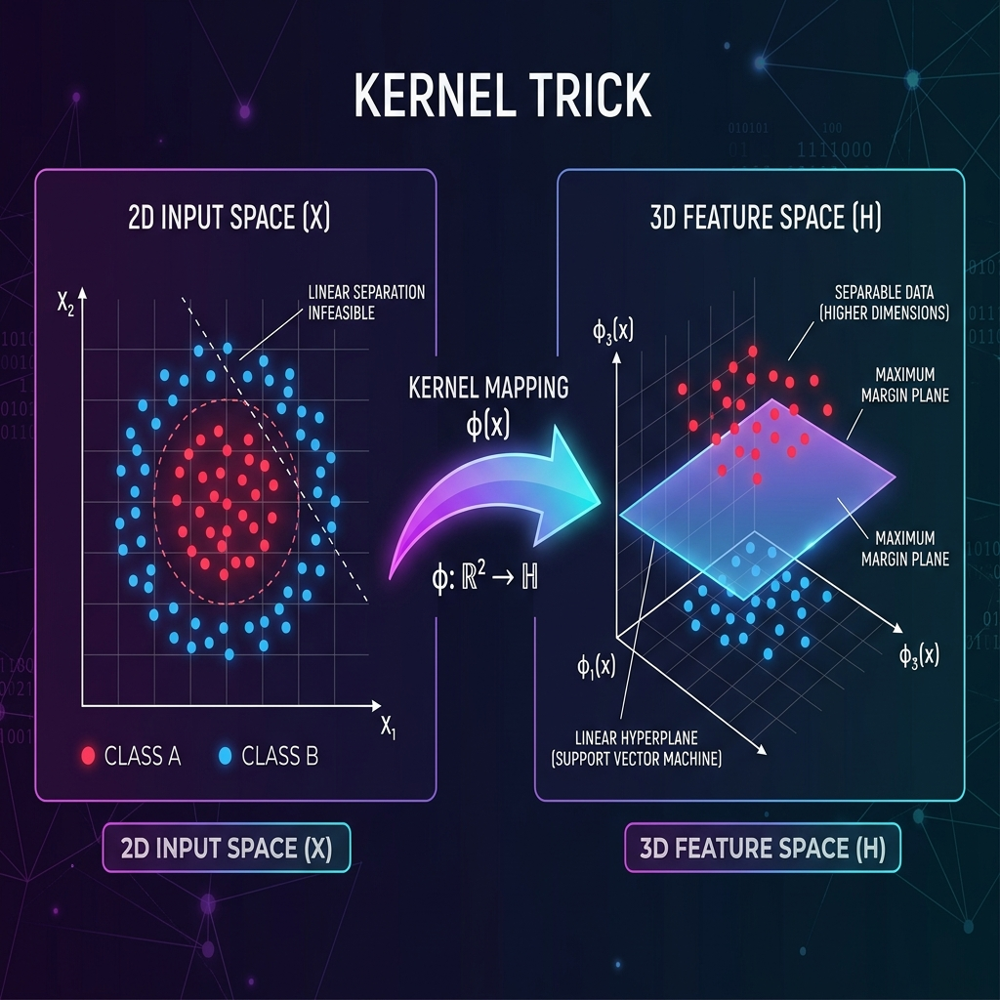
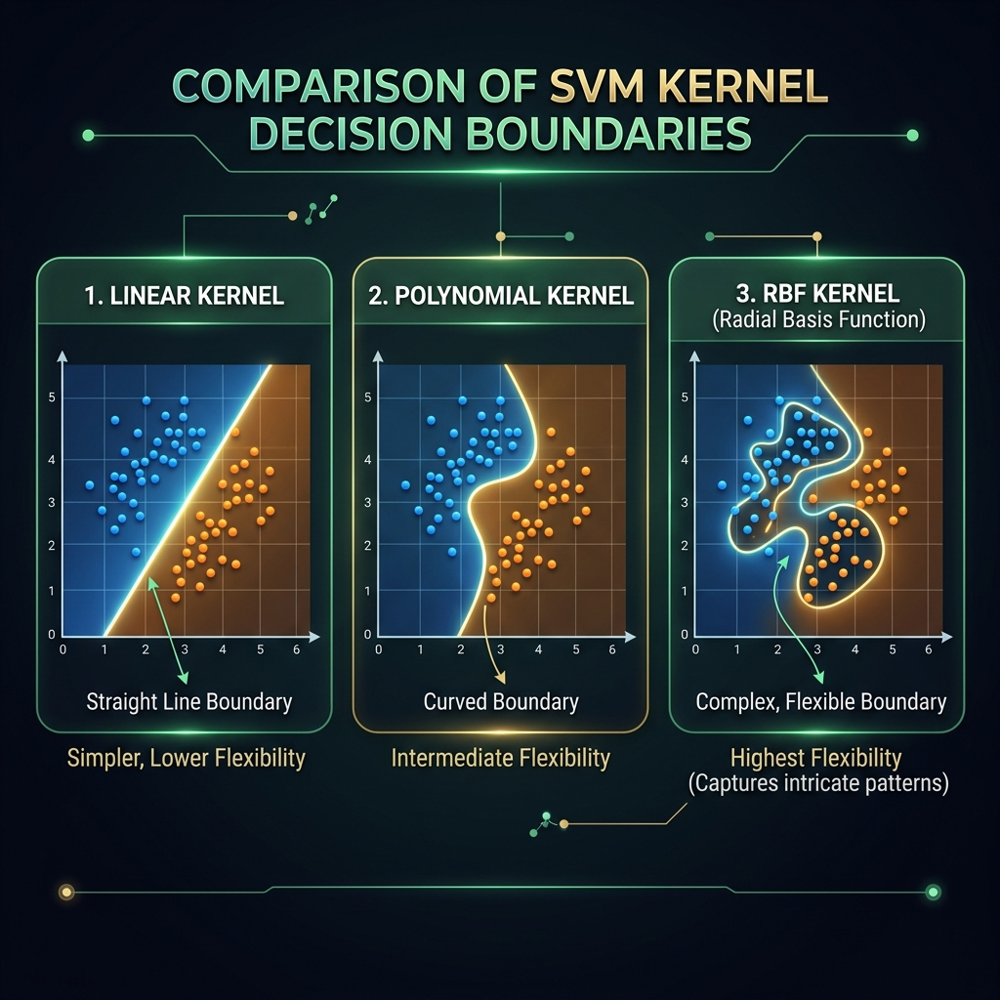

<div align="center">
  
</div>

# Chapter 26: Kernel Methods

**🎯 The Big Goal:** Understand the kernel trick — how to make linear algorithms work on non-linear data by implicitly mapping to higher dimensions — and explore the RBF kernel, the most powerful and widely-used kernel in practice.

## Core Concepts

### The Problem: Non-Linear Data

Imagine you have red and blue dots arranged in two concentric circles. No straight line can separate them. A linear SVM would fail miserably here. But what if you could *lift* the data into 3D by adding a new feature — say, z = x² + y²? Suddenly, the inner circle rises to a different height than the outer circle, and a flat plane in 3D can cleanly separate them.

This is the core idea: **map data to a higher-dimensional space where it becomes linearly separable**.

### The Kernel Trick: Computation Without Explosion

<div align="center">
  
</div>

Here's the problem with the naive approach: if you have 100 features and want to map to all pairwise interactions, you'd get ~5,000 new features. Map to all cubic interactions? ~170,000 features. The RBF kernel implicitly maps to an *infinite*-dimensional space. Computing φ(x) explicitly would be impossible.

The **kernel trick** is the elegant escape: instead of computing φ(x) for every data point and then computing dot products φ(xᵢ) · φ(xⱼ), we use a kernel function K(xᵢ, xⱼ) that *directly computes* the dot product in the high-dimensional space — without ever going there.

```
K(xᵢ, xⱼ) = φ(xᵢ) · φ(xⱼ)
```

This works because many algorithms (SVM, PCA, Ridge Regression) only access the data through **dot products**. If we can replace every dot product with a kernel evaluation, the algorithm works in the higher-dimensional space for free.

### The Three Most Important Kernels

<div align="center">
  
</div>

1. **Linear Kernel:** `K(x, y) = x · y`
   - Just the ordinary dot product. No transformation. Use when data is already linearly separable.

2. **Polynomial Kernel:** `K(x, y) = (x · y + c)ᵈ`
   - Maps to a space of all polynomial terms up to degree d. Captures interactions between features.

3. **RBF (Radial Basis Function) Kernel:** `K(x, y) = exp(-γ ||x - y||²)`
   - The most powerful kernel. Measures *similarity* between points: nearby points get a kernel value close to 1, distant points get ~0.
   - Implicitly maps to an infinite-dimensional space.
   - The γ parameter controls the "reach" of each data point — small γ = wide influence (smoother boundary), large γ = tight influence (more complex boundary).

### Mercer's Theorem: When Is K a Valid Kernel?

Not every function can be a kernel. **Mercer's Theorem** states that K is a valid kernel if and only if the **kernel matrix** (the matrix of all pairwise K(xᵢ, xⱼ) values) is positive semi-definite for any set of data points. This guarantees that there exists *some* feature space where K computes a valid dot product.

### The γ Parameter: The Most Important Hyperparameter

For the RBF kernel, γ controls the tradeoff:
- **Small γ (e.g., 0.01):** Each point influences a large neighborhood → smooth, simple decision boundary → risk of underfitting.
- **Large γ (e.g., 100):** Each point influences only its immediate vicinity → complex, wiggly boundary → risk of overfitting.

Think of γ as the "resolution" of the kernel's vision: low γ sees the big picture; high γ sees every individual noise point.

---

## 🤔 Reflection Questions

<details>
<summary>💡 View Answer: Why is the kernel trick computationally efficient?</summary>

Without the kernel trick, mapping to a polynomial feature space of degree d with p original features creates O(pᵈ) features — exponential growth. Computing dot products in that space costs O(pᵈ) per pair. The kernel trick replaces this with a single kernel evaluation K(xᵢ, xⱼ) that costs O(p) — regardless of the dimensionality of the implied feature space. For the RBF kernel, this is even more dramatic: the implicit feature space is *infinite*-dimensional, yet the kernel evaluation is just `exp(-γ ||x-y||²)`, which costs O(p). As Shawe-Taylor and Cristianini (2004) explain in *Kernel Methods for Pattern Analysis*: "The kernel function provides a computational shortcut."
</details>

<details>
<summary>💡 View Answer: What is the relationship between SVMs and kernel methods?</summary>

SVMs and kernel methods are deeply intertwined but distinct. SVMs are a *specific algorithm* (finding the maximum-margin hyperplane) that naturally expresses its solution purely in terms of dot products between data points. This dot-product formulation is what makes SVMs the perfect vehicle for the kernel trick. However, kernels are more general — they can be applied to any algorithm whose formulation uses only dot products: kernel PCA, kernel Ridge Regression, kernel k-means, etc. As Shawe-Taylor and Cristianini note, "the key insight is that many classical algorithms can be recast in terms of dot products, and hence kernelized."
</details>

<details>
<summary>💡 View Answer: How do you choose between different kernels?</summary>

Start with the **linear kernel** — it's the simplest and works surprisingly well on high-dimensional data (text, genomics). If linear doesn't work, try **RBF** — it's a universal approximator that can model any smooth decision boundary. Use **polynomial kernels** when you have domain knowledge that suggests polynomial interactions matter. In practice, use cross-validation to select both the kernel type and its hyperparameters (γ for RBF, degree d for polynomial). The RBF kernel with tuned γ is the default choice in most applications.
</details>

---

## 🐳 Hands-On Exercise: Kernel Classifier from Scratch

In this exercise, you'll implement kernel-based classification using the RBF kernel and see how γ affects the decision boundary.

### Step 1: Build
```bash
cd exercise
docker build -t ch26-kernels .
```

### Step 2: Run
```bash
docker run --rm ch26-kernels
```

### Dockerfile
```dockerfile
FROM python:3.9-alpine
WORKDIR /app
RUN pip install numpy
COPY kernel_methods.py /app/
CMD ["python", "kernel_methods.py"]
```

### Source Code

```python
import numpy as np

def rbf_kernel(X1, X2, gamma):
    """Compute RBF kernel matrix between X1 and X2."""
    sq_dists = np.sum(X1**2, axis=1, keepdims=True) + \
               np.sum(X2**2, axis=1, keepdims=True).T - \
               2 * X1 @ X2.T
    return np.exp(-gamma * sq_dists)

def linear_kernel(X1, X2):
    """Compute linear kernel matrix."""
    return X1 @ X2.T

def polynomial_kernel(X1, X2, degree=3, c=1):
    """Compute polynomial kernel matrix."""
    return (X1 @ X2.T + c) ** degree

def kernel_ridge_classifier(X_train, y_train, X_test, kernel_fn, lam=0.1):
    """Kernel Ridge Regression for classification."""
    K_train = kernel_fn(X_train, X_train)
    n = K_train.shape[0]
    alpha = np.linalg.solve(K_train + lam * np.eye(n), y_train)
    K_test = kernel_fn(X_test, X_train)
    predictions = K_test @ alpha
    return np.sign(predictions)

def generate_circles(n=200, noise=0.15, seed=42):
    """Generate two concentric circles (non-linearly separable)."""
    np.random.seed(seed)
    n_per_class = n // 2

    # Inner circle
    theta1 = np.random.uniform(0, 2 * np.pi, n_per_class)
    r1 = 0.5 + np.random.randn(n_per_class) * noise
    X1 = np.column_stack([r1 * np.cos(theta1), r1 * np.sin(theta1)])

    # Outer circle
    theta2 = np.random.uniform(0, 2 * np.pi, n_per_class)
    r2 = 1.5 + np.random.randn(n_per_class) * noise
    X2 = np.column_stack([r2 * np.cos(theta2), r2 * np.sin(theta2)])

    X = np.vstack([X1, X2])
    y = np.array([1] * n_per_class + [-1] * n_per_class, dtype=float)
    return X, y

def main():
    X, y = generate_circles(n=200, seed=42)
    split = 150
    X_train, y_train = X[:split], y[:split]
    X_test, y_test = X[split:], y[split:]

    print("=" * 60)
    print("KERNEL METHODS FROM SCRATCH")
    print("=" * 60)
    print(f"Dataset: Two concentric circles (non-linearly separable)")
    print(f"Train: {len(X_train)}, Test: {len(X_test)}")
    print("-" * 60)

    # Linear kernel (expected to fail)
    pred = kernel_ridge_classifier(X_train, y_train, X_test,
                                   lambda X1, X2: linear_kernel(X1, X2))
    acc = np.mean(pred == y_test)
    bar = "█" * int(acc * 40)
    print(f"\nLinear Kernel:      {acc:.2%}  {bar}")

    # Polynomial kernels
    for d in [2, 3, 5]:
        pred = kernel_ridge_classifier(X_train, y_train, X_test,
                                       lambda X1, X2, d=d: polynomial_kernel(X1, X2, degree=d))
        acc = np.mean(pred == y_test)
        bar = "█" * int(acc * 40)
        print(f"Polynomial (d={d}):   {acc:.2%}  {bar}")

    # RBF kernel with varying gamma
    print(f"\nRBF Kernel (varying γ):")
    print(f"  {'γ':>8} {'Accuracy':>10}  {'Visual':>30}")
    print("  " + "-" * 50)
    for gamma in [0.01, 0.1, 0.5, 1.0, 5.0, 10.0, 50.0]:
        pred = kernel_ridge_classifier(X_train, y_train, X_test,
                                       lambda X1, X2, g=gamma: rbf_kernel(X1, X2, g))
        acc = np.mean(pred == y_test)
        bar = "█" * int(acc * 40)
        note = ""
        if gamma < 0.05:
            note = " (underfit)"
        elif gamma > 20:
            note = " (overfit)"
        elif acc > 0.9:
            note = " ← sweet spot"
        print(f"  {gamma:8.2f} {acc:10.2%}  {bar}{note}")

    # Kernel matrix visualization
    print(f"\nKernel Matrix Properties (RBF, γ=1.0):")
    K = rbf_kernel(X_train[:10], X_train[:10], gamma=1.0)
    print(f"  Shape: {K.shape}")
    print(f"  Diagonal (self-similarity): {K[0,0]:.4f} (always 1.0 for RBF)")
    print(f"  Min off-diagonal: {K[np.triu_indices(10, k=1)].min():.4f}")
    print(f"  Max off-diagonal: {K[np.triu_indices(10, k=1)].max():.4f}")
    print(f"  Symmetric: {np.allclose(K, K.T)}")

    eigenvalues = np.linalg.eigvalsh(K)
    print(f"  Positive semi-definite: {np.all(eigenvalues >= -1e-10)}")

    print("\n" + "=" * 60)
    print("KEY INSIGHTS:")
    print("1. Linear kernels fail on non-linear data (concentric circles).")
    print("2. RBF kernel achieves high accuracy via implicit mapping.")
    print("3. γ controls complexity: too small = underfit, too large = overfit.")
    print("4. The kernel trick avoids explicit high-dimensional computation.")
    print("=" * 60)

if __name__ == "__main__":
    main()
```

---

## 📚 References

- Shawe-Taylor, J. & Cristianini, N. (2004). *Kernel Methods for Pattern Analysis*. Cambridge University Press. — The definitive textbook on kernel methods, Mercer's theorem, and the kernel trick.
- Scholkopf, B. & Smola, A. (2002). *Learning with Kernels*. — Referenced in the RBF Kernel paper for theoretical foundations.
- Bishop, C. M. (2006). *Pattern Recognition and Machine Learning*. Springer. — Chapter 6 on kernel methods and Gaussian processes.
- Platt, J. C. (1998). *Sequential Minimal Optimization*. — The efficient SVM training algorithm referenced in SVM_SequentialMinimalOptimization.pdf.
- Burges, C. J. C. (1998). *A Tutorial on Support Vector Machines for Pattern Recognition*. — Referenced in SupportVectorMachine-notes-long-08.pdf.
