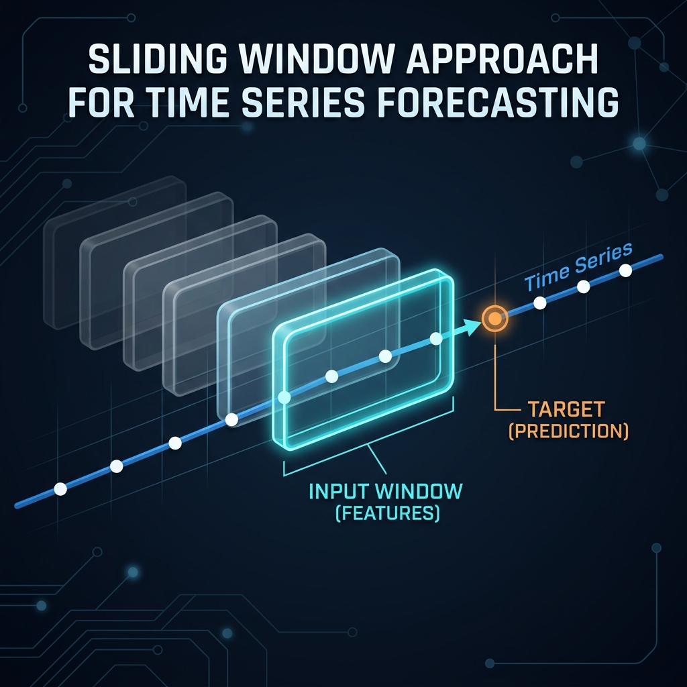
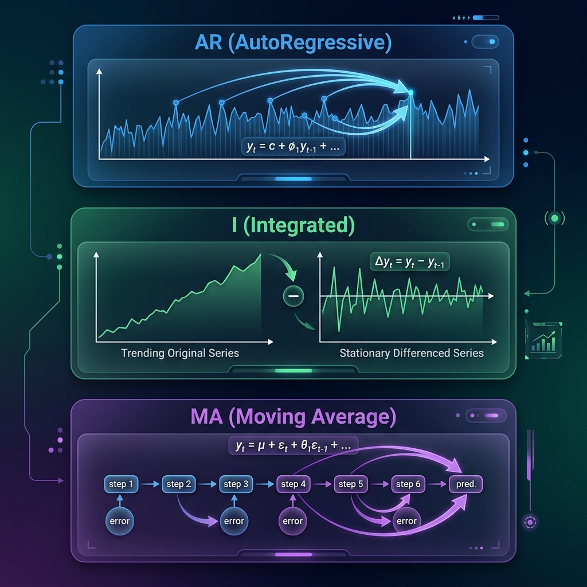

<div align="center">
  
</div>

# Chapter 27: Time Series Forecasting

**🎯 The Big Goal:** Understand how to predict future values from sequential data — master the concepts of stationarity, autoregression, and the ARIMA framework, and learn how to turn any time series into a supervised learning problem.

## Core Concepts

### What Makes Time Series Special?

Regular machine learning treats data points as independent — shuffling rows in a spreadsheet shouldn't matter. But time series data is fundamentally different: **order matters**. Yesterday's stock price tells you something about today's. Last month's temperature predicts this month's.

Think of it like reading a novel: you can't understand Chapter 10 without reading Chapters 1–9. Each data point carries a "memory" of what came before.

### Stationarity: The Foundation

A time series is **stationary** if its statistical properties (mean, variance) don't change over time. Think of it like a heartbeat: the pattern repeats at a consistent rhythm. A non-stationary series — like a company's stock price steadily rising — has a **trend** that shifts the mean over time.

Most forecasting methods require stationarity. If your series has a trend, you remove it by **differencing**: subtract each value from the previous one. `y'_t = y_t - y_{t-1}`. If there's seasonality, you difference at the seasonal period.

### The Sliding Window: Turning Time into Features

<div align="center">
  
</div>

The sliding window trick converts time series forecasting into a standard regression problem:

- **Window of size k:** Use the last k values as features: `[y_{t-k}, y_{t-k+1}, ..., y_{t-1}]`
- **Target:** Predict the next value: `y_t`
- **Slide:** Move the window forward by one step and repeat

This creates a tabular dataset where any regression model (linear regression, random forests, neural networks) can be applied. The choice of window size k is critical — too small misses long-range patterns, too large introduces noise.

### ARIMA: The Classical Framework

<div align="center">
  
</div>

**ARIMA(p, d, q)** is the most widely-used classical time series model. It has three components:

#### AR (AutoRegressive) — the "p" part
The current value depends linearly on the previous p values:
```
y_t = c + φ₁·y_{t-1} + φ₂·y_{t-2} + ... + φₚ·y_{t-p} + ε_t
```
Think of it as "momentum": if the series has been going up, it's likely to continue going up. The coefficients φ tell you *how much* each past value matters.

#### I (Integrated) — the "d" part
How many times you difference the series to make it stationary. d=1 means you difference once (remove linear trend). d=2 means you difference twice (remove quadratic trend).

#### MA (Moving Average) — the "q" part
The current value depends on the previous q forecast errors:
```
y_t = c + ε_t + θ₁·ε_{t-1} + θ₂·ε_{t-2} + ... + θ_q·ε_{t-q}
```
Think of it as "error correction": if you overshot yesterday's prediction, adjust today's.

### Choosing p, d, q

- **d:** Difference until the series looks stationary (usually 0 or 1).
- **p:** Look at the **autocorrelation function (ACF)** — how correlated is y_t with y_{t-k}? Significant spikes suggest the order.
- **q:** Look at the **partial autocorrelation function (PACF)** — the direct effect of y_{t-k} on y_t after removing intermediate effects.

In practice, try several combinations and pick the one with the lowest **AIC** (Akaike Information Criterion), which balances fit quality against model complexity.

---

## 🤔 Reflection Questions

<details>
<summary>💡 View Answer: Why is stationarity required for most time series models?</summary>

Stationarity is required because most forecasting models assume the patterns they learn from past data will continue into the future. If the mean, variance, or autocorrelation structure changes over time (non-stationarity), the model's parameters become meaningless for future predictions — it's fitting a moving target. Differencing removes trends and makes the statistical properties constant, allowing the model to capture the *dynamics* (how values change) rather than the *level* (where they currently are). As the time series literature explains, "a model of a non-stationary series cannot be generalized to other time periods."
</details>

<details>
<summary>💡 View Answer: How does the sliding window approach relate to autoregression?</summary>

The sliding window approach is a *generalization* of autoregression. An AR(p) model is essentially a linear regression on a sliding window of size p: the features are [y_{t-1}, ..., y_{t-p}] and the target is y_t. But the sliding window framework is more flexible — you can use any model (not just linear) on the windowed features. A random forest or neural network on windowed features can capture non-linear temporal dependencies that AR cannot. As Géron explains in *Hands-On Machine Learning*, "any supervised learning model can be turned into a time series forecaster with the right feature engineering."
</details>

<details>
<summary>💡 View Answer: What are the limitations of ARIMA?</summary>

ARIMA has several key limitations: (1) It's fundamentally **linear** — it cannot capture non-linear dynamics. (2) It assumes a **fixed** relationship structure — the φ and θ coefficients don't change over time. (3) It struggles with **multiple seasonalities** (e.g., daily + weekly + yearly patterns). (4) It doesn't naturally handle **exogenous variables** (ARIMAX addresses this partially). (5) It's a **univariate** method — it forecasts one series at a time without leveraging correlations between related series. Modern alternatives like LSTMs, Transformers, and Prophet address many of these limitations, but ARIMA remains the benchmark to beat on many standard forecasting tasks.
</details>

---

## 🐳 Hands-On Exercise: Autoregressive Forecasting from Scratch

In this exercise, you'll build an AR model from scratch, implement the sliding window transformation, and compare forecasting with different window sizes.

### Step 1: Build
```bash
cd exercise
docker build -t ch27-timeseries .
```

### Step 2: Run
```bash
docker run --rm ch27-timeseries
```

### Dockerfile
```dockerfile
FROM python:3.9-alpine
WORKDIR /app
RUN pip install numpy
COPY time_series.py /app/
CMD ["python", "time_series.py"]
```

### Source Code

```python
import numpy as np

def generate_time_series(n=300, seed=42):
    """Generate a synthetic time series with trend, seasonality, and noise."""
    np.random.seed(seed)
    t = np.arange(n)
    trend = 0.02 * t
    seasonality = 2 * np.sin(2 * np.pi * t / 50)
    noise = np.random.randn(n) * 0.5
    return trend + seasonality + noise

def difference(series, order=1):
    """Apply differencing to remove trend."""
    diff = series.copy()
    for _ in range(order):
        diff = np.diff(diff)
    return diff

def create_sliding_windows(series, window_size):
    """Convert time series to supervised learning format."""
    X, y = [], []
    for i in range(window_size, len(series)):
        X.append(series[i - window_size:i])
        y.append(series[i])
    return np.array(X), np.array(y)

def fit_ar(X, y):
    """Fit autoregressive model via least squares."""
    # Add bias term
    X_bias = np.column_stack([np.ones(len(X)), X])
    # Normal equation: w = (X'X)^{-1} X'y
    w = np.linalg.lstsq(X_bias, y, rcond=None)[0]
    return w

def predict_ar(X, w):
    """Predict using fitted AR model."""
    X_bias = np.column_stack([np.ones(len(X)), X])
    return X_bias @ w

def forecast_multi_step(series, w, window_size, steps):
    """Generate multi-step forecasts by feeding predictions back."""
    history = list(series[-window_size:])
    forecasts = []
    for _ in range(steps):
        x = np.array(history[-window_size:]).reshape(1, -1)
        x_bias = np.column_stack([np.ones(1), x])
        pred = (x_bias @ w)[0]
        forecasts.append(pred)
        history.append(pred)
    return np.array(forecasts)

def main():
    series = generate_time_series(n=300)

    print("=" * 60)
    print("TIME SERIES FORECASTING FROM SCRATCH")
    print("=" * 60)
    print(f"Series length: {len(series)}")
    print(f"Mean: {series.mean():.2f}, Std: {series.std():.2f}")
    print("-" * 60)

    # Part 1: Effect of differencing
    print("\n--- Part 1: Stationarity via Differencing ---")
    for d in [0, 1]:
        s = difference(series, order=d) if d > 0 else series
        print(f"  d={d}: Mean={s.mean():7.3f}, Std={s.std():5.3f}, "
              f"Range=[{s.min():.2f}, {s.max():.2f}]")

    # Part 2: Sliding window size comparison
    print("\n--- Part 2: Window Size vs Forecast Accuracy ---")
    print(f"  {'Window':>6} {'Train MSE':>10} {'Test MSE':>10}  Visual")
    print("  " + "-" * 45)

    # Difference first to make stationary
    diff_series = difference(series, order=1)
    train_size = int(len(diff_series) * 0.8)

    for window in [3, 5, 10, 20, 50]:
        X, y = create_sliding_windows(diff_series, window)
        X_train, y_train = X[:train_size], y[:train_size]
        X_test, y_test = X[train_size:], y[train_size:]

        if len(X_train) < window + 1:
            continue

        w = fit_ar(X_train, y_train)
        train_pred = predict_ar(X_train, w)
        test_pred = predict_ar(X_test, w)

        train_mse = np.mean((y_train - train_pred)**2)
        test_mse = np.mean((y_test - test_pred)**2)

        bar = "█" * max(1, int((1 - min(test_mse, 1)) * 30))
        print(f"  {window:6d} {train_mse:10.4f} {test_mse:10.4f}  {bar}")

    # Part 3: Multi-step forecasting
    print("\n--- Part 3: Multi-Step Forecasting (window=10) ---")
    window = 10
    X, y = create_sliding_windows(diff_series, window)
    w = fit_ar(X, y)

    forecasts = forecast_multi_step(diff_series, w, window, steps=20)
    # Reconstruct from differenced forecasts
    last_value = series[-1]
    reconstructed = [last_value]
    for f in forecasts:
        reconstructed.append(reconstructed[-1] + f)
    reconstructed = np.array(reconstructed[1:])

    print(f"  Last observed value: {series[-1]:.3f}")
    print(f"  Forecasted values:")
    for i in range(0, 20, 4):
        print(f"    t+{i+1:2d}: {reconstructed[i]:7.3f}")

    # Part 4: Autocorrelation analysis
    print("\n--- Part 4: Autocorrelation Analysis ---")
    centered = diff_series - diff_series.mean()
    var = np.var(centered)
    print(f"  {'Lag':>4} {'ACF':>8}  Visual")
    print("  " + "-" * 35)
    for lag in [1, 2, 5, 10, 25, 50]:
        if lag < len(centered):
            acf = np.mean(centered[lag:] * centered[:-lag]) / var
            bar_len = int(abs(acf) * 30)
            direction = "+" if acf > 0 else "-"
            bar = direction * bar_len
            print(f"  {lag:4d} {acf:8.3f}  {bar}")

    print("\n" + "=" * 60)
    print("KEY INSIGHTS:")
    print("1. Differencing removes trends → stationarity.")
    print("2. Window size controls how much 'memory' the model uses.")
    print("3. Multi-step forecasts accumulate error over time.")
    print("4. Autocorrelation reveals the series' temporal structure.")
    print("=" * 60)

if __name__ == "__main__":
    main()
```

---

## 📚 References

- Box, G. E. P. & Jenkins, G. M. (1970). *Time Series Analysis: Forecasting and Control*. — The foundational work on ARIMA methodology, referenced in time_ser.pdf.
- Géron, A. (2017). *Hands-On Machine Learning with Scikit-Learn & TensorFlow*. O'Reilly. — Chapter 15 on sequence modeling and the sliding window approach.
- VanderPlas, J. (2016). *Python Data Science Handbook*. O'Reilly. — Practical time series analysis with pandas.
- McKinney, W. (2017). *Python for Data Analysis* (2nd ed.). O'Reilly. — Data manipulation foundations for time series preprocessing.
